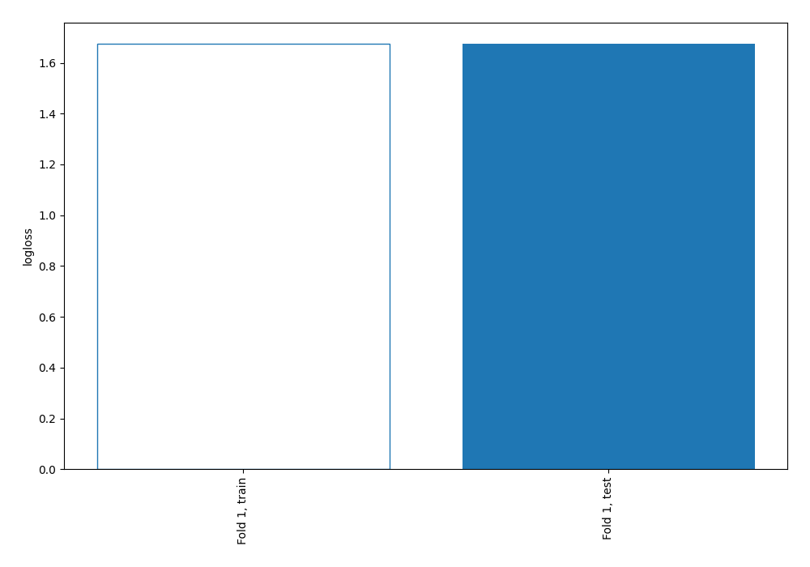
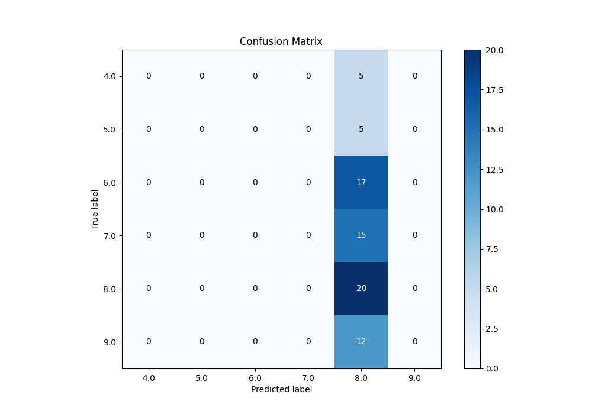
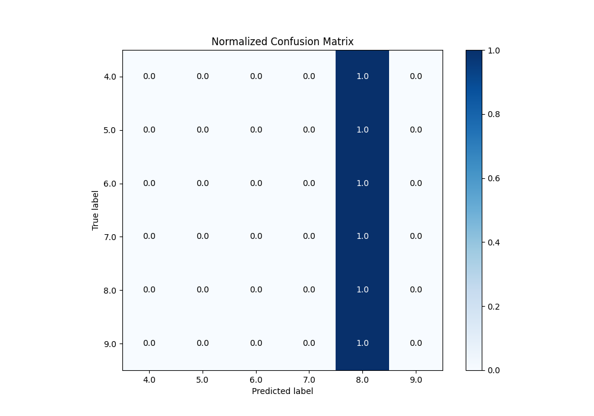
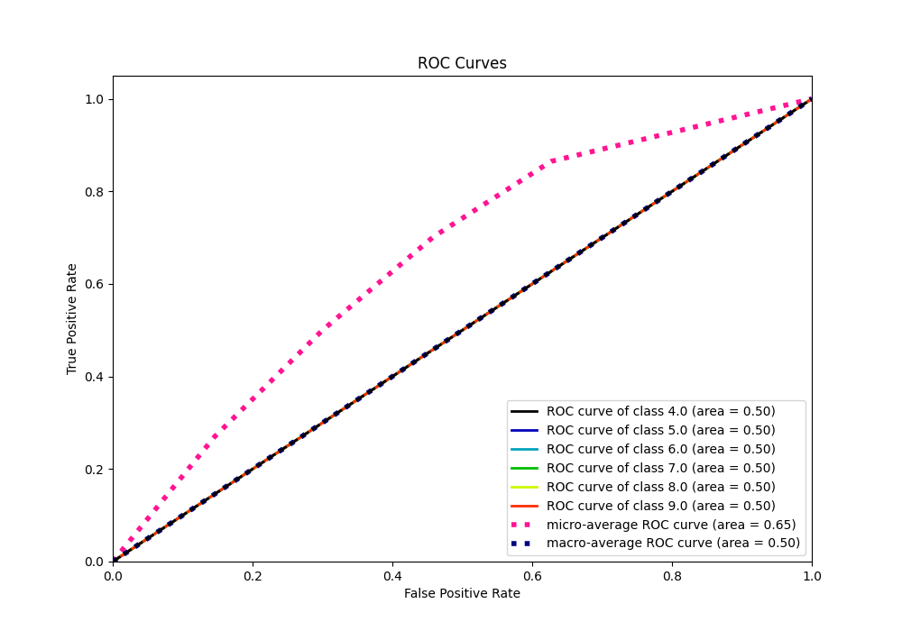
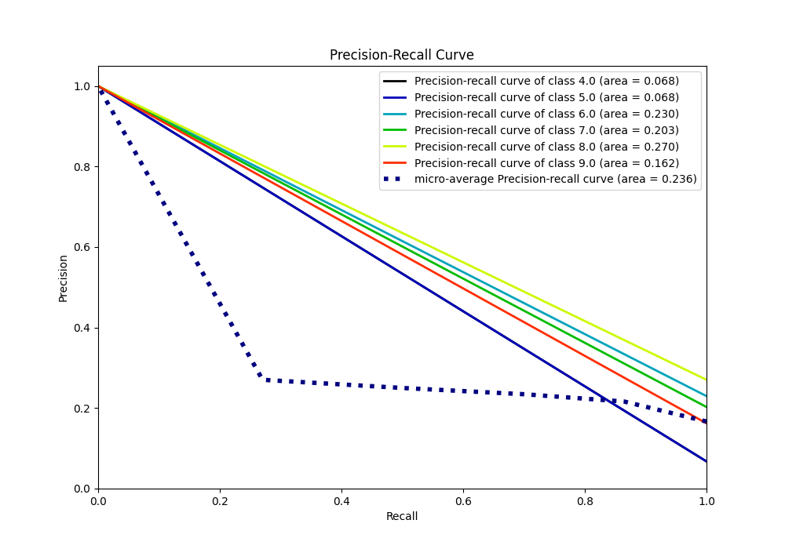

# Summary of 1_Baseline

[<< Go back](../README.md)

## Baseline Classifier (Baseline)
- **n_jobs**: -1
- **num_class**: 6
- **explain_level**: 2

## Validation
 - **validation_type**: split
 - **train_ratio**: 0.75
 - **shuffle**: True
 - **stratify**: True

## Optimized metric
logloss

## Training time

0.8 seconds

### Metric details
|           |   4.0 |   5.0 |   6.0 |   7.0 |       8.0 |   9.0 |   accuracy |   macro avg |   weighted avg |   logloss |
|:----------|------:|------:|------:|------:|----------:|------:|-----------:|------------:|---------------:|----------:|
| precision |     0 |     0 |     0 |     0 |  0.27027  |     0 |    0.27027 |    0.045045 |       0.073046 |   1.67454 |
| recall    |     0 |     0 |     0 |     0 |  1        |     0 |    0.27027 |    0.166667 |       0.27027  |   1.67454 |
| f1-score  |     0 |     0 |     0 |     0 |  0.425532 |     0 |    0.27027 |    0.070922 |       0.115009 |   1.67454 |
| support   |     5 |     5 |    17 |    15 | 20        |    12 |    0.27027 |   74        |      74        |   1.67454 |

## Confusion matrix
|                |   Predicted as 4.0 |   Predicted as 5.0 |   Predicted as 6.0 |   Predicted as 7.0 |   Predicted as 8.0 |   Predicted as 9.0 |
|:---------------|-------------------:|-------------------:|-------------------:|-------------------:|-------------------:|-------------------:|
| Labeled as 4.0 |                  0 |                  0 |                  0 |                  0 |                  5 |                  0 |
| Labeled as 5.0 |                  0 |                  0 |                  0 |                  0 |                  5 |                  0 |
| Labeled as 6.0 |                  0 |                  0 |                  0 |                  0 |                 17 |                  0 |
| Labeled as 7.0 |                  0 |                  0 |                  0 |                  0 |                 15 |                  0 |
| Labeled as 8.0 |                  0 |                  0 |                  0 |                  0 |                 20 |                  0 |
| Labeled as 9.0 |                  0 |                  0 |                  0 |                  0 |                 12 |                  0 |

## Learning curves

## Confusion Matrix

## Normalized Confusion Matrix

## ROC Curve

## Precision Recall Curve

[<< Go back](../README.md)
