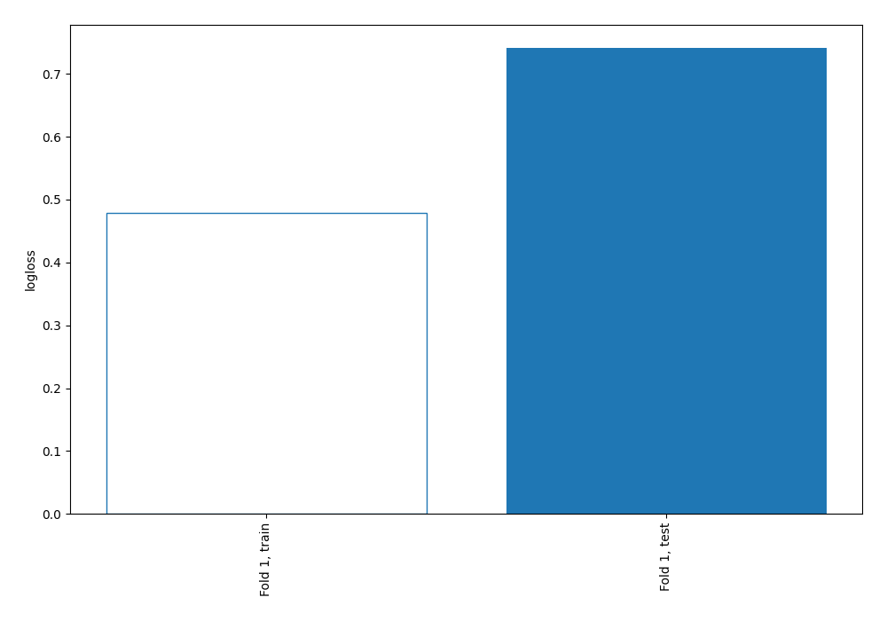
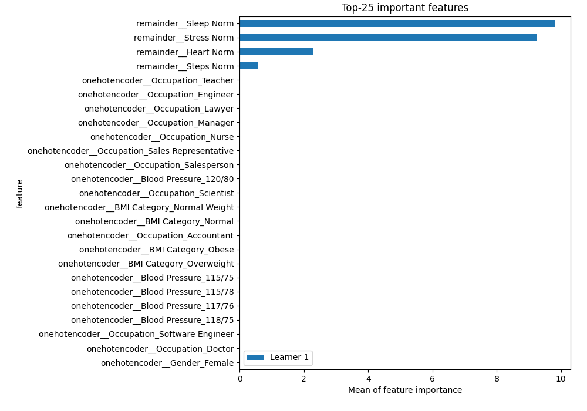
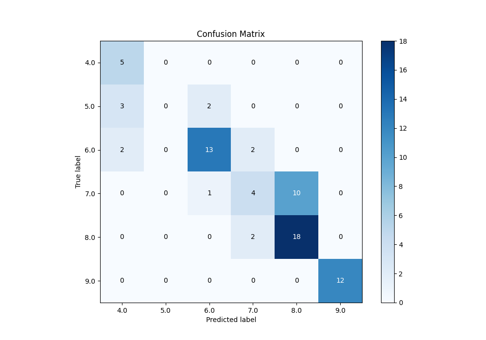
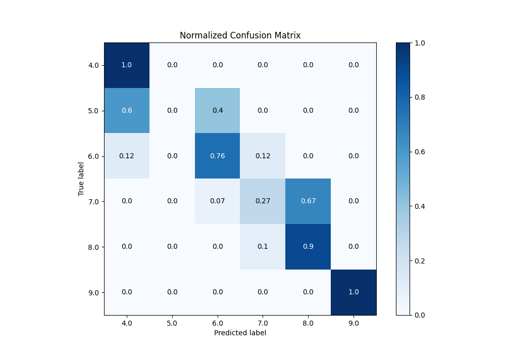
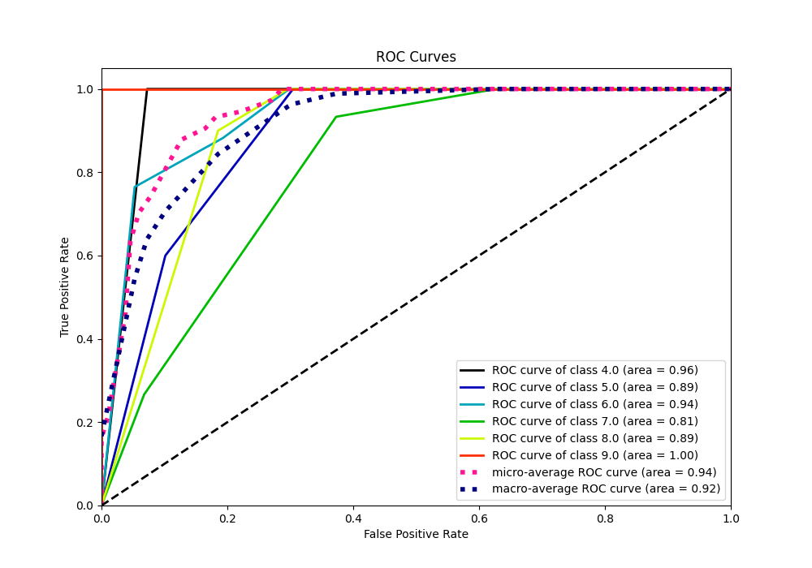
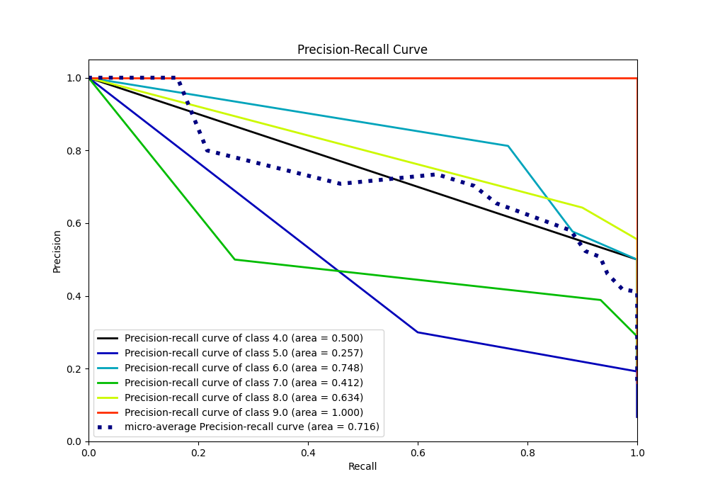

# Summary of 2_DecisionTree

[<< Go back](../README.md)

## Decision Tree
- **n_jobs**: -1
- **criterion**: gini
- **max_depth**: 3
- **num_class**: 6
- **explain_level**: 2

## Validation
 - **validation_type**: split
 - **train_ratio**: 0.75
 - **shuffle**: True
 - **stratify**: True

## Optimized metric
logloss

## Training time

8.6 seconds

### Metric details
|           |      4.0 |   5.0 |       6.0 |       7.0 |       8.0 |   9.0 |   accuracy |   macro avg |   weighted avg |   logloss |
|:----------|---------:|------:|----------:|----------:|----------:|------:|-----------:|------------:|---------------:|----------:|
| precision | 0.5      |     0 |  0.8125   |  0.5      |  0.642857 |     1 |   0.702703 |    0.575893 |       0.657698 |  0.741143 |
| recall    | 1        |     0 |  0.764706 |  0.266667 |  0.9      |     1 |   0.702703 |    0.655229 |       0.702703 |  0.741143 |
| f1-score  | 0.666667 |     0 |  0.787879 |  0.347826 |  0.75     |     1 |   0.702703 |    0.592062 |       0.661414 |  0.741143 |
| support   | 5        |     5 | 17        | 15        | 20        |    12 |   0.702703 |   74        |      74        |  0.741143 |

## Confusion matrix
|                |   Predicted as 4.0 |   Predicted as 5.0 |   Predicted as 6.0 |   Predicted as 7.0 |   Predicted as 8.0 |   Predicted as 9.0 |
|:---------------|-------------------:|-------------------:|-------------------:|-------------------:|-------------------:|-------------------:|
| Labeled as 4.0 |                  5 |                  0 |                  0 |                  0 |                  0 |                  0 |
| Labeled as 5.0 |                  3 |                  0 |                  2 |                  0 |                  0 |                  0 |
| Labeled as 6.0 |                  2 |                  0 |                 13 |                  2 |                  0 |                  0 |
| Labeled as 7.0 |                  0 |                  0 |                  1 |                  4 |                 10 |                  0 |
| Labeled as 8.0 |                  0 |                  0 |                  0 |                  2 |                 18 |                  0 |
| Labeled as 9.0 |                  0 |                  0 |                  0 |                  0 |                  0 |                 12 |

## Learning curves

## Permutation-based Importance

## Confusion Matrix

## Normalized Confusion Matrix

## ROC Curve

## Precision Recall Curve

[<< Go back](../README.md)
