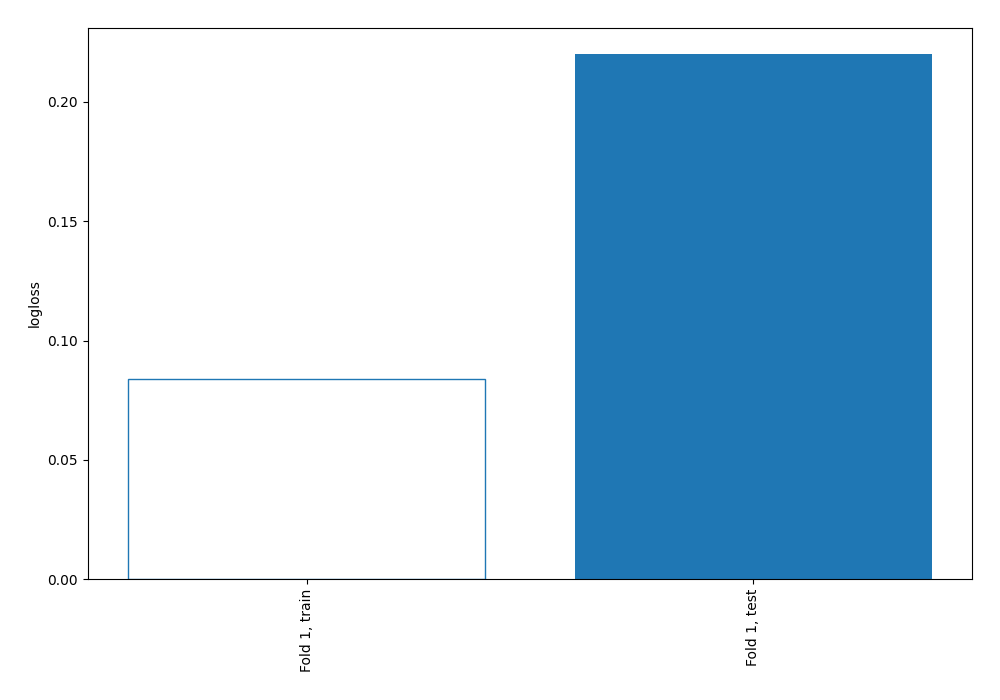
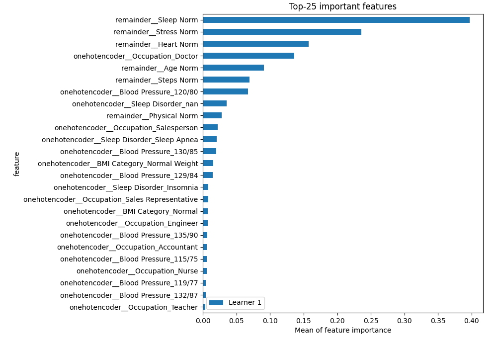
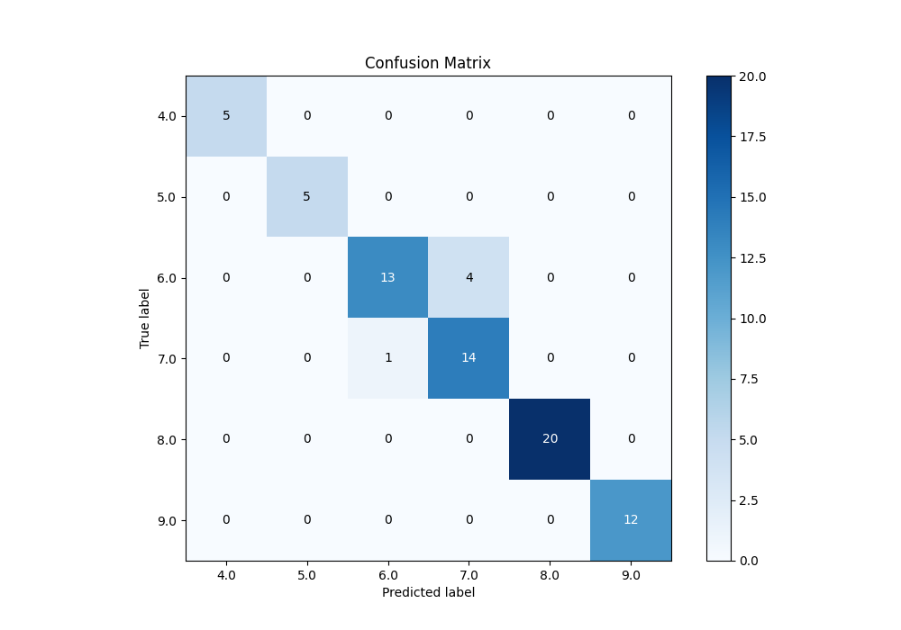
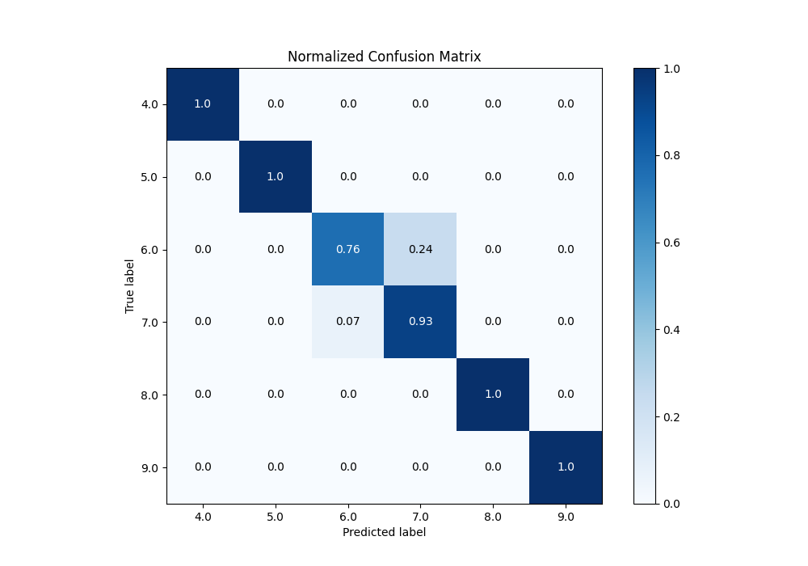
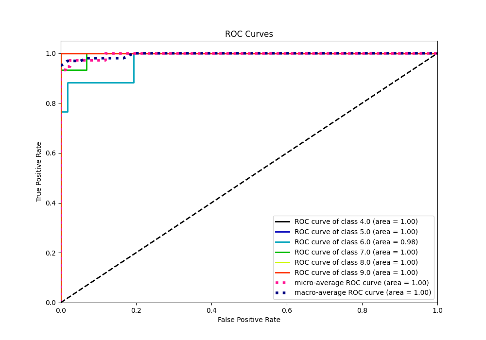
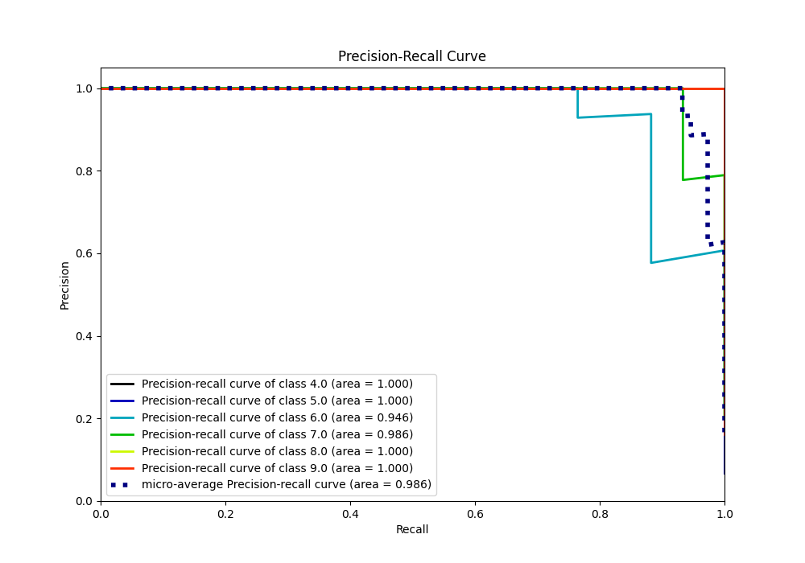

# Summary of 3_Linear

[<< Go back](../README.md)

## Logistic Regression (Linear)
- **n_jobs**: -1
- **num_class**: 6
- **explain_level**: 2

## Validation
 - **validation_type**: split
 - **train_ratio**: 0.75
 - **shuffle**: True
 - **stratify**: True

## Optimized metric
logloss

## Training time

1.1 seconds

### Metric details
|           |   4.0 |   5.0 |       6.0 |       7.0 |   8.0 |   9.0 |   accuracy |   macro avg |   weighted avg |   logloss |
|:----------|------:|------:|----------:|----------:|------:|------:|-----------:|------------:|---------------:|----------:|
| precision |     1 |     1 |  0.928571 |  0.777778 |     1 |     1 |   0.932432 |    0.951058 |       0.938546 |  0.220068 |
| recall    |     1 |     1 |  0.764706 |  0.933333 |     1 |     1 |   0.932432 |    0.949673 |       0.932432 |  0.220068 |
| f1-score  |     1 |     1 |  0.83871  |  0.848485 |     1 |     1 |   0.932432 |    0.947866 |       0.932234 |  0.220068 |
| support   |     5 |     5 | 17        | 15        |    20 |    12 |   0.932432 |   74        |      74        |  0.220068 |

## Confusion matrix
|                |   Predicted as 4.0 |   Predicted as 5.0 |   Predicted as 6.0 |   Predicted as 7.0 |   Predicted as 8.0 |   Predicted as 9.0 |
|:---------------|-------------------:|-------------------:|-------------------:|-------------------:|-------------------:|-------------------:|
| Labeled as 4.0 |                  5 |                  0 |                  0 |                  0 |                  0 |                  0 |
| Labeled as 5.0 |                  0 |                  5 |                  0 |                  0 |                  0 |                  0 |
| Labeled as 6.0 |                  0 |                  0 |                 13 |                  4 |                  0 |                  0 |
| Labeled as 7.0 |                  0 |                  0 |                  1 |                 14 |                  0 |                  0 |
| Labeled as 8.0 |                  0 |                  0 |                  0 |                  0 |                 20 |                  0 |
| Labeled as 9.0 |                  0 |                  0 |                  0 |                  0 |                  0 |                 12 |

## Learning curves

## Coefficients

### Coefficients learner #1
|                                                |          4.0 |          5.0 |          6.0 |        7.0 |          8.0 |          9.0 |
|:-----------------------------------------------|-------------:|-------------:|-------------:|-----------:|-------------:|-------------:|
| intercept                                      | -2.6547      | -1.75648     |  0.23645     |  2.22206   |  2.03864     | -0.0859765   |
| onehotencoder__Gender_Female                   |  0.223808    | -0.251679    | -0.70877     |  0.297085  | -0.175472    |  0.615029    |
| onehotencoder__Gender_Male                     | -0.14572     |  0.143951    |  0.376642    | -0.174598  |  0.0620987   | -0.262374    |
| onehotencoder__Occupation_Accountant           | -0.0417767   | -0.0760976   | -0.399526    | -0.0810344 |  0.278088    |  0.320347    |
| onehotencoder__Occupation_Doctor               | -0.100546    | -0.211713    |  0.202044    |  1.30655   | -1.34948     |  0.153148    |
| onehotencoder__Occupation_Engineer             | -0.121716    |  0.0788023   | -0.339857    | -0.406731  |  0.636524    |  0.152978    |
| onehotencoder__Occupation_Lawyer               | -0.0326367   | -0.0657327   | -0.377289    |  0.20951   |  0.351792    | -0.0856438   |
| onehotencoder__Occupation_Manager              | -0.0077282   | -0.00491249  | -0.0116207   |  0.0895373 | -0.0328188   | -0.0324571   |
| onehotencoder__Occupation_Nurse                | -0.413316    |  0.421934    |  0.588815    | -0.664899  |  0.187438    | -0.119971    |
| onehotencoder__Occupation_Sales Representative |  0.362829    | -0.102819    | -0.257179    | -0.0030234 | -8.87041e-05 |  0.000281234 |
| onehotencoder__Occupation_Salesperson          | -0.0312618   | -0.222033    |  0.962676    | -0.639449  | -0.0702163   |  0.000283771 |
| onehotencoder__Occupation_Scientist            |  0.567035    | -0.191465    | -0.298792    | -0.0774395 | -0.000574027 |  0.00123526  |
| onehotencoder__Occupation_Software Engineer    |  0           |  0           |  0           |  0         |  0           |  0           |
| onehotencoder__Occupation_Teacher              | -0.254053    |  0.413558    | -0.0196959   |  0.210291  | -0.0552673   | -0.294832    |
| onehotencoder__BMI Category_Normal             | -0.0395209   | -0.306514    | -0.0669581   | -0.106604  |  0.605263    | -0.0856663   |
| onehotencoder__BMI Category_Normal Weight      | -0.270993    |  0.442018    | -0.146159    | -0.48404   |  0.320051    |  0.139122    |
| onehotencoder__BMI Category_Obese              |  0.155417    | -0.591892    |  0.331707    |  0.0281623 | -0.0235466   |  0.100153    |
| onehotencoder__BMI Category_Overweight         |  0.0951526   |  0.32408     | -0.12506     |  0.477869  | -0.62766     | -0.144382    |
| onehotencoder__Blood Pressure_115/75           | -0.00123446  | -0.00769413  | -0.0233603   | -0.454267  |  0.7216      | -0.235044    |
| onehotencoder__Blood Pressure_115/78           |  0.000308706 |  1.96417e-05 |  0.000165982 | -0.067888  | -0.527432    |  0.594826    |
| onehotencoder__Blood Pressure_117/76           | -0.00135544  | -0.0206892   |  0.274247    | -0.144626  |  0.00853618  | -0.116113    |
| onehotencoder__Blood Pressure_118/75           |  0.000118566 |  0.00012832  |  0.000118445 | -0.0476824 | -0.0289385   |  0.0762555   |
| onehotencoder__Blood Pressure_119/77           | -0.00753725  | -0.011446    | -0.0416589   | -0.262596  |  0.383396    | -0.0601585   |
| onehotencoder__Blood Pressure_120/80           | -0.0066213   | -0.0355699   | -0.209427    |  1.09194   | -0.639557    | -0.200765    |
| onehotencoder__Blood Pressure_121/79           | -0.00106124  | -0.0145503   | -0.0842983   | -0.111829  |  0.228956    | -0.0172169   |
| onehotencoder__Blood Pressure_122/80           |  3.92328e-05 | -0.0020451   | -0.00846241  | -0.139117  |  0.233367    | -0.0837818   |
| onehotencoder__Blood Pressure_125/80           | -0.0487423   | -0.102123    |  0.400421    | -0.479636  | -0.157918    |  0.387999    |
| onehotencoder__Blood Pressure_125/82           | -0.0172577   | -0.047574    | -0.245827    |  0.784716  | -0.288164    | -0.185893    |
| onehotencoder__Blood Pressure_126/83           | -0.11109     | -0.0957676   |  0.394217    | -0.148708  | -0.0369743   | -0.00167661  |
| onehotencoder__Blood Pressure_128/84           |  0           |  0           |  0           |  0         |  0           |  0           |
| onehotencoder__Blood Pressure_128/85           | -0.0281094   | -0.0350867   | -0.0461805   |  0.332383  | -0.198801    | -0.024205    |
| onehotencoder__Blood Pressure_129/84           | -0.0843218   |  1.03375     | -0.476897    | -0.463782  | -0.0092856   |  0.000535263 |
| onehotencoder__Blood Pressure_130/85           | -0.106014    | -0.552732    |  0.125406    | -0.111711  |  0.803724    | -0.158672    |
| onehotencoder__Blood Pressure_130/86           | -0.0906895   |  0.254358    | -0.0920171   | -0.0648469 | -0.00683185  |  2.77129e-05 |
| onehotencoder__Blood Pressure_131/86           |  0.567035    | -0.191465    | -0.298792    | -0.0774395 | -0.000574027 |  0.00123526  |
| onehotencoder__Blood Pressure_132/87           | -0.21898     |  0.677753    | -0.239586    | -0.204902  | -0.0144816   |  0.000197149 |
| onehotencoder__Blood Pressure_135/90           | -0.00423469  | -0.213314    | -0.15136     |  0.91029   | -0.303834    | -0.237546    |
| onehotencoder__Blood Pressure_139/91           | -0.0115208   | -0.00461788  |  6.43186e-06 | -0.123835  | -0.0125047   |  0.152472    |
| onehotencoder__Blood Pressure_140/90           |  0.198761    | -0.502758    |  0.361546    | -0.055019  | -0.00289932  |  0.000369351 |
| onehotencoder__Blood Pressure_140/95           | -0.0688385   | -0.00453743  |  0.441158    | -0.425151  | -0.197844    |  0.255213    |
| onehotencoder__Blood Pressure_142/92           | -0.0318239   | -0.0845163   | -0.0298448   |  0.207016  | -0.00814257  | -0.0526885   |
| onehotencoder__Sleep Disorder_Insomnia         | -0.657078    |  0.503989    |  0.107403    |  0.512642  | -0.185129    | -0.281826    |
| onehotencoder__Sleep Disorder_Sleep Apnea      |  0.797027    | -0.145579    | -0.25791     | -0.564334  | -0.118977    |  0.289773    |
| onehotencoder__Sleep Disorder_nan              | -0.348439    | -0.682425    |  0.347789    |  0.0512478 |  0.559538    |  0.0722898   |
| remainder__Age Norm                            | -0.449011    | -0.761144    |  0.0527459   |  0.277715  | -0.292201    |  1.1719      |
| remainder__Sleep Norm                          | -0.641499    |  0.164402    | -1.82608     |  0.651684  | -0.0986001   |  1.75009     |
| remainder__Physical Norm                       | -0.555814    | -0.633962    | -0.0352203   |  0.22764   |  0.664448    |  0.332907    |
| remainder__Stress Norm                         |  0.541725    |  0.436833    |  1.15046     |  0.431745  | -1.16888     | -1.39189     |
| remainder__Heart Norm                          |  0.953055    |  0.120094    | -0.146378    | -0.362036  | -0.211656    | -0.353079    |
| remainder__Steps Norm                          | -0.151787    | -0.609928    |  0.655952    | -0.201928  |  0.55286     | -0.245168    |

## Permutation-based Importance

## Confusion Matrix

## Normalized Confusion Matrix

## ROC Curve

## Precision Recall Curve

[<< Go back](../README.md)
