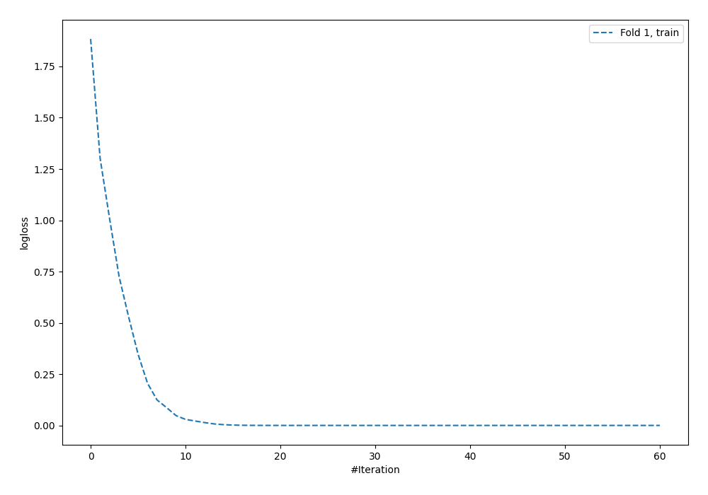
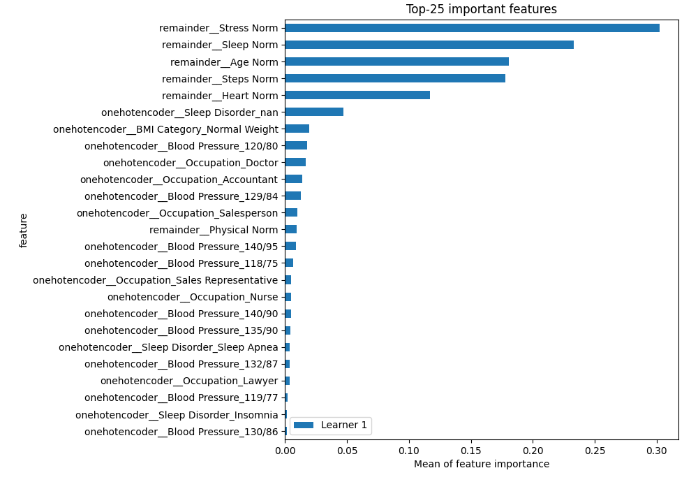
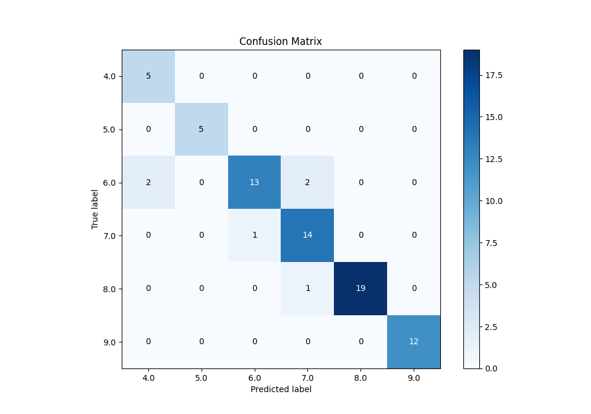
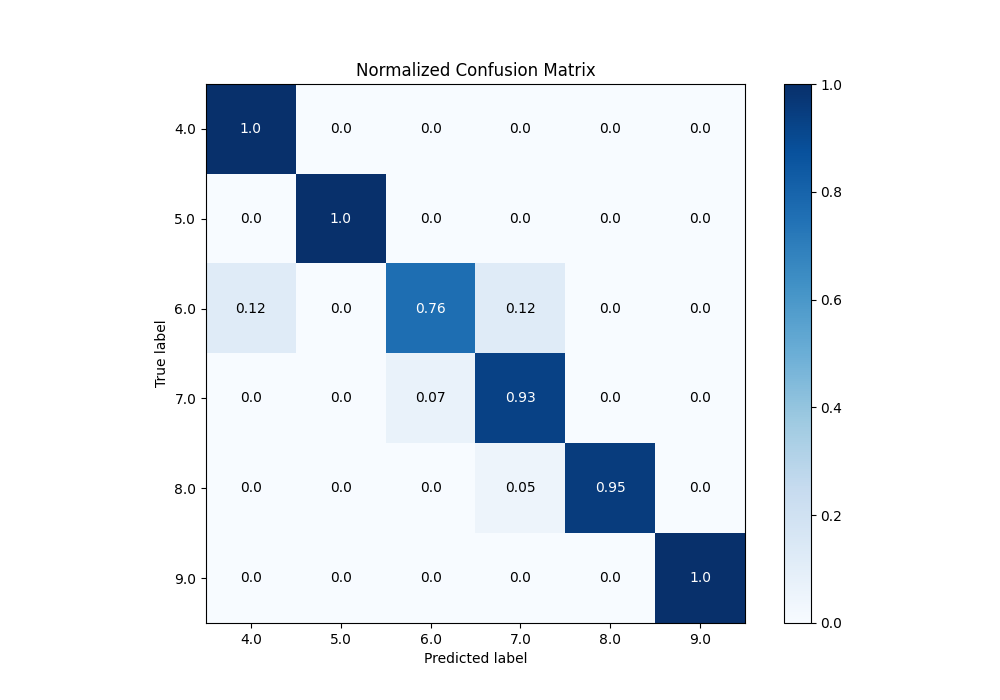
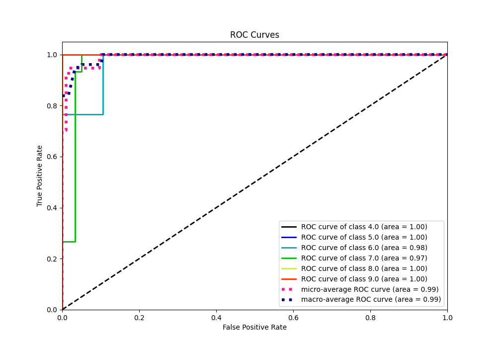
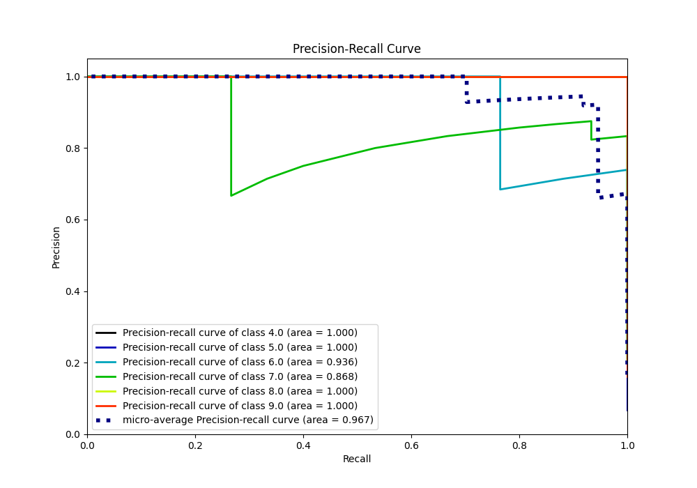

# Summary of 5_Default_NeuralNetwork

[<< Go back](../README.md)

## Neural Network
- **n_jobs**: -1
- **dense_1_size**: 32
- **dense_2_size**: 16
- **learning_rate**: 0.05
- **num_class**: 6
- **explain_level**: 2

## Validation
 - **validation_type**: split
 - **train_ratio**: 0.75
 - **shuffle**: True
 - **stratify**: True

## Optimized metric
logloss

## Training time

0.7 seconds

### Metric details
|           |      4.0 |   5.0 |       6.0 |       7.0 |       8.0 |   9.0 |   accuracy |   macro avg |   weighted avg |   logloss |
|:----------|---------:|------:|----------:|----------:|----------:|------:|-----------:|------------:|---------------:|----------:|
| precision | 0.714286 |     1 |  0.928571 |  0.823529 |  1        |     1 |   0.918919 |    0.911064 |       0.928515 |  0.303876 |
| recall    | 1        |     1 |  0.764706 |  0.933333 |  0.95     |     1 |   0.918919 |    0.94134  |       0.918919 |  0.303876 |
| f1-score  | 0.833333 |     1 |  0.83871  |  0.875    |  0.974359 |     1 |   0.918919 |    0.920234 |       0.919418 |  0.303876 |
| support   | 5        |     5 | 17        | 15        | 20        |    12 |   0.918919 |   74        |      74        |  0.303876 |

## Confusion matrix
|                |   Predicted as 4.0 |   Predicted as 5.0 |   Predicted as 6.0 |   Predicted as 7.0 |   Predicted as 8.0 |   Predicted as 9.0 |
|:---------------|-------------------:|-------------------:|-------------------:|-------------------:|-------------------:|-------------------:|
| Labeled as 4.0 |                  5 |                  0 |                  0 |                  0 |                  0 |                  0 |
| Labeled as 5.0 |                  0 |                  5 |                  0 |                  0 |                  0 |                  0 |
| Labeled as 6.0 |                  2 |                  0 |                 13 |                  2 |                  0 |                  0 |
| Labeled as 7.0 |                  0 |                  0 |                  1 |                 14 |                  0 |                  0 |
| Labeled as 8.0 |                  0 |                  0 |                  0 |                  1 |                 19 |                  0 |
| Labeled as 9.0 |                  0 |                  0 |                  0 |                  0 |                  0 |                 12 |

## Learning curves

## Permutation-based Importance

## Confusion Matrix

## Normalized Confusion Matrix

## ROC Curve

## Precision Recall Curve

[<< Go back](../README.md)
