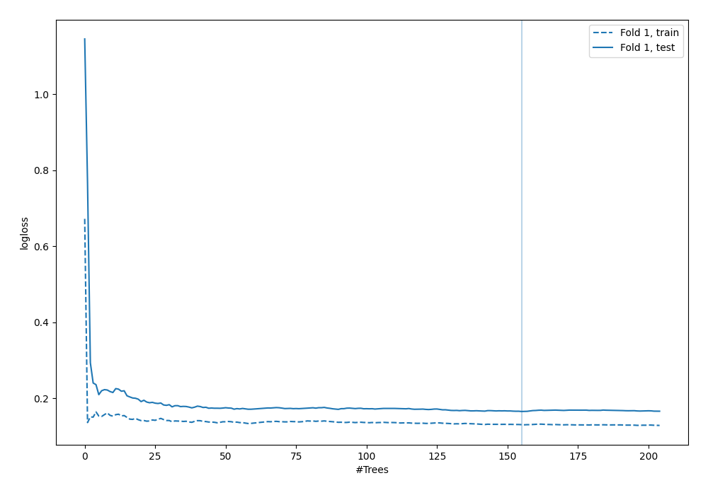
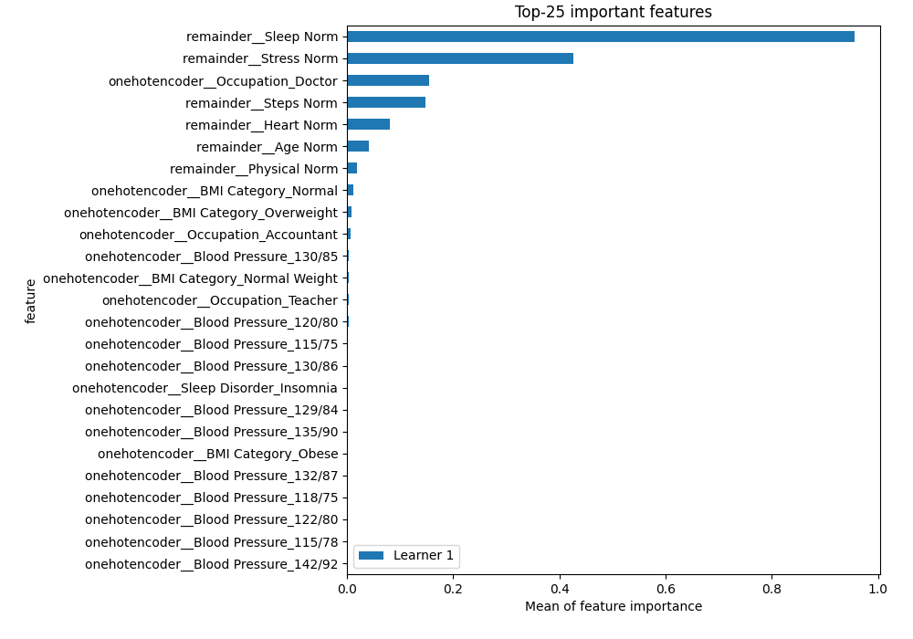
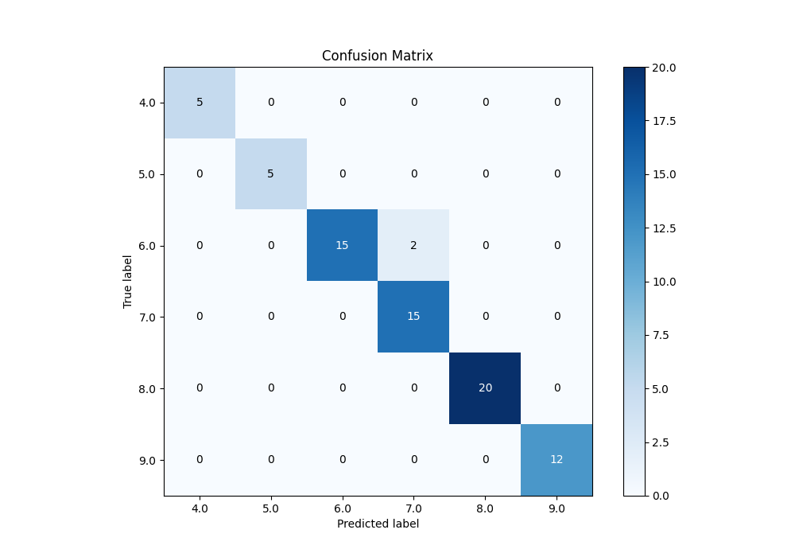
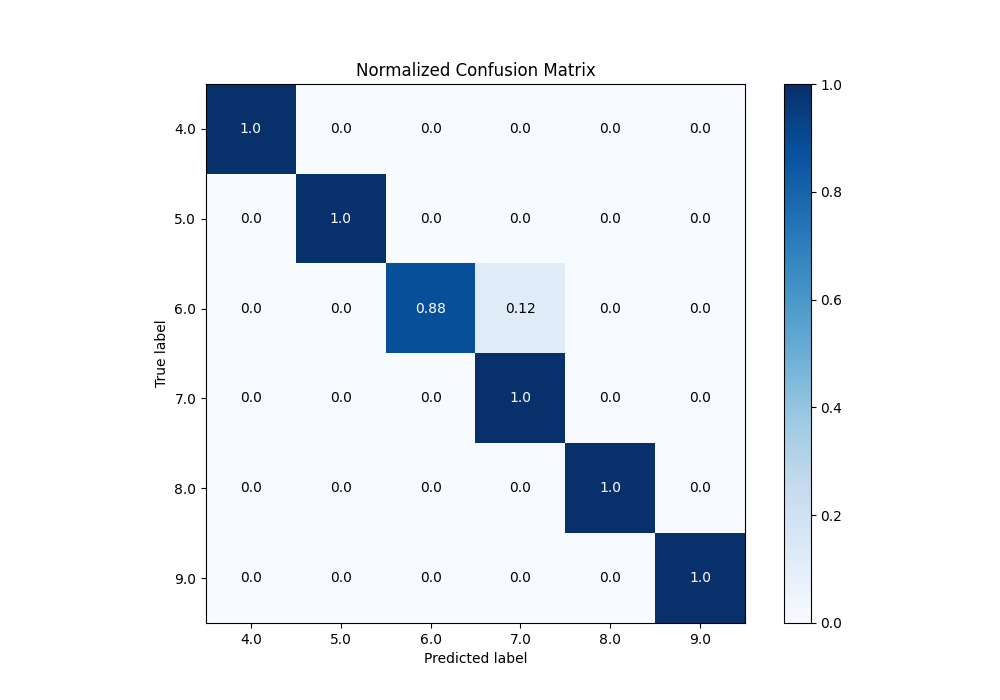
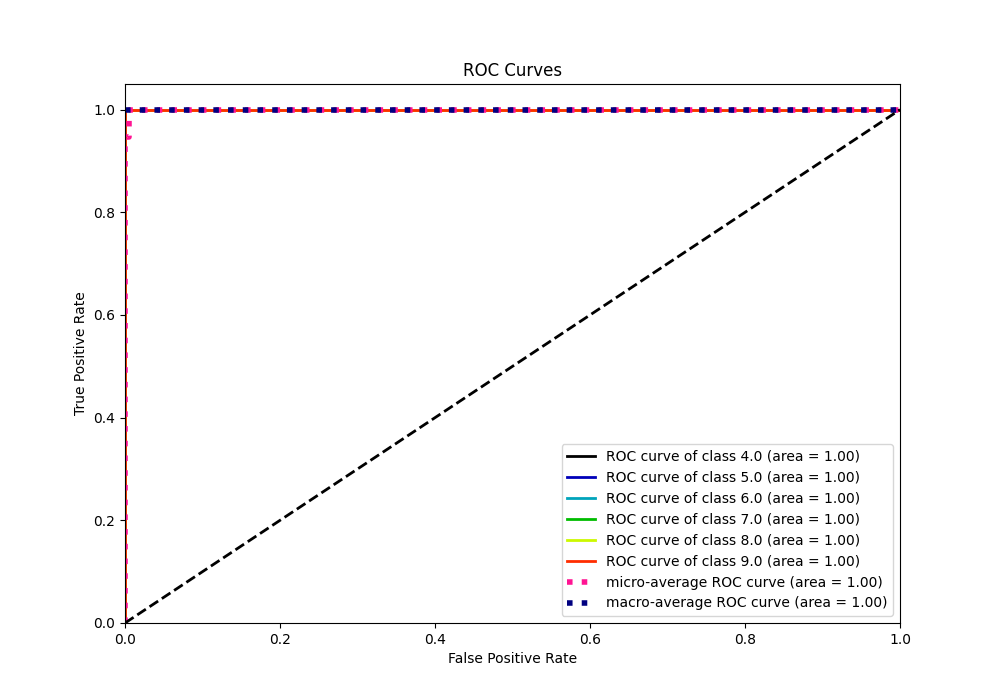
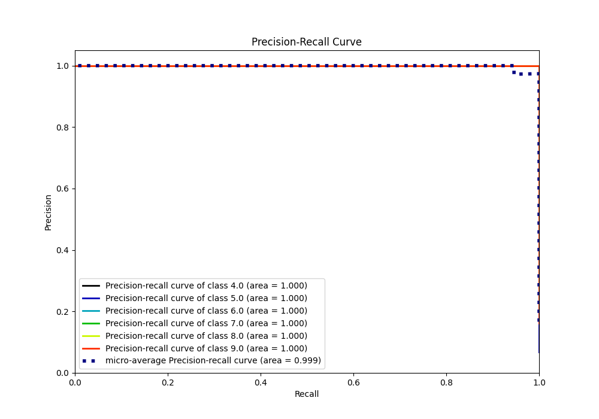

# Summary of 6_Default_RandomForest

[<< Go back](../README.md)

## Random Forest
- **n_jobs**: -1
- **criterion**: gini
- **max_features**: 0.9
- **min_samples_split**: 30
- **max_depth**: 4
- **eval_metric_name**: logloss
- **num_class**: 6
- **explain_level**: 2

## Validation
 - **validation_type**: split
 - **train_ratio**: 0.75
 - **shuffle**: True
 - **stratify**: True

## Optimized metric
logloss

## Training time

3.1 seconds

### Metric details
|           |   4.0 |   5.0 |       6.0 |       7.0 |   8.0 |   9.0 |   accuracy |   macro avg |   weighted avg |   logloss |
|:----------|------:|------:|----------:|----------:|------:|------:|-----------:|------------:|---------------:|----------:|
| precision |     1 |     1 |  1        |  0.882353 |     1 |     1 |   0.972973 |    0.980392 |       0.976153 |  0.165033 |
| recall    |     1 |     1 |  0.882353 |  1        |     1 |     1 |   0.972973 |    0.980392 |       0.972973 |  0.165033 |
| f1-score  |     1 |     1 |  0.9375   |  0.9375   |     1 |     1 |   0.972973 |    0.979167 |       0.972973 |  0.165033 |
| support   |     5 |     5 | 17        | 15        |    20 |    12 |   0.972973 |   74        |      74        |  0.165033 |

## Confusion matrix
|                |   Predicted as 4.0 |   Predicted as 5.0 |   Predicted as 6.0 |   Predicted as 7.0 |   Predicted as 8.0 |   Predicted as 9.0 |
|:---------------|-------------------:|-------------------:|-------------------:|-------------------:|-------------------:|-------------------:|
| Labeled as 4.0 |                  5 |                  0 |                  0 |                  0 |                  0 |                  0 |
| Labeled as 5.0 |                  0 |                  5 |                  0 |                  0 |                  0 |                  0 |
| Labeled as 6.0 |                  0 |                  0 |                 15 |                  2 |                  0 |                  0 |
| Labeled as 7.0 |                  0 |                  0 |                  0 |                 15 |                  0 |                  0 |
| Labeled as 8.0 |                  0 |                  0 |                  0 |                  0 |                 20 |                  0 |
| Labeled as 9.0 |                  0 |                  0 |                  0 |                  0 |                  0 |                 12 |

## Learning curves

## Permutation-based Importance

## Confusion Matrix

## Normalized Confusion Matrix

## ROC Curve

## Precision Recall Curve

[<< Go back](../README.md)
