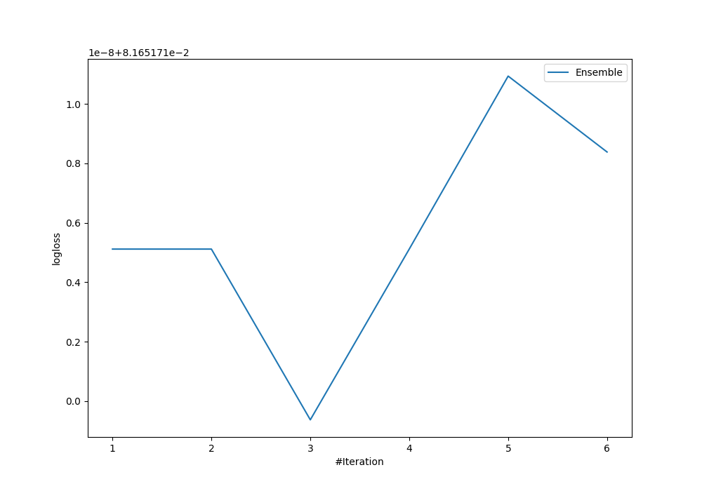
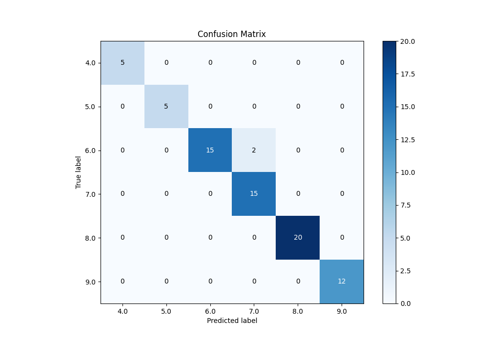
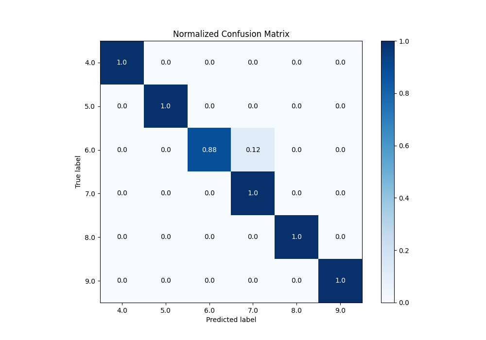
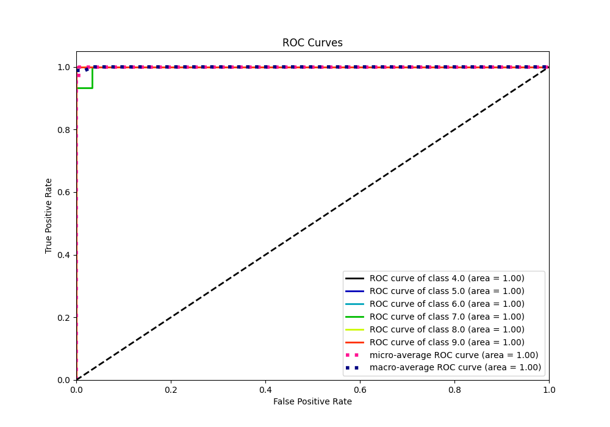
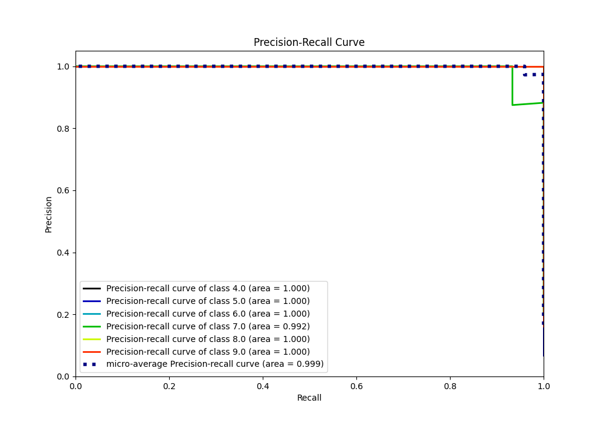

# Summary of Ensemble

[<< Go back](../README.md)

## Ensemble structure
| Model             |   Weight |
|:------------------|---------:|
| 4_Default_Xgboost |        3 |

### Metric details
|           |   4.0 |   5.0 |       6.0 |       7.0 |   8.0 |   9.0 |   accuracy |   macro avg |   weighted avg |   logloss |
|:----------|------:|------:|----------:|----------:|------:|------:|-----------:|------------:|---------------:|----------:|
| precision |     1 |     1 |  1        |  0.882353 |     1 |     1 |   0.972973 |    0.980392 |       0.976153 | 0.0816517 |
| recall    |     1 |     1 |  0.882353 |  1        |     1 |     1 |   0.972973 |    0.980392 |       0.972973 | 0.0816517 |
| f1-score  |     1 |     1 |  0.9375   |  0.9375   |     1 |     1 |   0.972973 |    0.979167 |       0.972973 | 0.0816517 |
| support   |     5 |     5 | 17        | 15        |    20 |    12 |   0.972973 |   74        |      74        | 0.0816517 |

## Confusion matrix
|                |   Predicted as 4.0 |   Predicted as 5.0 |   Predicted as 6.0 |   Predicted as 7.0 |   Predicted as 8.0 |   Predicted as 9.0 |
|:---------------|-------------------:|-------------------:|-------------------:|-------------------:|-------------------:|-------------------:|
| Labeled as 4.0 |                  5 |                  0 |                  0 |                  0 |                  0 |                  0 |
| Labeled as 5.0 |                  0 |                  5 |                  0 |                  0 |                  0 |                  0 |
| Labeled as 6.0 |                  0 |                  0 |                 15 |                  2 |                  0 |                  0 |
| Labeled as 7.0 |                  0 |                  0 |                  0 |                 15 |                  0 |                  0 |
| Labeled as 8.0 |                  0 |                  0 |                  0 |                  0 |                 20 |                  0 |
| Labeled as 9.0 |                  0 |                  0 |                  0 |                  0 |                  0 |                 12 |

## Learning curves

## Confusion Matrix

## Normalized Confusion Matrix

## ROC Curve

## Precision Recall Curve

[<< Go back](../README.md)
