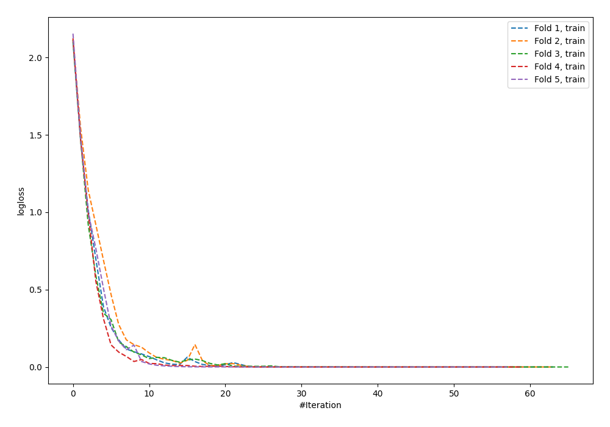
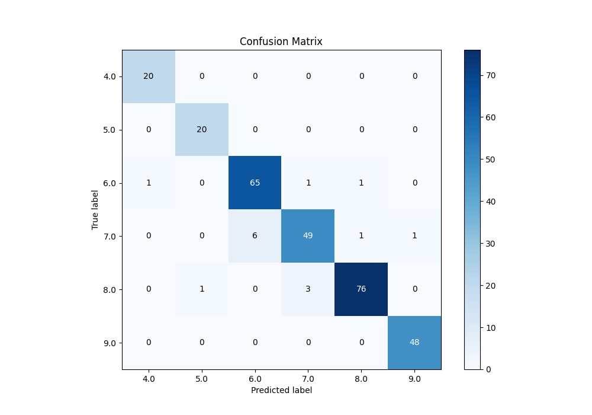
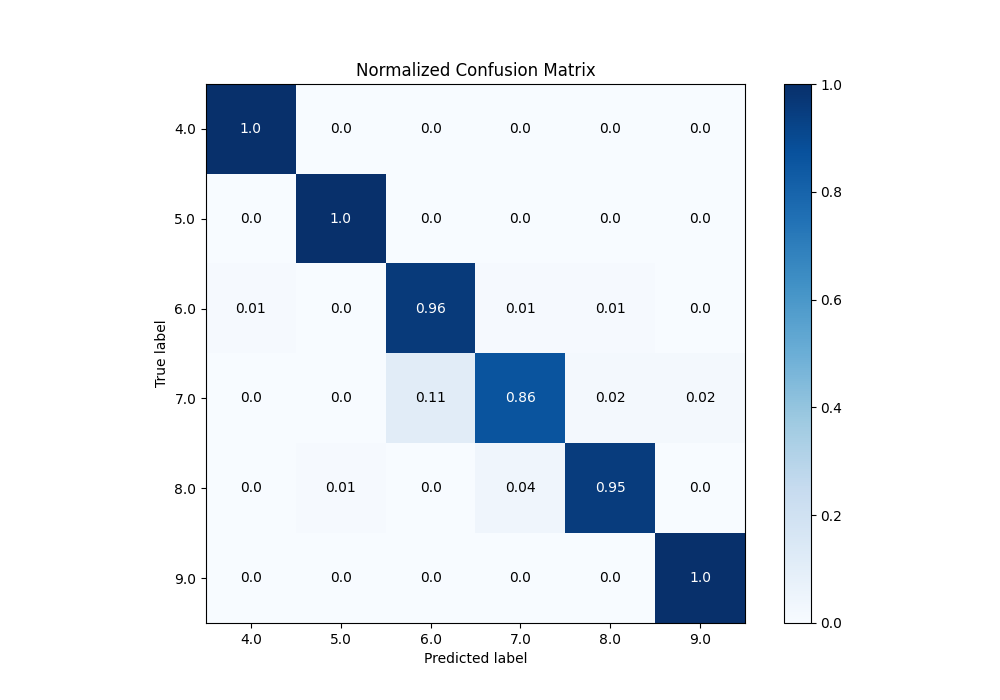
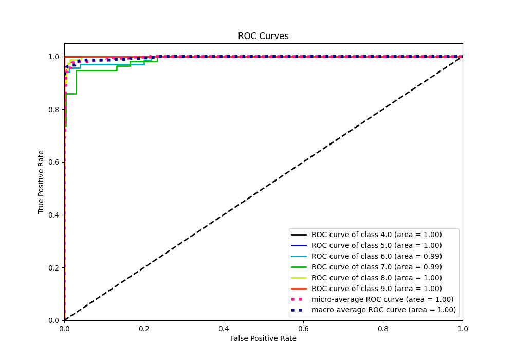
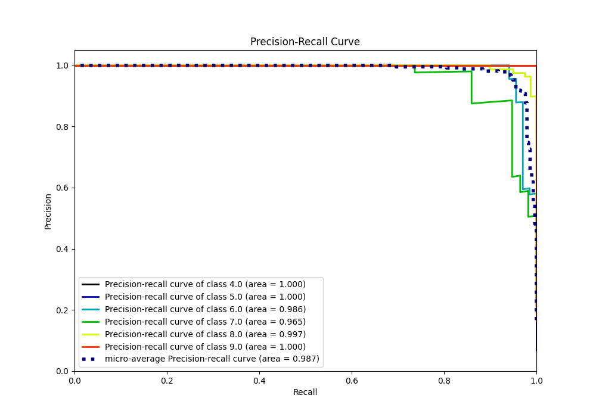

# Summary of 100_NeuralNetwork

[<< Go back](../README.md)

## Neural Network
- **n_jobs**: -1
- **dense_1_size**: 32
- **dense_2_size**: 8
- **learning_rate**: 0.05
- **num_class**: 6
- **explain_level**: 0

## Validation
 - **validation_type**: kfold
 - **k_folds**: 5

## Optimized metric
accuracy

## Training time

8.1 seconds

### Metric details
|           |       4.0 |       5.0 |       6.0 |       7.0 |       8.0 |       9.0 |   accuracy |   macro avg |   weighted avg |   logloss |
|:----------|----------:|----------:|----------:|----------:|----------:|----------:|-----------:|------------:|---------------:|----------:|
| precision |  0.952381 |  0.952381 |  0.915493 |  0.924528 |  0.974359 |  0.979592 |   0.948805 |    0.949789 |       0.94886  |  0.191844 |
| recall    |  1        |  1        |  0.955882 |  0.859649 |  0.95     |  1        |   0.948805 |    0.960922 |       0.948805 |  0.191844 |
| f1-score  |  0.97561  |  0.97561  |  0.935252 |  0.890909 |  0.962025 |  0.989691 |   0.948805 |    0.954849 |       0.948364 |  0.191844 |
| support   | 20        | 20        | 68        | 57        | 80        | 48        |   0.948805 |  293        |     293        |  0.191844 |

## Confusion matrix
|                |   Predicted as 4.0 |   Predicted as 5.0 |   Predicted as 6.0 |   Predicted as 7.0 |   Predicted as 8.0 |   Predicted as 9.0 |
|:---------------|-------------------:|-------------------:|-------------------:|-------------------:|-------------------:|-------------------:|
| Labeled as 4.0 |                 20 |                  0 |                  0 |                  0 |                  0 |                  0 |
| Labeled as 5.0 |                  0 |                 20 |                  0 |                  0 |                  0 |                  0 |
| Labeled as 6.0 |                  1 |                  0 |                 65 |                  1 |                  1 |                  0 |
| Labeled as 7.0 |                  0 |                  0 |                  6 |                 49 |                  1 |                  1 |
| Labeled as 8.0 |                  0 |                  1 |                  0 |                  3 |                 76 |                  0 |
| Labeled as 9.0 |                  0 |                  0 |                  0 |                  0 |                  0 |                 48 |

## Learning curves

## Confusion Matrix

## Normalized Confusion Matrix

## ROC Curve

## Precision Recall Curve

[<< Go back](../README.md)
