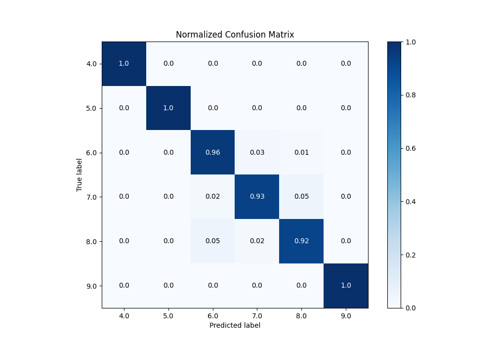

# Summary of 100_NeuralNetwork_Stacked

[<< Go back](../README.md)

## Neural Network
- **n_jobs**: -1
- **dense_1_size**: 32
- **dense_2_size**: 8
- **learning_rate**: 0.05
- **num_class**: 6
- **explain_level**: 0

## Validation
 - **validation_type**: kfold
 - **k_folds**: 5

## Optimized metric
accuracy

## Training time

14.8 seconds

### Metric details
|           |   4.0 |   5.0 |       6.0 |       7.0 |       8.0 |   9.0 |   accuracy |   macro avg |   weighted avg |   logloss |
|:----------|------:|------:|----------:|----------:|----------:|------:|-----------:|------------:|---------------:|----------:|
| precision |     1 |     1 |  0.928571 |  0.929825 |  0.948718 |     1 |   0.955631 |    0.967852 |       0.955769 |  0.276589 |
| recall    |     1 |     1 |  0.955882 |  0.929825 |  0.925    |     1 |   0.955631 |    0.968451 |       0.955631 |  0.276589 |
| f1-score  |     1 |     1 |  0.942029 |  0.929825 |  0.936709 |     1 |   0.955631 |    0.968094 |       0.955613 |  0.276589 |
| support   |    20 |    20 | 68        | 57        | 80        |    48 |   0.955631 |  293        |     293        |  0.276589 |

## Confusion matrix
|                |   Predicted as 4.0 |   Predicted as 5.0 |   Predicted as 6.0 |   Predicted as 7.0 |   Predicted as 8.0 |   Predicted as 9.0 |
|:---------------|-------------------:|-------------------:|-------------------:|-------------------:|-------------------:|-------------------:|
| Labeled as 4.0 |                 20 |                  0 |                  0 |                  0 |                  0 |                  0 |
| Labeled as 5.0 |                  0 |                 20 |                  0 |                  0 |                  0 |                  0 |
| Labeled as 6.0 |                  0 |                  0 |                 65 |                  2 |                  1 |                  0 |
| Labeled as 7.0 |                  0 |                  0 |                  1 |                 53 |                  3 |                  0 |
| Labeled as 8.0 |                  0 |                  0 |                  4 |                  2 |                 74 |                  0 |
| Labeled as 9.0 |                  0 |                  0 |                  0 |                  0 |                  0 |                 48 |

## Learning curves

## Confusion Matrix

## Normalized Confusion Matrix

## ROC Curve

## Precision Recall Curve

[<< Go back](../README.md)
