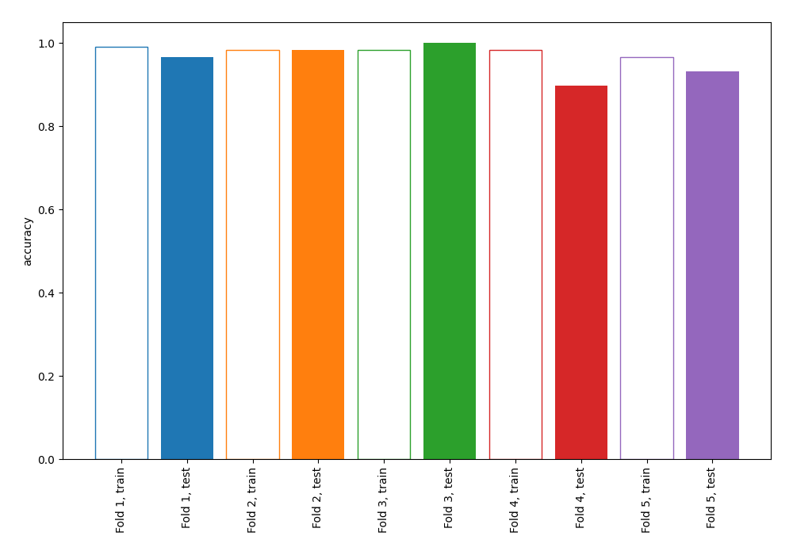
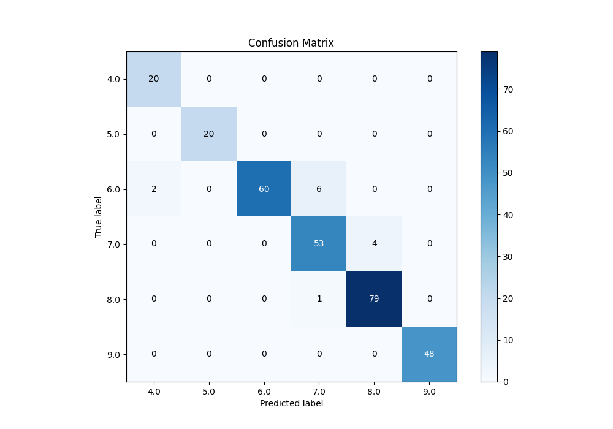
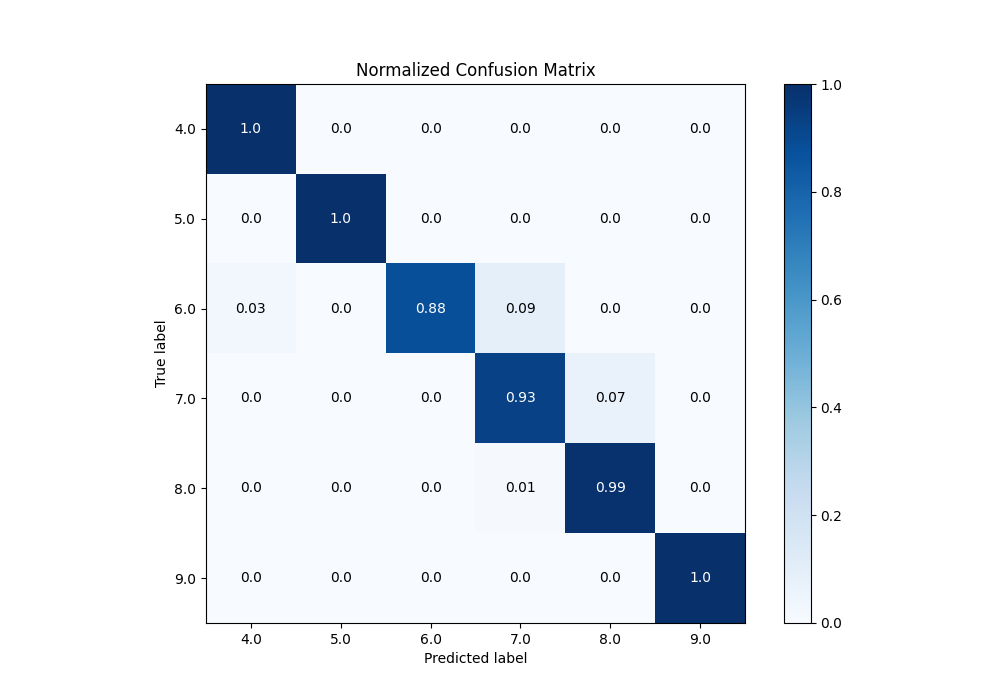
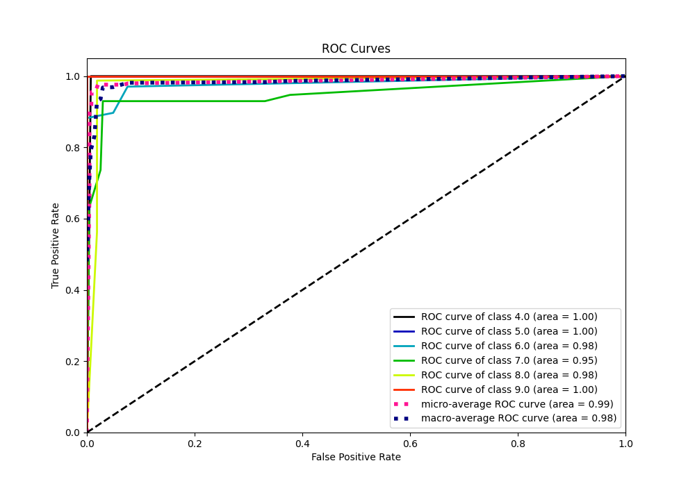
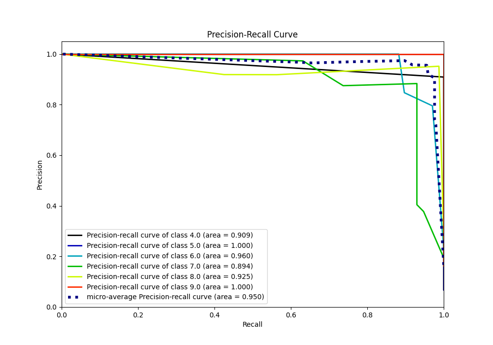

# Summary of 101_DecisionTree

[<< Go back](../README.md)

## Decision Tree
- **n_jobs**: -1
- **criterion**: entropy
- **max_depth**: 4
- **num_class**: 6
- **explain_level**: 0

## Validation
 - **validation_type**: kfold
 - **k_folds**: 5

## Optimized metric
accuracy

## Training time

9.2 seconds

### Metric details
|           |       4.0 |   5.0 |       6.0 |       7.0 |       8.0 |   9.0 |   accuracy |   macro avg |   weighted avg |   logloss |
|:----------|----------:|------:|----------:|----------:|----------:|------:|-----------:|------------:|---------------:|----------:|
| precision |  0.909091 |     1 |  1        |  0.883333 |  0.951807 |     1 |   0.955631 |    0.957372 |       0.95794  |  0.403012 |
| recall    |  1        |     1 |  0.882353 |  0.929825 |  0.9875   |     1 |   0.955631 |    0.966613 |       0.955631 |  0.403012 |
| f1-score  |  0.952381 |     1 |  0.9375   |  0.905983 |  0.969325 |     1 |   0.955631 |    0.960865 |       0.955579 |  0.403012 |
| support   | 20        |    20 | 68        | 57        | 80        |    48 |   0.955631 |  293        |     293        |  0.403012 |

## Confusion matrix
|                |   Predicted as 4.0 |   Predicted as 5.0 |   Predicted as 6.0 |   Predicted as 7.0 |   Predicted as 8.0 |   Predicted as 9.0 |
|:---------------|-------------------:|-------------------:|-------------------:|-------------------:|-------------------:|-------------------:|
| Labeled as 4.0 |                 20 |                  0 |                  0 |                  0 |                  0 |                  0 |
| Labeled as 5.0 |                  0 |                 20 |                  0 |                  0 |                  0 |                  0 |
| Labeled as 6.0 |                  2 |                  0 |                 60 |                  6 |                  0 |                  0 |
| Labeled as 7.0 |                  0 |                  0 |                  0 |                 53 |                  4 |                  0 |
| Labeled as 8.0 |                  0 |                  0 |                  0 |                  1 |                 79 |                  0 |
| Labeled as 9.0 |                  0 |                  0 |                  0 |                  0 |                  0 |                 48 |

## Learning curves

## Confusion Matrix

## Normalized Confusion Matrix

## ROC Curve

## Precision Recall Curve

[<< Go back](../README.md)
