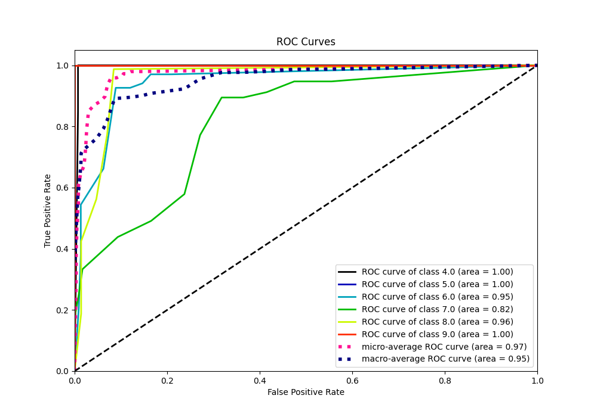

# Summary of 103_DecisionTree

[<< Go back](../README.md)

## Decision Tree
- **n_jobs**: -1
- **criterion**: entropy
- **max_depth**: 3
- **num_class**: 6
- **explain_level**: 0

## Validation
 - **validation_type**: kfold
 - **k_folds**: 5

## Optimized metric
accuracy

## Training time

9.4 seconds

### Metric details
|           |       4.0 |   5.0 |       6.0 |       7.0 |       8.0 |   9.0 |   accuracy |   macro avg |   weighted avg |   logloss |
|:----------|----------:|------:|----------:|----------:|----------:|------:|-----------:|------------:|---------------:|----------:|
| precision |  0.909091 |     1 |  0.759036 |  0.826087 |  0.814433 |     1 |   0.849829 |    0.884774 |       0.853372 |   0.62644 |
| recall    |  1        |     1 |  0.926471 |  0.333333 |  0.9875   |     1 |   0.849829 |    0.874551 |       0.849829 |   0.62644 |
| f1-score  |  0.952381 |     1 |  0.834437 |  0.475    |  0.892655 |     1 |   0.849829 |    0.859079 |       0.826883 |   0.62644 |
| support   | 20        |    20 | 68        | 57        | 80        |    48 |   0.849829 |  293        |     293        |   0.62644 |

## Confusion matrix
|                |   Predicted as 4.0 |   Predicted as 5.0 |   Predicted as 6.0 |   Predicted as 7.0 |   Predicted as 8.0 |   Predicted as 9.0 |
|:---------------|-------------------:|-------------------:|-------------------:|-------------------:|-------------------:|-------------------:|
| Labeled as 4.0 |                 20 |                  0 |                  0 |                  0 |                  0 |                  0 |
| Labeled as 5.0 |                  0 |                 20 |                  0 |                  0 |                  0 |                  0 |
| Labeled as 6.0 |                  2 |                  0 |                 63 |                  3 |                  0 |                  0 |
| Labeled as 7.0 |                  0 |                  0 |                 20 |                 19 |                 18 |                  0 |
| Labeled as 8.0 |                  0 |                  0 |                  0 |                  1 |                 79 |                  0 |
| Labeled as 9.0 |                  0 |                  0 |                  0 |                  0 |                  0 |                 48 |

## Learning curves

## Confusion Matrix

## Normalized Confusion Matrix

## ROC Curve

## Precision Recall Curve

[<< Go back](../README.md)
