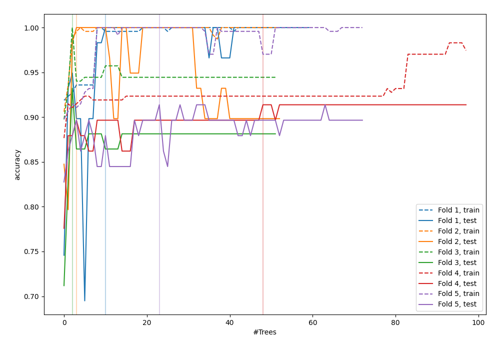
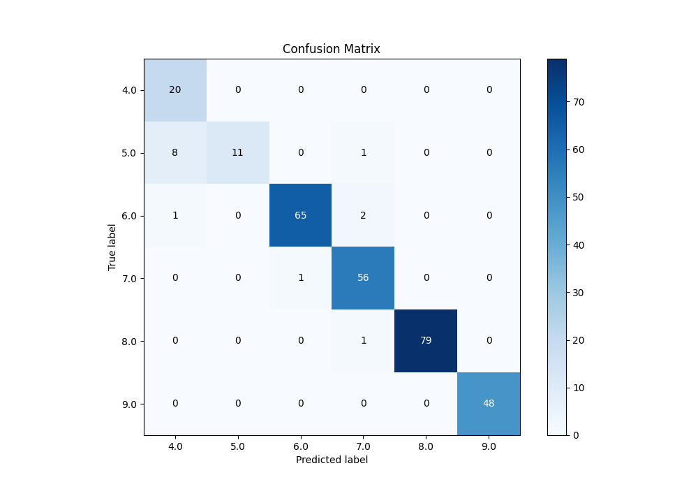
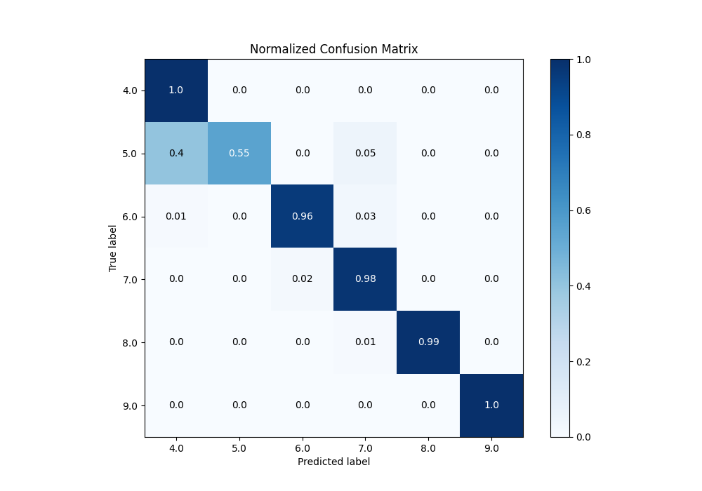
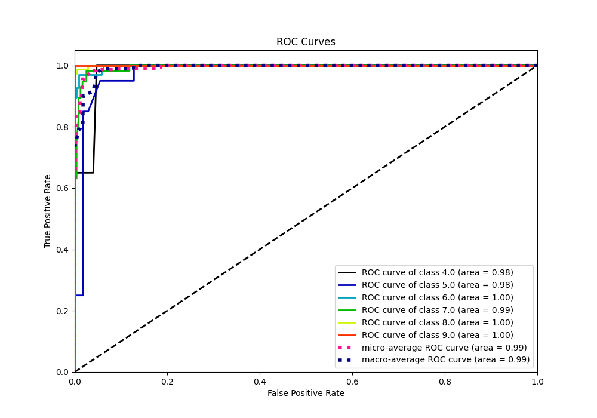
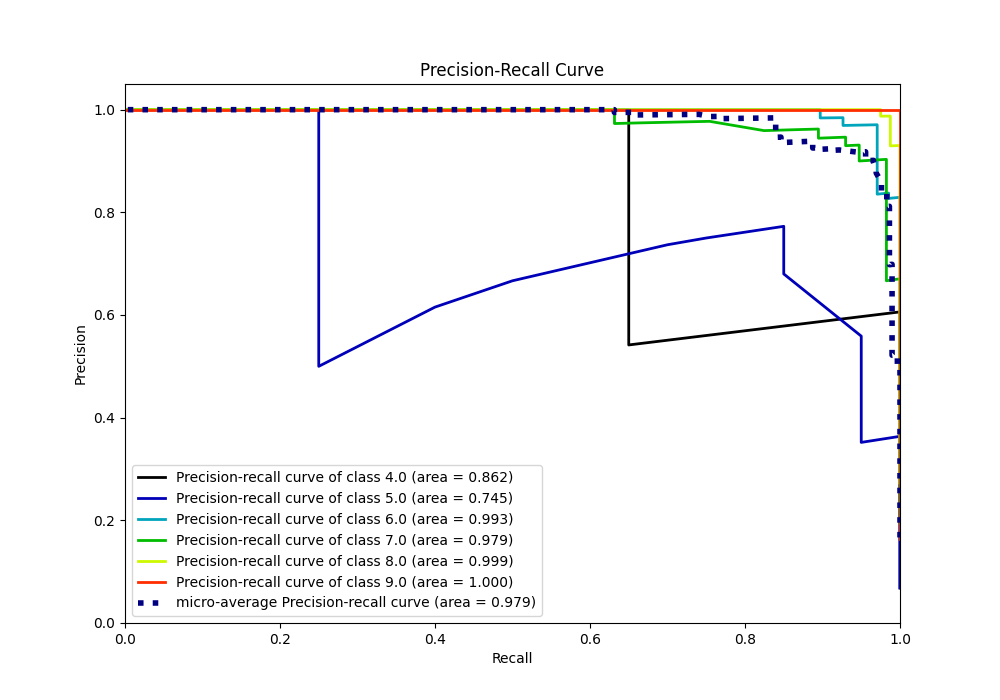

# Summary of 107_RandomForest_Stacked

[<< Go back](../README.md)

## Random Forest
- **n_jobs**: -1
- **criterion**: entropy
- **max_features**: 0.6
- **min_samples_split**: 30
- **max_depth**: 7
- **eval_metric_name**: accuracy
- **num_class**: 6
- **explain_level**: 0

## Validation
 - **validation_type**: kfold
 - **k_folds**: 5

## Optimized metric
accuracy

## Training time

17.6 seconds

### Metric details
|           |       4.0 |       5.0 |       6.0 |       7.0 |       8.0 |   9.0 |   accuracy |   macro avg |   weighted avg |   logloss |
|:----------|----------:|----------:|----------:|----------:|----------:|------:|-----------:|------------:|---------------:|----------:|
| precision |  0.689655 |  1        |  0.984848 |  0.933333 |  1        |     1 |   0.952218 |    0.934639 |       0.96233  |   0.28836 |
| recall    |  1        |  0.55     |  0.955882 |  0.982456 |  0.9875   |     1 |   0.952218 |    0.91264  |       0.952218 |   0.28836 |
| f1-score  |  0.816327 |  0.709677 |  0.970149 |  0.957265 |  0.993711 |     1 |   0.952218 |    0.907855 |       0.950687 |   0.28836 |
| support   | 20        | 20        | 68        | 57        | 80        |    48 |   0.952218 |  293        |     293        |   0.28836 |

## Confusion matrix
|                |   Predicted as 4.0 |   Predicted as 5.0 |   Predicted as 6.0 |   Predicted as 7.0 |   Predicted as 8.0 |   Predicted as 9.0 |
|:---------------|-------------------:|-------------------:|-------------------:|-------------------:|-------------------:|-------------------:|
| Labeled as 4.0 |                 20 |                  0 |                  0 |                  0 |                  0 |                  0 |
| Labeled as 5.0 |                  8 |                 11 |                  0 |                  1 |                  0 |                  0 |
| Labeled as 6.0 |                  1 |                  0 |                 65 |                  2 |                  0 |                  0 |
| Labeled as 7.0 |                  0 |                  0 |                  1 |                 56 |                  0 |                  0 |
| Labeled as 8.0 |                  0 |                  0 |                  0 |                  1 |                 79 |                  0 |
| Labeled as 9.0 |                  0 |                  0 |                  0 |                  0 |                  0 |                 48 |

## Learning curves

## Confusion Matrix

## Normalized Confusion Matrix

## ROC Curve

## Precision Recall Curve

[<< Go back](../README.md)
