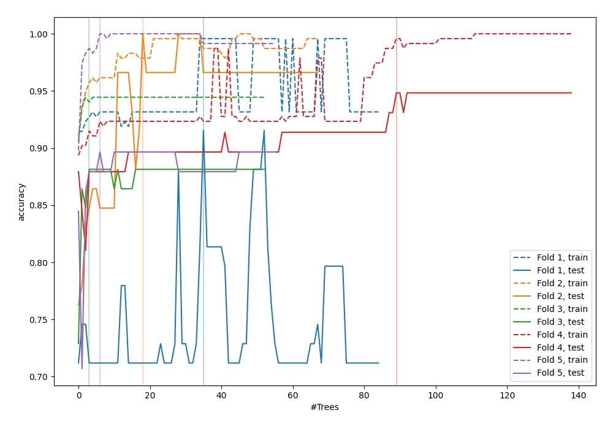
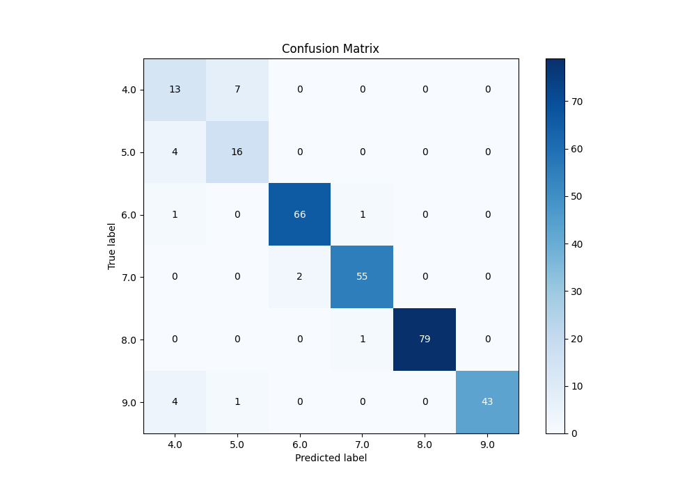
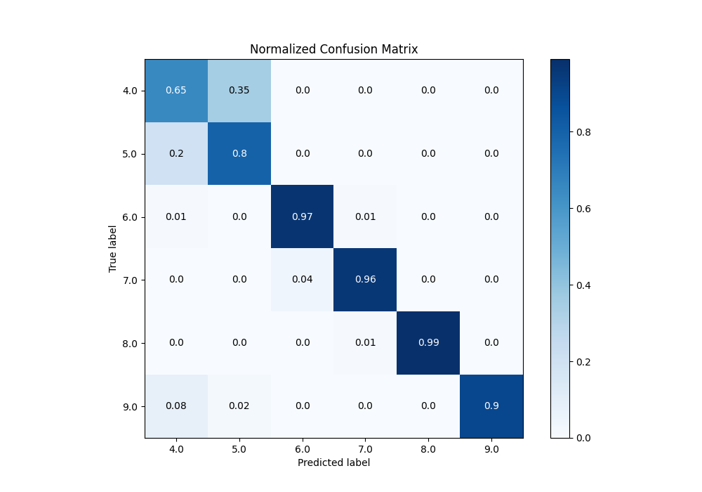
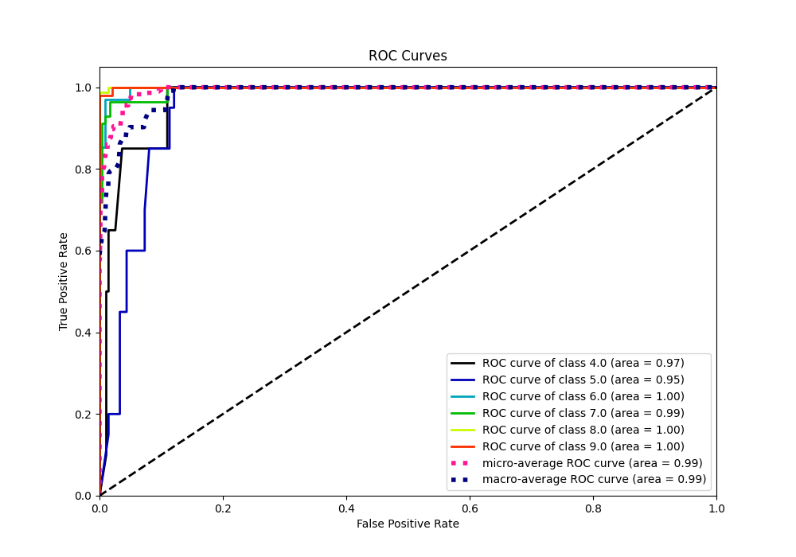
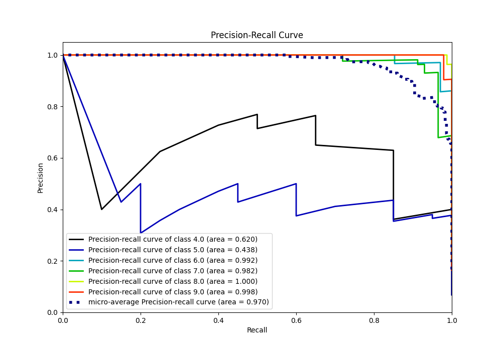

# Summary of 109_RandomForest_SelectedFeatures_Stacked

[<< Go back](../README.md)

## Random Forest
- **n_jobs**: -1
- **criterion**: entropy
- **max_features**: 0.7
- **min_samples_split**: 30
- **max_depth**: 7
- **eval_metric_name**: accuracy
- **num_class**: 6
- **explain_level**: 0

## Validation
 - **validation_type**: kfold
 - **k_folds**: 5

## Optimized metric
accuracy

## Training time

27.4 seconds

### Metric details
|           |       4.0 |       5.0 |       6.0 |       7.0 |       8.0 |       9.0 |   accuracy |   macro avg |   weighted avg |   logloss |
|:----------|----------:|----------:|----------:|----------:|----------:|----------:|-----------:|------------:|---------------:|----------:|
| precision |  0.590909 |  0.666667 |  0.970588 |  0.964912 |  1        |  1        |   0.928328 |    0.865513 |       0.935671 |  0.293035 |
| recall    |  0.65     |  0.8      |  0.970588 |  0.964912 |  0.9875   |  0.895833 |   0.928328 |    0.878139 |       0.928328 |  0.293035 |
| f1-score  |  0.619048 |  0.727273 |  0.970588 |  0.964912 |  0.993711 |  0.945055 |   0.928328 |    0.870098 |       0.93101  |  0.293035 |
| support   | 20        | 20        | 68        | 57        | 80        | 48        |   0.928328 |  293        |     293        |  0.293035 |

## Confusion matrix
|                |   Predicted as 4.0 |   Predicted as 5.0 |   Predicted as 6.0 |   Predicted as 7.0 |   Predicted as 8.0 |   Predicted as 9.0 |
|:---------------|-------------------:|-------------------:|-------------------:|-------------------:|-------------------:|-------------------:|
| Labeled as 4.0 |                 13 |                  7 |                  0 |                  0 |                  0 |                  0 |
| Labeled as 5.0 |                  4 |                 16 |                  0 |                  0 |                  0 |                  0 |
| Labeled as 6.0 |                  1 |                  0 |                 66 |                  1 |                  0 |                  0 |
| Labeled as 7.0 |                  0 |                  0 |                  2 |                 55 |                  0 |                  0 |
| Labeled as 8.0 |                  0 |                  0 |                  0 |                  1 |                 79 |                  0 |
| Labeled as 9.0 |                  4 |                  1 |                  0 |                  0 |                  0 |                 43 |

## Learning curves

## Confusion Matrix

## Normalized Confusion Matrix

## ROC Curve

## Precision Recall Curve

[<< Go back](../README.md)
