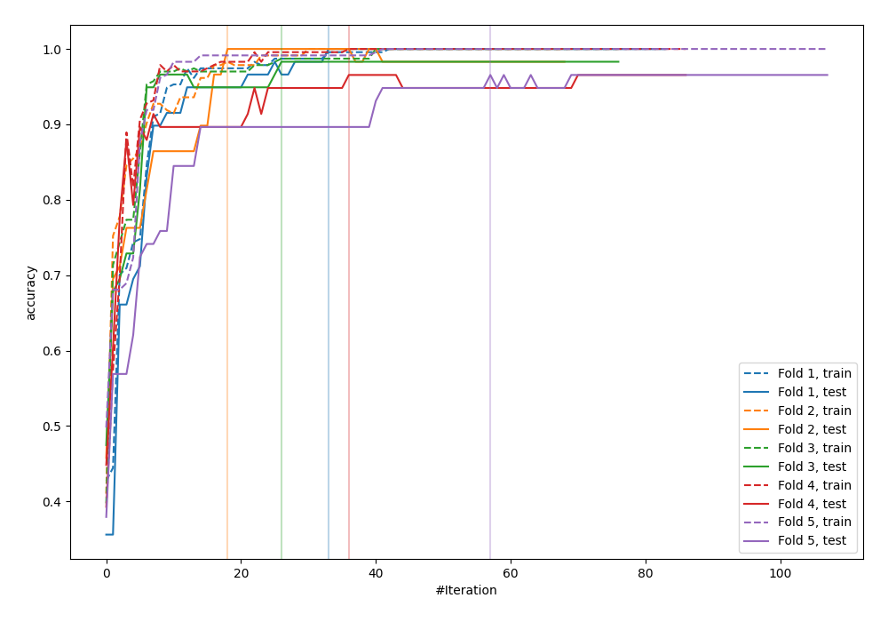
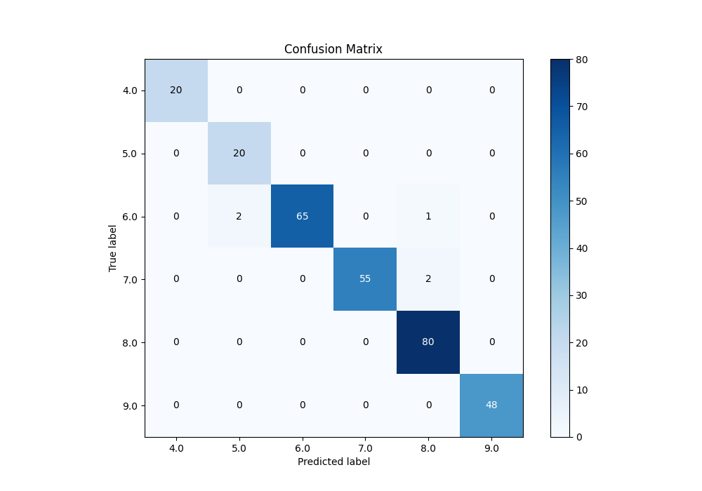
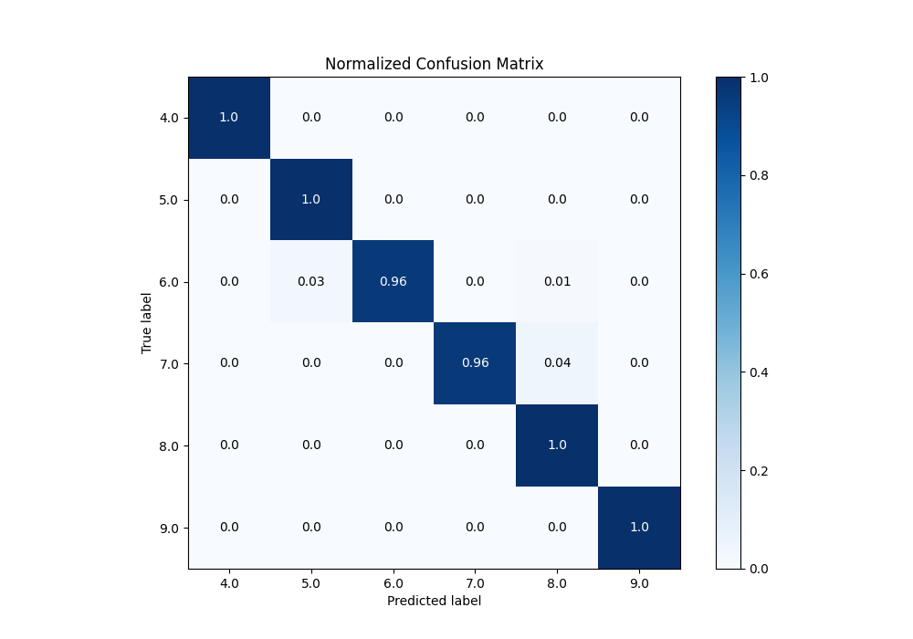
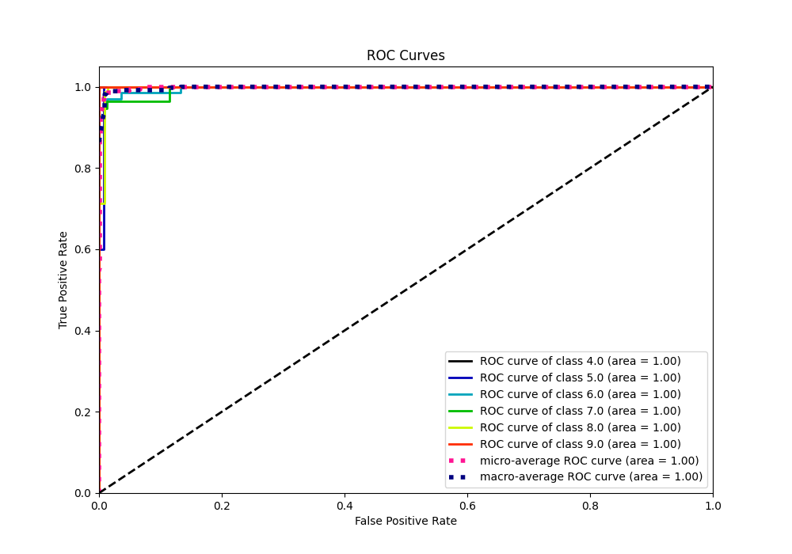
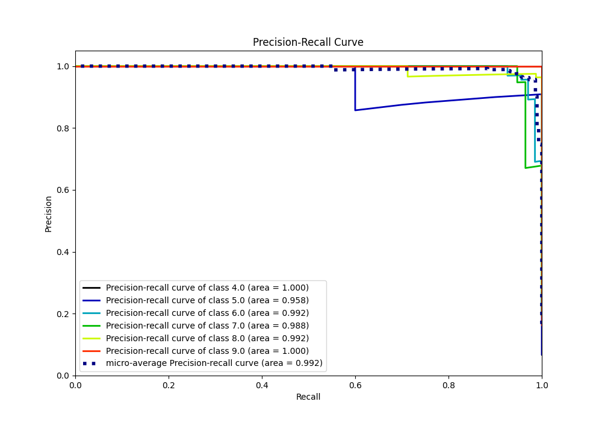

# Summary of 111_LightGBM

[<< Go back](../README.md)

## LightGBM
- **n_jobs**: -1
- **objective**: multiclass
- **num_leaves**: 63
- **learning_rate**: 0.05
- **feature_fraction**: 0.9
- **bagging_fraction**: 0.9
- **min_data_in_leaf**: 30
- **metric**: custom
- **custom_eval_metric_name**: accuracy
- **num_class**: 6
- **explain_level**: 0

## Validation
 - **validation_type**: kfold
 - **k_folds**: 5

## Optimized metric
accuracy

## Training time

8.3 seconds

### Metric details
|           |   4.0 |       5.0 |       6.0 |       7.0 |       8.0 |   9.0 |   accuracy |   macro avg |   weighted avg |   logloss |
|:----------|------:|----------:|----------:|----------:|----------:|------:|-----------:|------------:|---------------:|----------:|
| precision |     1 |  0.909091 |  1        |  1        |  0.963855 |     1 |   0.982935 |    0.978824 |       0.983926 |  0.278743 |
| recall    |     1 |  1        |  0.955882 |  0.964912 |  1        |     1 |   0.982935 |    0.986799 |       0.982935 |  0.278743 |
| f1-score  |     1 |  0.952381 |  0.977444 |  0.982143 |  0.981595 |     1 |   0.982935 |    0.98226  |       0.983015 |  0.278743 |
| support   |    20 | 20        | 68        | 57        | 80        |    48 |   0.982935 |  293        |     293        |  0.278743 |

## Confusion matrix
|                |   Predicted as 4.0 |   Predicted as 5.0 |   Predicted as 6.0 |   Predicted as 7.0 |   Predicted as 8.0 |   Predicted as 9.0 |
|:---------------|-------------------:|-------------------:|-------------------:|-------------------:|-------------------:|-------------------:|
| Labeled as 4.0 |                 20 |                  0 |                  0 |                  0 |                  0 |                  0 |
| Labeled as 5.0 |                  0 |                 20 |                  0 |                  0 |                  0 |                  0 |
| Labeled as 6.0 |                  0 |                  2 |                 65 |                  0 |                  1 |                  0 |
| Labeled as 7.0 |                  0 |                  0 |                  0 |                 55 |                  2 |                  0 |
| Labeled as 8.0 |                  0 |                  0 |                  0 |                  0 |                 80 |                  0 |
| Labeled as 9.0 |                  0 |                  0 |                  0 |                  0 |                  0 |                 48 |

## Learning curves

## Confusion Matrix

## Normalized Confusion Matrix

## ROC Curve

## Precision Recall Curve

[<< Go back](../README.md)
