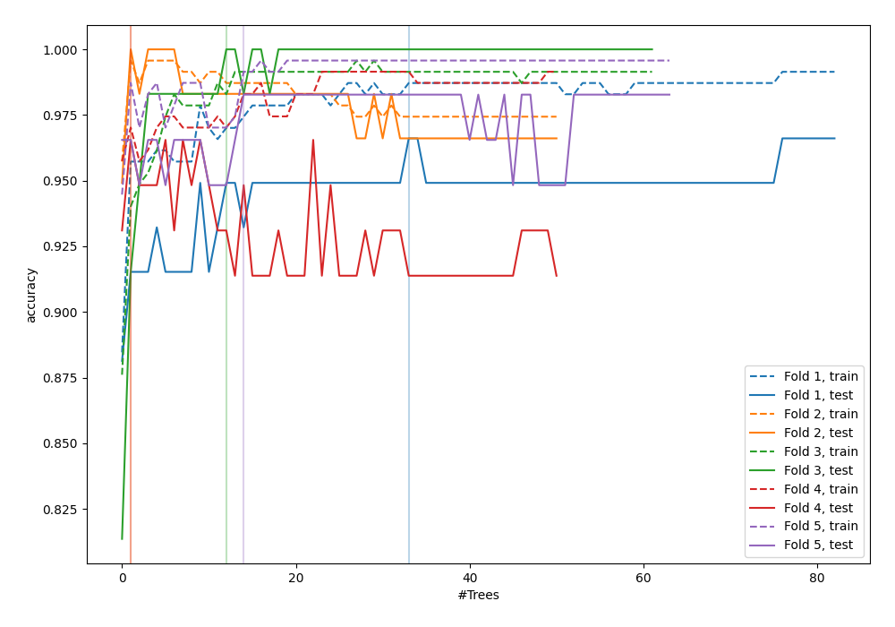
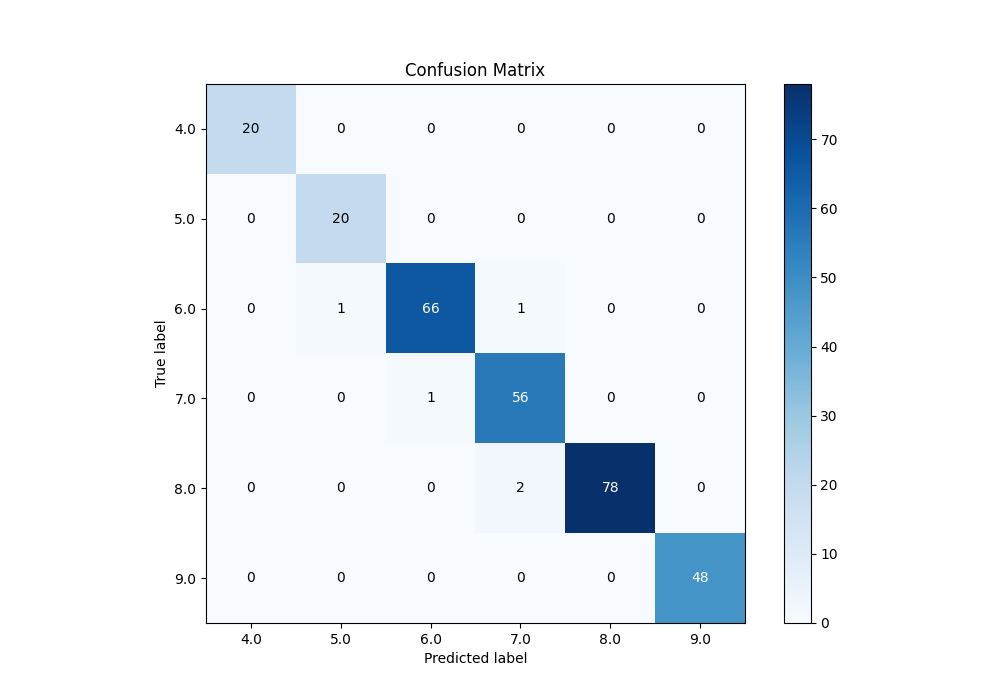
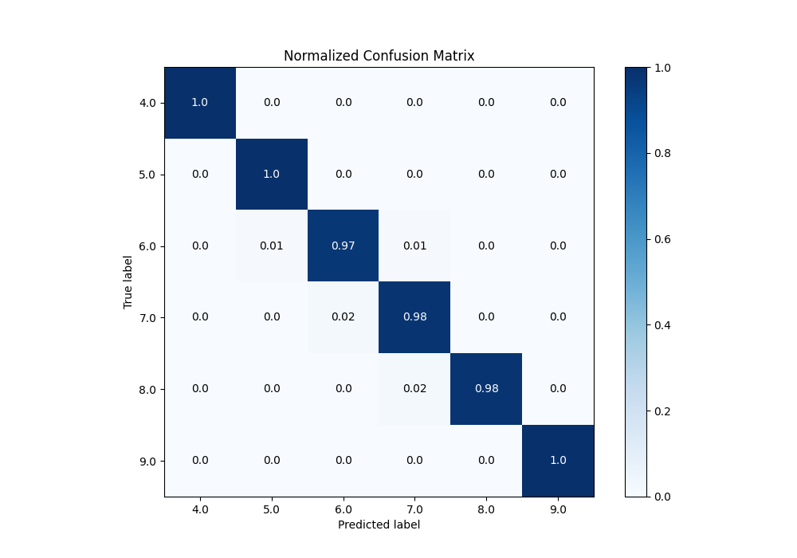
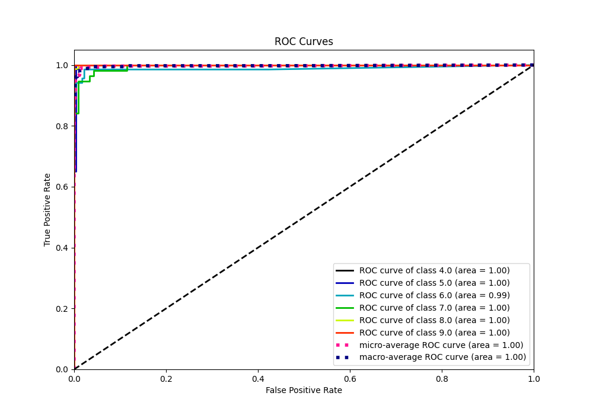
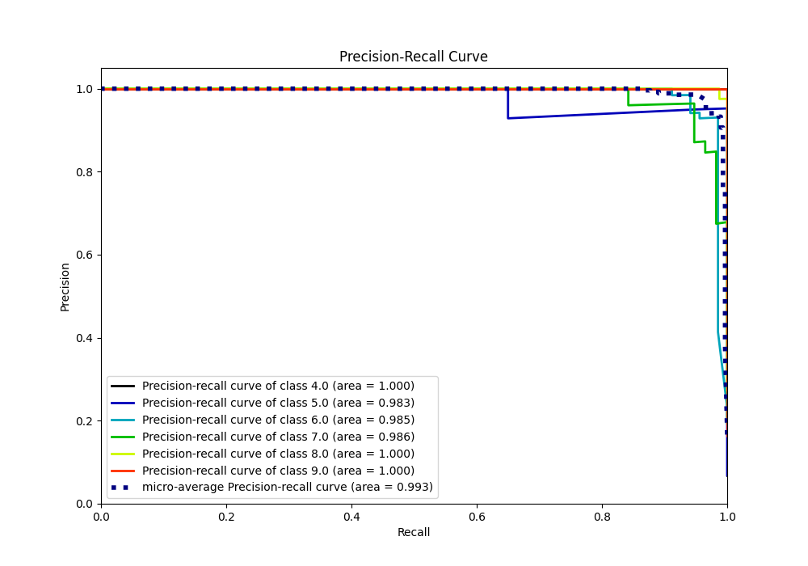

# Summary of 113_ExtraTrees

[<< Go back](../README.md)

## Extra Trees Classifier (Extra Trees)
- **n_jobs**: -1
- **criterion**: entropy
- **max_features**: 0.8
- **min_samples_split**: 30
- **max_depth**: 7
- **eval_metric_name**: accuracy
- **num_class**: 6
- **explain_level**: 0

## Validation
 - **validation_type**: kfold
 - **k_folds**: 5

## Optimized metric
accuracy

## Training time

8.8 seconds

### Metric details
|           |   4.0 |       5.0 |       6.0 |       7.0 |       8.0 |   9.0 |   accuracy |   macro avg |   weighted avg |   logloss |
|:----------|------:|----------:|----------:|----------:|----------:|------:|-----------:|------------:|---------------:|----------:|
| precision |     1 |  0.952381 |  0.985075 |  0.949153 |  1        |     1 |   0.982935 |    0.981101 |       0.983394 |  0.202888 |
| recall    |     1 |  1        |  0.970588 |  0.982456 |  0.975    |     1 |   0.982935 |    0.988007 |       0.982935 |  0.202888 |
| f1-score  |     1 |  0.97561  |  0.977778 |  0.965517 |  0.987342 |     1 |   0.982935 |    0.984374 |       0.983013 |  0.202888 |
| support   |    20 | 20        | 68        | 57        | 80        |    48 |   0.982935 |  293        |     293        |  0.202888 |

## Confusion matrix
|                |   Predicted as 4.0 |   Predicted as 5.0 |   Predicted as 6.0 |   Predicted as 7.0 |   Predicted as 8.0 |   Predicted as 9.0 |
|:---------------|-------------------:|-------------------:|-------------------:|-------------------:|-------------------:|-------------------:|
| Labeled as 4.0 |                 20 |                  0 |                  0 |                  0 |                  0 |                  0 |
| Labeled as 5.0 |                  0 |                 20 |                  0 |                  0 |                  0 |                  0 |
| Labeled as 6.0 |                  0 |                  1 |                 66 |                  1 |                  0 |                  0 |
| Labeled as 7.0 |                  0 |                  0 |                  1 |                 56 |                  0 |                  0 |
| Labeled as 8.0 |                  0 |                  0 |                  0 |                  2 |                 78 |                  0 |
| Labeled as 9.0 |                  0 |                  0 |                  0 |                  0 |                  0 |                 48 |

## Learning curves

## Confusion Matrix

## Normalized Confusion Matrix

## ROC Curve

## Precision Recall Curve

[<< Go back](../README.md)
