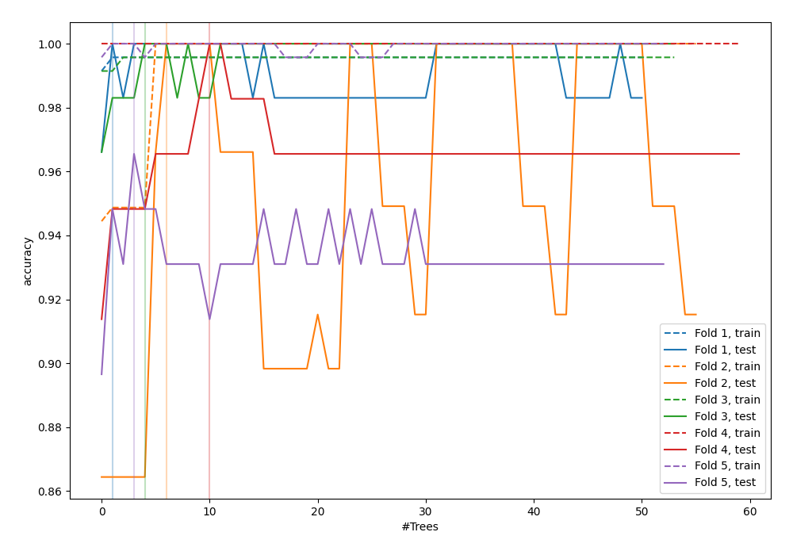
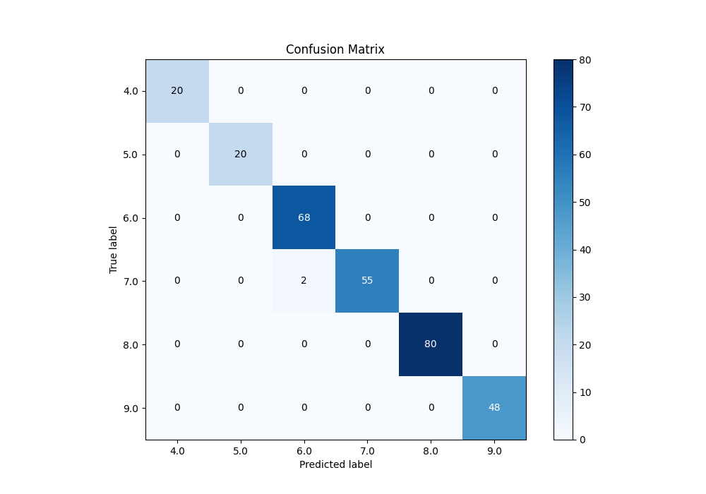
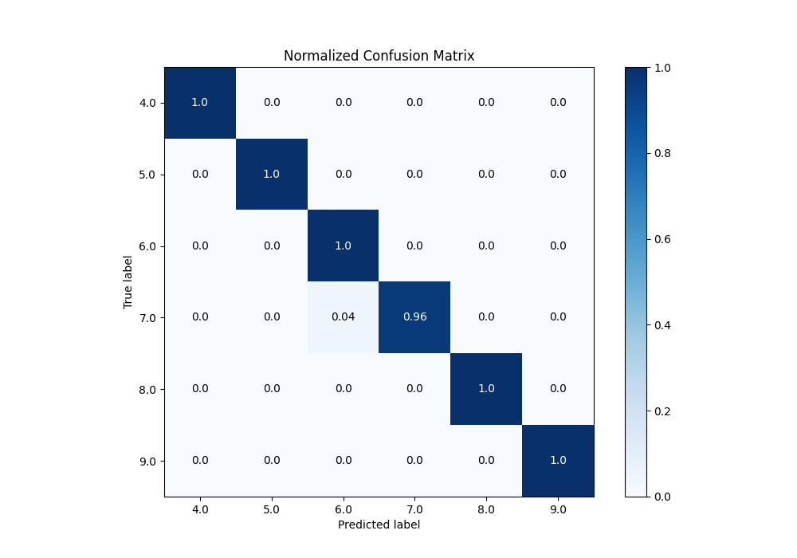
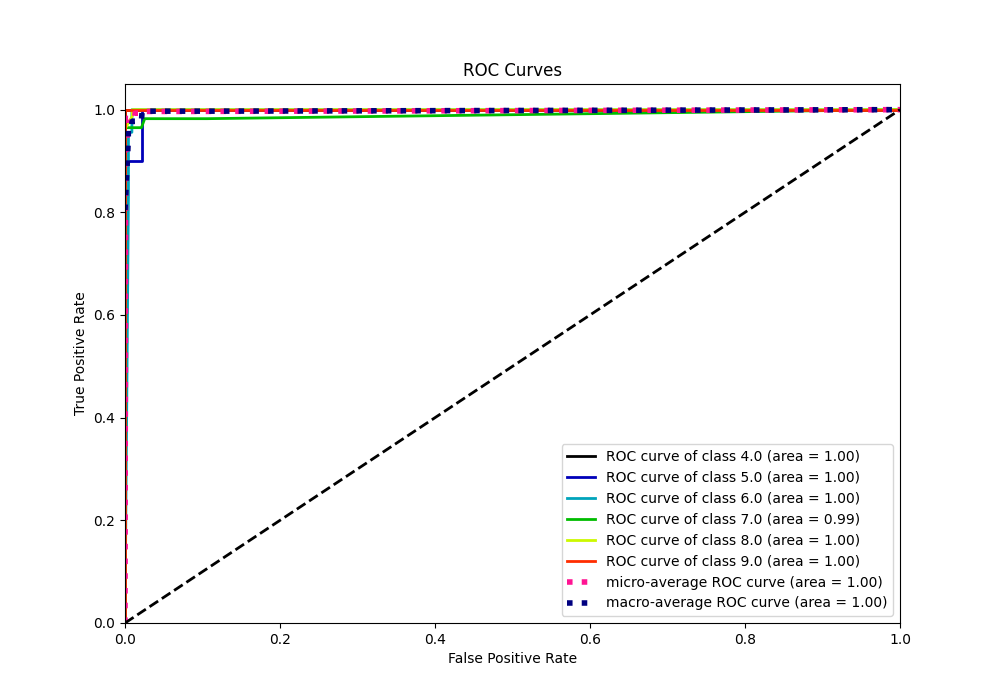
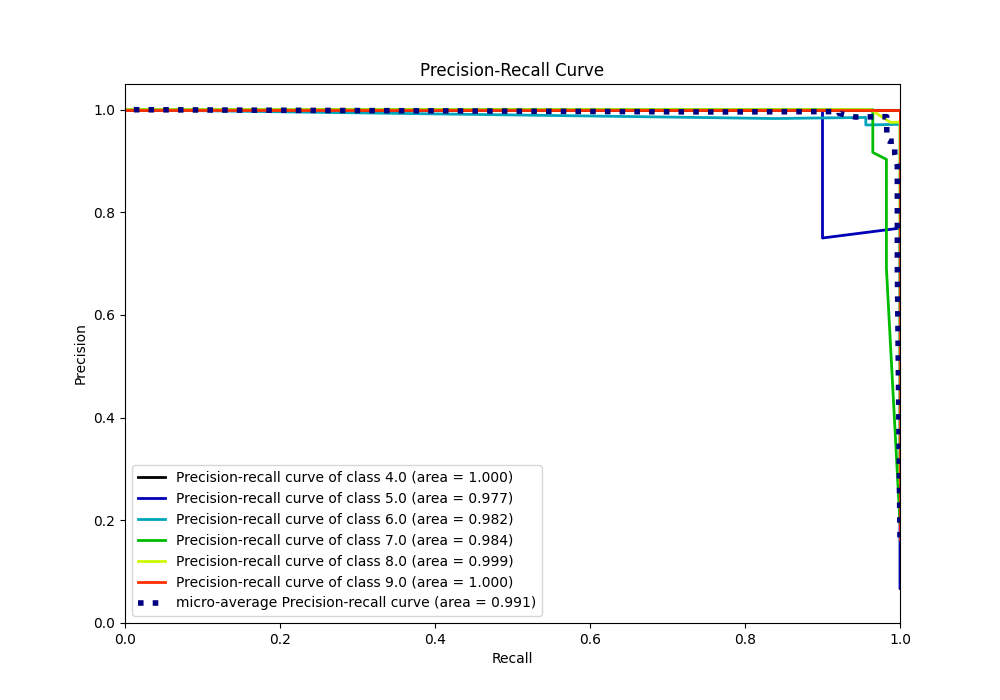

# Summary of 113_ExtraTrees_Stacked

[<< Go back](../README.md)

## Extra Trees Classifier (Extra Trees)
- **n_jobs**: -1
- **criterion**: entropy
- **max_features**: 0.8
- **min_samples_split**: 30
- **max_depth**: 7
- **eval_metric_name**: accuracy
- **num_class**: 6
- **explain_level**: 0

## Validation
 - **validation_type**: kfold
 - **k_folds**: 5

## Optimized metric
accuracy

## Training time

22.2 seconds

### Metric details
|           |   4.0 |   5.0 |       6.0 |       7.0 |   8.0 |   9.0 |   accuracy |   macro avg |   weighted avg |   logloss |
|:----------|------:|------:|----------:|----------:|------:|------:|-----------:|------------:|---------------:|----------:|
| precision |     1 |     1 |  0.971429 |  1        |     1 |     1 |   0.993174 |    0.995238 |       0.993369 |  0.149395 |
| recall    |     1 |     1 |  1        |  0.964912 |     1 |     1 |   0.993174 |    0.994152 |       0.993174 |  0.149395 |
| f1-score  |     1 |     1 |  0.985507 |  0.982143 |     1 |     1 |   0.993174 |    0.994608 |       0.993163 |  0.149395 |
| support   |    20 |    20 | 68        | 57        |    80 |    48 |   0.993174 |  293        |     293        |  0.149395 |

## Confusion matrix
|                |   Predicted as 4.0 |   Predicted as 5.0 |   Predicted as 6.0 |   Predicted as 7.0 |   Predicted as 8.0 |   Predicted as 9.0 |
|:---------------|-------------------:|-------------------:|-------------------:|-------------------:|-------------------:|-------------------:|
| Labeled as 4.0 |                 20 |                  0 |                  0 |                  0 |                  0 |                  0 |
| Labeled as 5.0 |                  0 |                 20 |                  0 |                  0 |                  0 |                  0 |
| Labeled as 6.0 |                  0 |                  0 |                 68 |                  0 |                  0 |                  0 |
| Labeled as 7.0 |                  0 |                  0 |                  2 |                 55 |                  0 |                  0 |
| Labeled as 8.0 |                  0 |                  0 |                  0 |                  0 |                 80 |                  0 |
| Labeled as 9.0 |                  0 |                  0 |                  0 |                  0 |                  0 |                 48 |

## Learning curves

## Confusion Matrix

## Normalized Confusion Matrix

## ROC Curve

## Precision Recall Curve

[<< Go back](../README.md)
