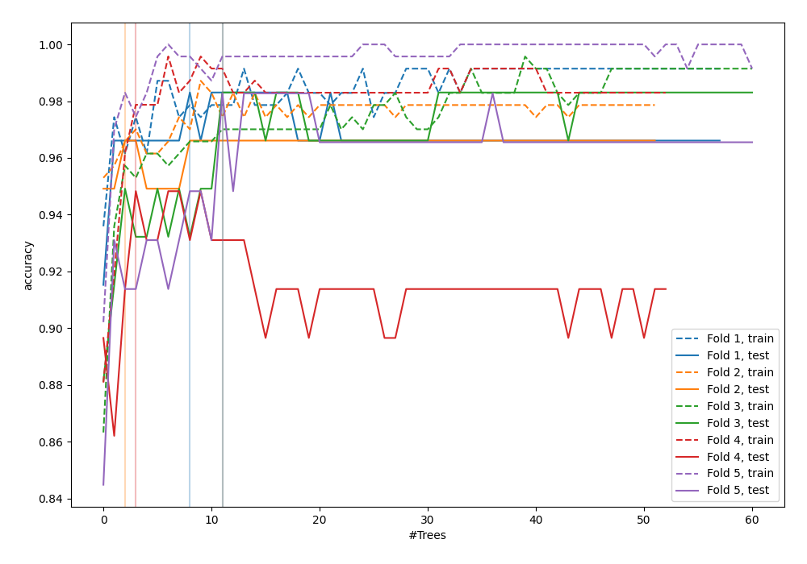
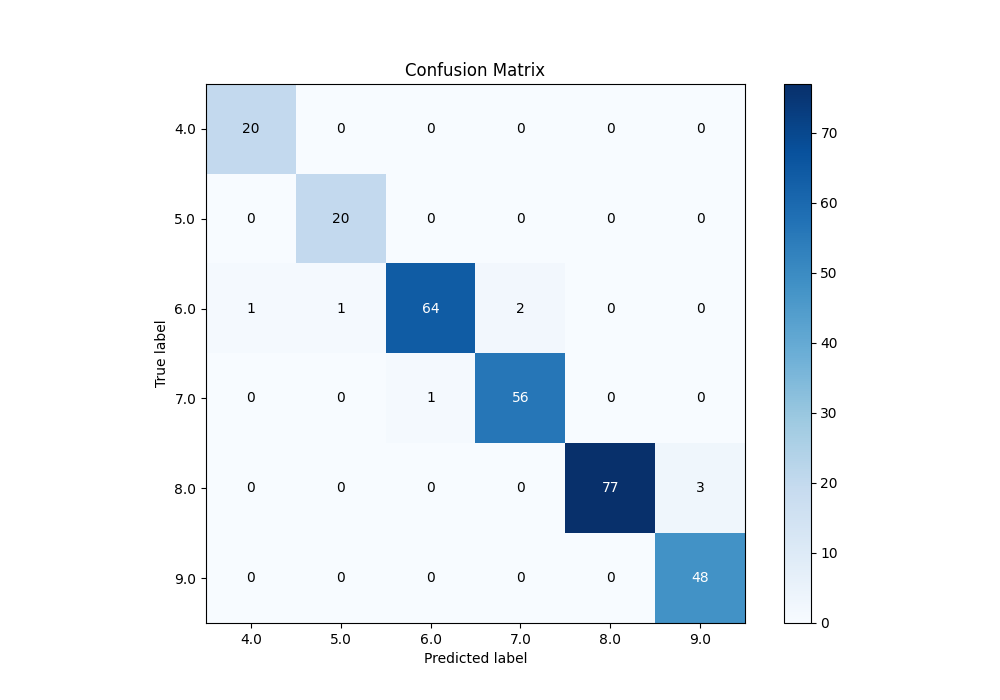
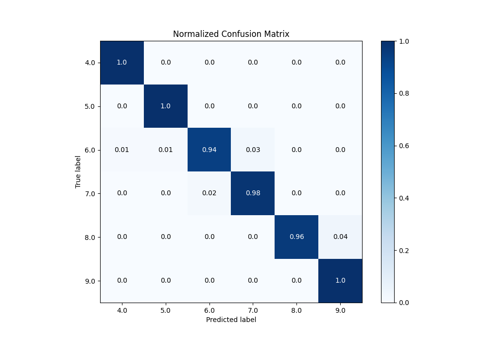
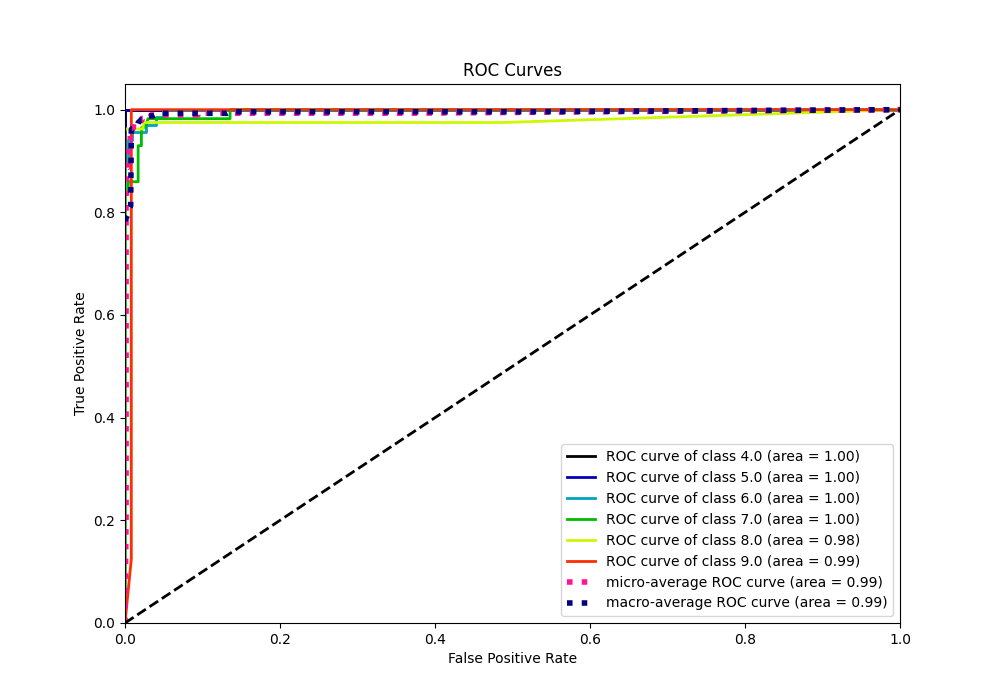
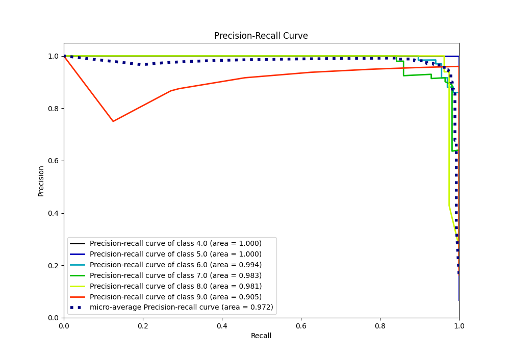

# Summary of 114_ExtraTrees

[<< Go back](../README.md)

## Extra Trees Classifier (Extra Trees)
- **n_jobs**: -1
- **criterion**: entropy
- **max_features**: 1.0
- **min_samples_split**: 40
- **max_depth**: 7
- **eval_metric_name**: accuracy
- **num_class**: 6
- **explain_level**: 0

## Validation
 - **validation_type**: kfold
 - **k_folds**: 5

## Optimized metric
accuracy

## Training time

11.7 seconds

### Metric details
|           |       4.0 |       5.0 |       6.0 |       7.0 |       8.0 |       9.0 |   accuracy |   macro avg |   weighted avg |   logloss |
|:----------|----------:|----------:|----------:|----------:|----------:|----------:|-----------:|------------:|---------------:|----------:|
| precision |  0.952381 |  0.952381 |  0.984615 |  0.965517 |  1        |  0.941176 |   0.972696 |    0.966012 |       0.973584 |  0.309453 |
| recall    |  1        |  1        |  0.941176 |  0.982456 |  0.9625   |  1        |   0.972696 |    0.981022 |       0.972696 |  0.309453 |
| f1-score  |  0.97561  |  0.97561  |  0.962406 |  0.973913 |  0.980892 |  0.969697 |   0.972696 |    0.973021 |       0.972689 |  0.309453 |
| support   | 20        | 20        | 68        | 57        | 80        | 48        |   0.972696 |  293        |     293        |  0.309453 |

## Confusion matrix
|                |   Predicted as 4.0 |   Predicted as 5.0 |   Predicted as 6.0 |   Predicted as 7.0 |   Predicted as 8.0 |   Predicted as 9.0 |
|:---------------|-------------------:|-------------------:|-------------------:|-------------------:|-------------------:|-------------------:|
| Labeled as 4.0 |                 20 |                  0 |                  0 |                  0 |                  0 |                  0 |
| Labeled as 5.0 |                  0 |                 20 |                  0 |                  0 |                  0 |                  0 |
| Labeled as 6.0 |                  1 |                  1 |                 64 |                  2 |                  0 |                  0 |
| Labeled as 7.0 |                  0 |                  0 |                  1 |                 56 |                  0 |                  0 |
| Labeled as 8.0 |                  0 |                  0 |                  0 |                  0 |                 77 |                  3 |
| Labeled as 9.0 |                  0 |                  0 |                  0 |                  0 |                  0 |                 48 |

## Learning curves

## Confusion Matrix

## Normalized Confusion Matrix

## ROC Curve

## Precision Recall Curve

[<< Go back](../README.md)
