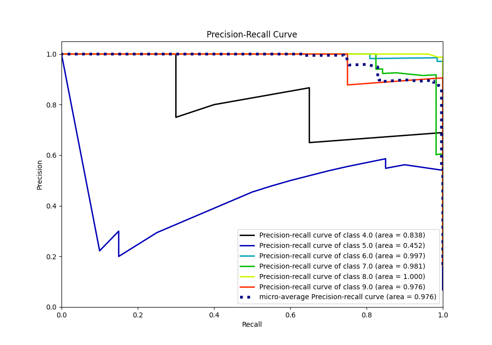

# Summary of 119_RandomForest_Stacked

[<< Go back](../README.md)

## Random Forest
- **n_jobs**: -1
- **criterion**: entropy
- **max_features**: 0.7
- **min_samples_split**: 30
- **max_depth**: 7
- **eval_metric_name**: accuracy
- **num_class**: 6
- **explain_level**: 0

## Validation
 - **validation_type**: kfold
 - **k_folds**: 5

## Optimized metric
accuracy

## Training time

16.7 seconds

### Metric details
|           |       4.0 |       5.0 |       6.0 |       7.0 |       8.0 |   9.0 |   accuracy |   macro avg |   weighted avg |   logloss |
|:----------|----------:|----------:|----------:|----------:|----------:|------:|-----------:|------------:|---------------:|----------:|
| precision |  0.684211 |  0.666667 |  0.985507 |  0.965517 |  1        |     1 |   0.945392 |    0.88365  |       0.94562  |  0.283313 |
| recall    |  0.65     |  0.7      |  1        |  0.982456 |  0.975    |     1 |   0.945392 |    0.884576 |       0.945392 |  0.283313 |
| f1-score  |  0.666667 |  0.682927 |  0.992701 |  0.973913 |  0.987342 |     1 |   0.945392 |    0.883925 |       0.945379 |  0.283313 |
| support   | 20        | 20        | 68        | 57        | 80        |    48 |   0.945392 |  293        |     293        |  0.283313 |

## Confusion matrix
|                |   Predicted as 4.0 |   Predicted as 5.0 |   Predicted as 6.0 |   Predicted as 7.0 |   Predicted as 8.0 |   Predicted as 9.0 |
|:---------------|-------------------:|-------------------:|-------------------:|-------------------:|-------------------:|-------------------:|
| Labeled as 4.0 |                 13 |                  7 |                  0 |                  0 |                  0 |                  0 |
| Labeled as 5.0 |                  6 |                 14 |                  0 |                  0 |                  0 |                  0 |
| Labeled as 6.0 |                  0 |                  0 |                 68 |                  0 |                  0 |                  0 |
| Labeled as 7.0 |                  0 |                  0 |                  1 |                 56 |                  0 |                  0 |
| Labeled as 8.0 |                  0 |                  0 |                  0 |                  2 |                 78 |                  0 |
| Labeled as 9.0 |                  0 |                  0 |                  0 |                  0 |                  0 |                 48 |

## Learning curves

## Confusion Matrix

## Normalized Confusion Matrix

## ROC Curve

## Precision Recall Curve

[<< Go back](../README.md)
