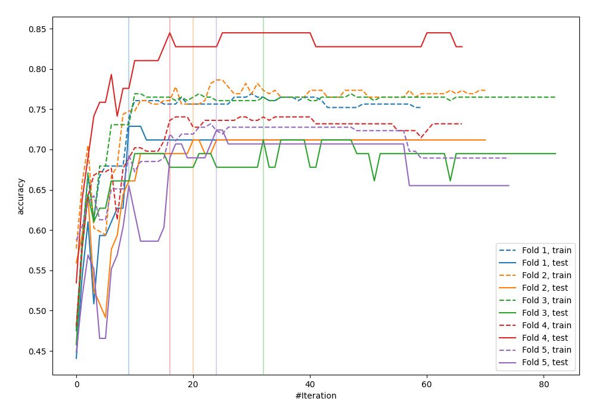
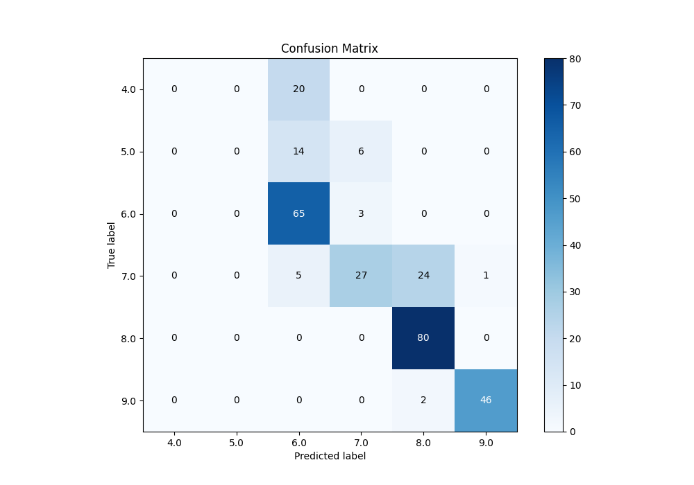
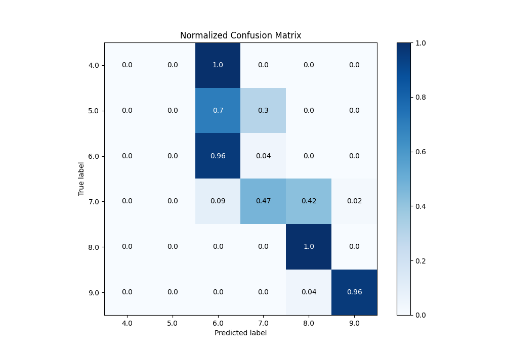
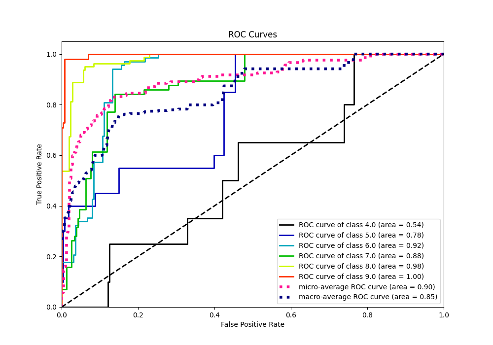
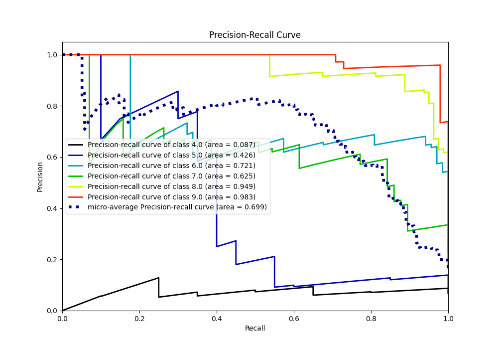

# Summary of 14_Xgboost

[<< Go back](../README.md)

## Extreme Gradient Boosting (Xgboost)
- **n_jobs**: -1
- **objective**: multi:softprob
- **eta**: 0.1
- **max_depth**: 7
- **min_child_weight**: 25
- **subsample**: 0.9
- **colsample_bytree**: 0.6
- **eval_metric**: accuracy
- **num_class**: 6
- **explain_level**: 0

## Validation
 - **validation_type**: kfold
 - **k_folds**: 5

## Optimized metric
accuracy

## Training time

3.8 seconds

### Metric details
|           |   4.0 |   5.0 |       6.0 |       7.0 |       8.0 |       9.0 |   accuracy |   macro avg |   weighted avg |   logloss |
|:----------|------:|------:|----------:|----------:|----------:|----------:|-----------:|------------:|---------------:|----------:|
| precision |     0 |     0 |  0.625    |  0.75     |  0.754717 |  0.978723 |   0.744027 |    0.518073 |       0.657359 |   1.17999 |
| recall    |     0 |     0 |  0.955882 |  0.473684 |  1        |  0.958333 |   0.744027 |    0.56465  |       0.744027 |   1.17999 |
| f1-score  |     0 |     0 |  0.755814 |  0.580645 |  0.860215 |  0.968421 |   0.744027 |    0.527516 |       0.681889 |   1.17999 |
| support   |    20 |    20 | 68        | 57        | 80        | 48        |   0.744027 |  293        |     293        |   1.17999 |

## Confusion matrix
|                |   Predicted as 4.0 |   Predicted as 5.0 |   Predicted as 6.0 |   Predicted as 7.0 |   Predicted as 8.0 |   Predicted as 9.0 |
|:---------------|-------------------:|-------------------:|-------------------:|-------------------:|-------------------:|-------------------:|
| Labeled as 4.0 |                  0 |                  0 |                 20 |                  0 |                  0 |                  0 |
| Labeled as 5.0 |                  0 |                  0 |                 14 |                  6 |                  0 |                  0 |
| Labeled as 6.0 |                  0 |                  0 |                 65 |                  3 |                  0 |                  0 |
| Labeled as 7.0 |                  0 |                  0 |                  5 |                 27 |                 24 |                  1 |
| Labeled as 8.0 |                  0 |                  0 |                  0 |                  0 |                 80 |                  0 |
| Labeled as 9.0 |                  0 |                  0 |                  0 |                  0 |                  2 |                 46 |

## Learning curves

## Confusion Matrix

## Normalized Confusion Matrix

## ROC Curve

## Precision Recall Curve

[<< Go back](../README.md)
