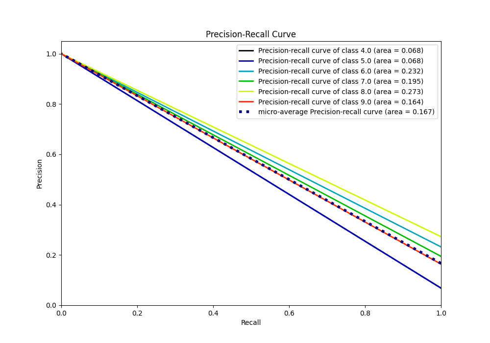

# Summary of 15_Xgboost

[<< Go back](../README.md)

## Extreme Gradient Boosting (Xgboost)
- **n_jobs**: -1
- **objective**: multi:softprob
- **eta**: 0.15
- **max_depth**: 8
- **min_child_weight**: 50
- **subsample**: 0.6
- **colsample_bytree**: 0.6
- **eval_metric**: accuracy
- **num_class**: 6
- **explain_level**: 0

## Validation
 - **validation_type**: kfold
 - **k_folds**: 5

## Optimized metric
accuracy

## Training time

5.1 seconds

### Metric details
|           |        4.0 |   5.0 |   6.0 |   7.0 |   8.0 |   9.0 |   accuracy |   macro avg |   weighted avg |   logloss |
|:----------|-----------:|------:|------:|------:|------:|------:|-----------:|------------:|---------------:|----------:|
| precision |  0.0682594 |     0 |     0 |     0 |     0 |     0 |  0.0682594 |   0.0113766 |     0.00465934 |   1.79176 |
| recall    |  1         |     0 |     0 |     0 |     0 |     0 |  0.0682594 |   0.166667  |     0.0682594  |   1.79176 |
| f1-score  |  0.127796  |     0 |     0 |     0 |     0 |     0 |  0.0682594 |   0.0212993 |     0.00872324 |   1.79176 |
| support   | 20         |    20 |    68 |    57 |    80 |    48 |  0.0682594 | 293         |   293          |   1.79176 |

## Confusion matrix
|                |   Predicted as 4.0 |   Predicted as 5.0 |   Predicted as 6.0 |   Predicted as 7.0 |   Predicted as 8.0 |   Predicted as 9.0 |
|:---------------|-------------------:|-------------------:|-------------------:|-------------------:|-------------------:|-------------------:|
| Labeled as 4.0 |                 20 |                  0 |                  0 |                  0 |                  0 |                  0 |
| Labeled as 5.0 |                 20 |                  0 |                  0 |                  0 |                  0 |                  0 |
| Labeled as 6.0 |                 68 |                  0 |                  0 |                  0 |                  0 |                  0 |
| Labeled as 7.0 |                 57 |                  0 |                  0 |                  0 |                  0 |                  0 |
| Labeled as 8.0 |                 80 |                  0 |                  0 |                  0 |                  0 |                  0 |
| Labeled as 9.0 |                 48 |                  0 |                  0 |                  0 |                  0 |                  0 |

## Learning curves

## Confusion Matrix

## Normalized Confusion Matrix

## ROC Curve

## Precision Recall Curve

[<< Go back](../README.md)
