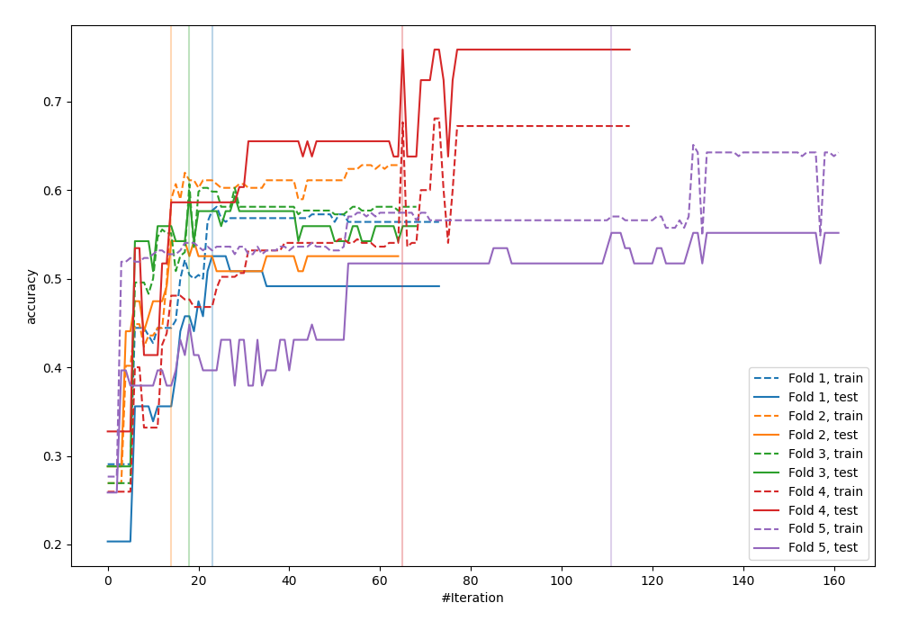
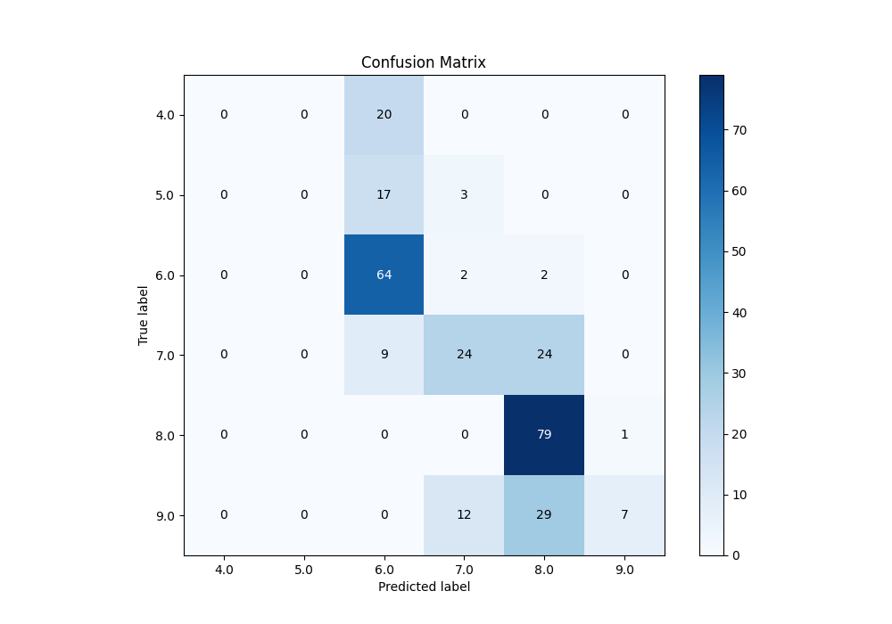
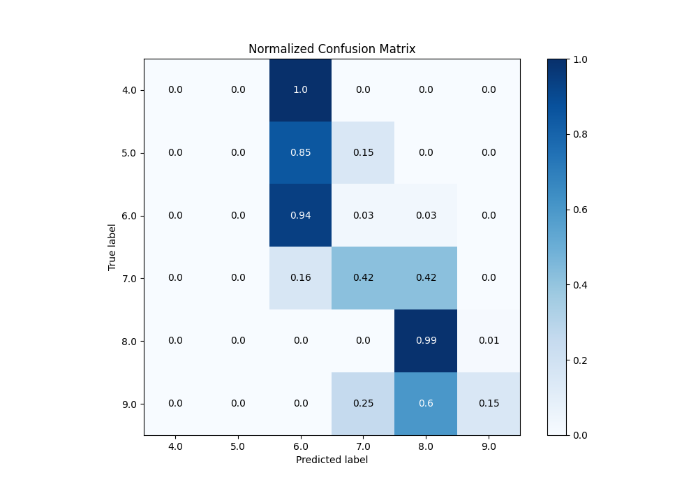
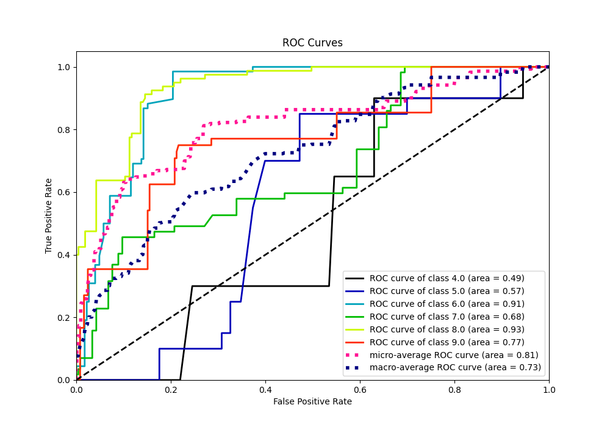
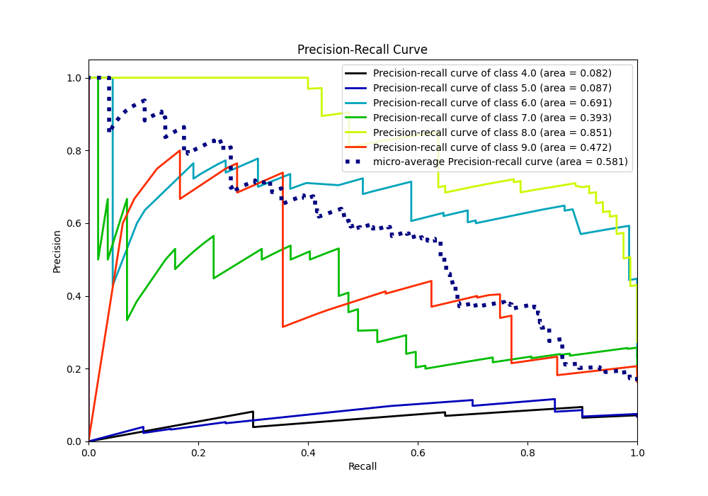

# Summary of 17_Xgboost

[<< Go back](../README.md)

## Extreme Gradient Boosting (Xgboost)
- **n_jobs**: -1
- **objective**: multi:softprob
- **eta**: 0.1
- **max_depth**: 4
- **min_child_weight**: 25
- **subsample**: 0.7
- **colsample_bytree**: 0.7
- **eval_metric**: accuracy
- **num_class**: 6
- **explain_level**: 0

## Validation
 - **validation_type**: kfold
 - **k_folds**: 5

## Optimized metric
accuracy

## Training time

5.1 seconds

### Metric details
|           |   4.0 |   5.0 |       6.0 |       7.0 |       8.0 |       9.0 |   accuracy |   macro avg |   weighted avg |   logloss |
|:----------|------:|------:|----------:|----------:|----------:|----------:|-----------:|------------:|---------------:|----------:|
| precision |     0 |     0 |  0.581818 |  0.585366 |  0.589552 |  0.875    |   0.593857 |    0.438623 |       0.553221 |   1.40945 |
| recall    |     0 |     0 |  0.941176 |  0.421053 |  0.9875   |  0.145833 |   0.593857 |    0.415927 |       0.593857 |   1.40945 |
| f1-score  |     0 |     0 |  0.719101 |  0.489796 |  0.738318 |  0.25     |   0.593857 |    0.366202 |       0.504719 |   1.40945 |
| support   |    20 |    20 | 68        | 57        | 80        | 48        |   0.593857 |  293        |     293        |   1.40945 |

## Confusion matrix
|                |   Predicted as 4.0 |   Predicted as 5.0 |   Predicted as 6.0 |   Predicted as 7.0 |   Predicted as 8.0 |   Predicted as 9.0 |
|:---------------|-------------------:|-------------------:|-------------------:|-------------------:|-------------------:|-------------------:|
| Labeled as 4.0 |                  0 |                  0 |                 20 |                  0 |                  0 |                  0 |
| Labeled as 5.0 |                  0 |                  0 |                 17 |                  3 |                  0 |                  0 |
| Labeled as 6.0 |                  0 |                  0 |                 64 |                  2 |                  2 |                  0 |
| Labeled as 7.0 |                  0 |                  0 |                  9 |                 24 |                 24 |                  0 |
| Labeled as 8.0 |                  0 |                  0 |                  0 |                  0 |                 79 |                  1 |
| Labeled as 9.0 |                  0 |                  0 |                  0 |                 12 |                 29 |                  7 |

## Learning curves

## Confusion Matrix

## Normalized Confusion Matrix

## ROC Curve

## Precision Recall Curve

[<< Go back](../README.md)
