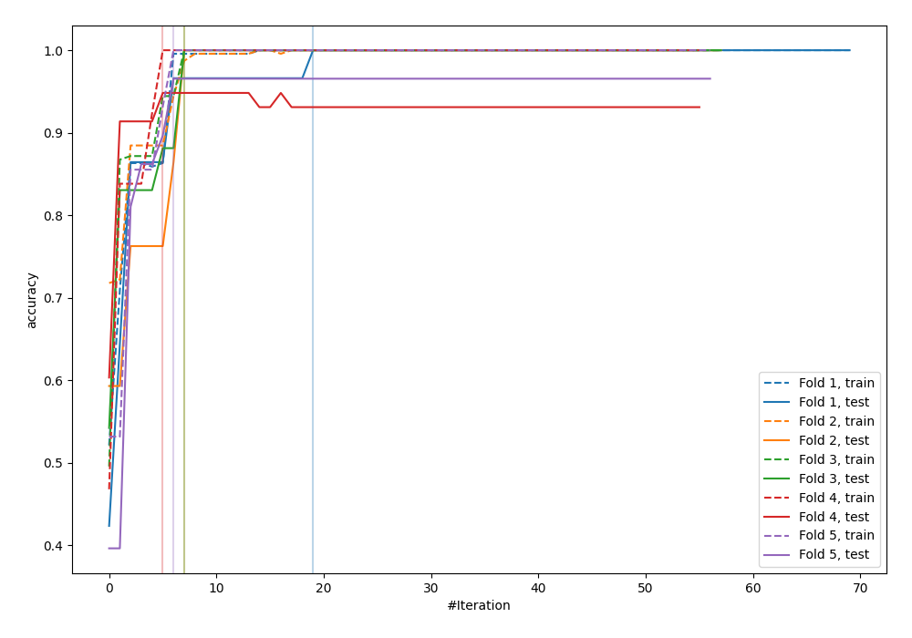
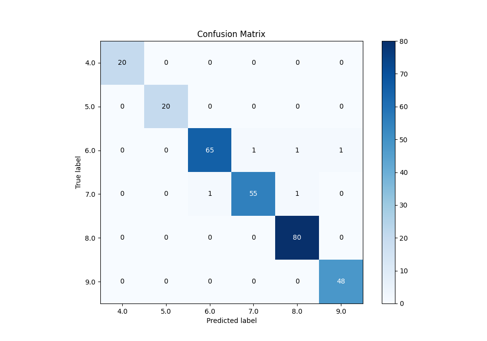
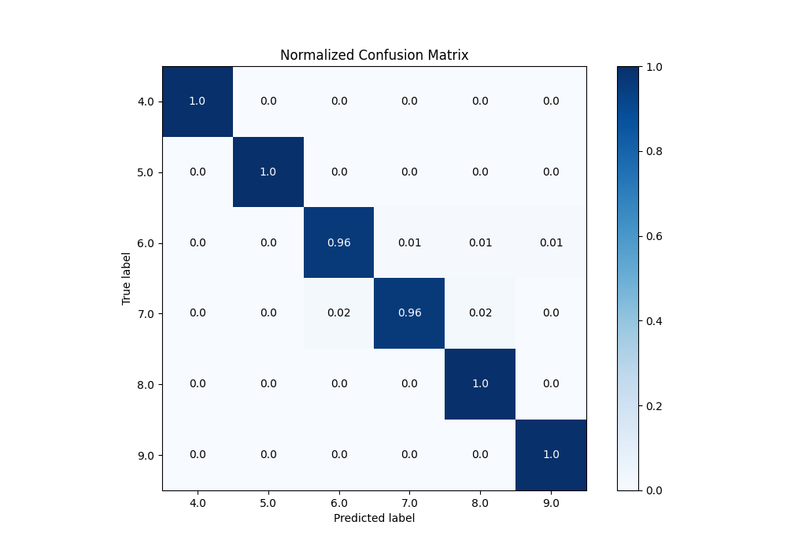
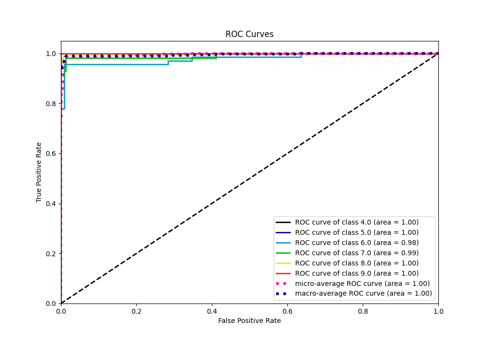
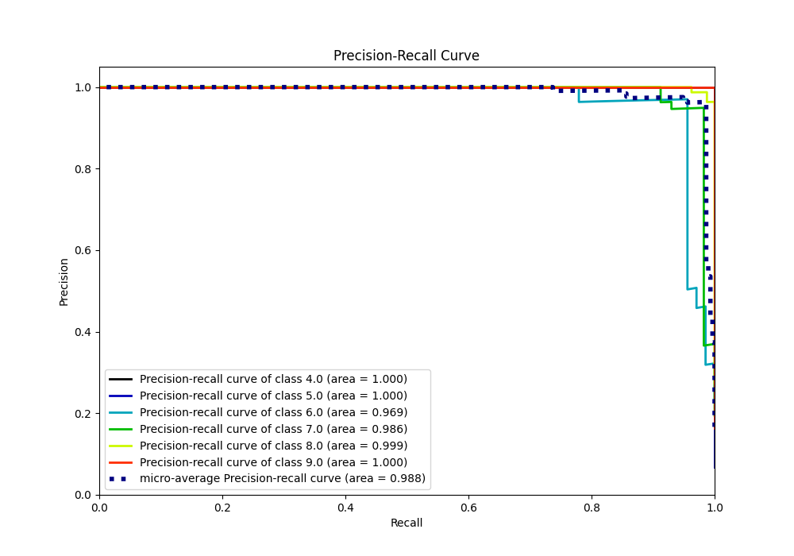

# Summary of 21_LightGBM_Stacked

[<< Go back](../README.md)

## LightGBM
- **n_jobs**: -1
- **objective**: multiclass
- **num_leaves**: 15
- **learning_rate**: 0.05
- **feature_fraction**: 0.8
- **bagging_fraction**: 0.5
- **min_data_in_leaf**: 50
- **metric**: custom
- **custom_eval_metric_name**: accuracy
- **num_class**: 6
- **explain_level**: 0

## Validation
 - **validation_type**: kfold
 - **k_folds**: 5

## Optimized metric
accuracy

## Training time

22.5 seconds

### Metric details
|           |   4.0 |   5.0 |       6.0 |       7.0 |       8.0 |       9.0 |   accuracy |   macro avg |   weighted avg |   logloss |
|:----------|------:|------:|----------:|----------:|----------:|----------:|-----------:|------------:|---------------:|----------:|
| precision |     1 |     1 |  0.984848 |  0.982143 |  0.97561  |  0.979592 |   0.982935 |    0.987032 |       0.983007 |  0.737767 |
| recall    |     1 |     1 |  0.955882 |  0.964912 |  1        |  1        |   0.982935 |    0.986799 |       0.982935 |  0.737767 |
| f1-score  |     1 |     1 |  0.970149 |  0.973451 |  0.987654 |  0.989691 |   0.982935 |    0.986824 |       0.982848 |  0.737767 |
| support   |    20 |    20 | 68        | 57        | 80        | 48        |   0.982935 |  293        |     293        |  0.737767 |

## Confusion matrix
|                |   Predicted as 4.0 |   Predicted as 5.0 |   Predicted as 6.0 |   Predicted as 7.0 |   Predicted as 8.0 |   Predicted as 9.0 |
|:---------------|-------------------:|-------------------:|-------------------:|-------------------:|-------------------:|-------------------:|
| Labeled as 4.0 |                 20 |                  0 |                  0 |                  0 |                  0 |                  0 |
| Labeled as 5.0 |                  0 |                 20 |                  0 |                  0 |                  0 |                  0 |
| Labeled as 6.0 |                  0 |                  0 |                 65 |                  1 |                  1 |                  1 |
| Labeled as 7.0 |                  0 |                  0 |                  1 |                 55 |                  1 |                  0 |
| Labeled as 8.0 |                  0 |                  0 |                  0 |                  0 |                 80 |                  0 |
| Labeled as 9.0 |                  0 |                  0 |                  0 |                  0 |                  0 |                 48 |

## Learning curves

## Confusion Matrix

## Normalized Confusion Matrix

## ROC Curve

## Precision Recall Curve

[<< Go back](../README.md)
