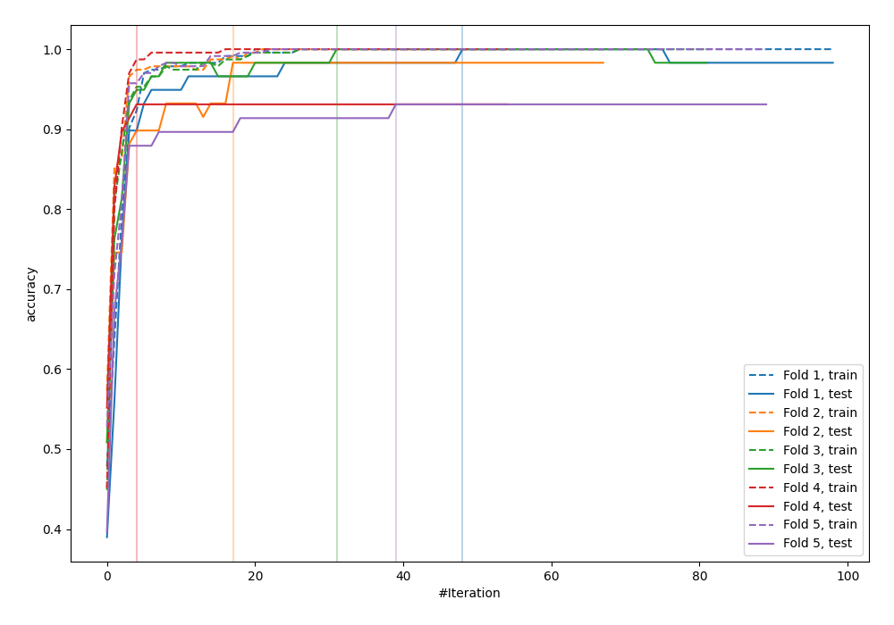
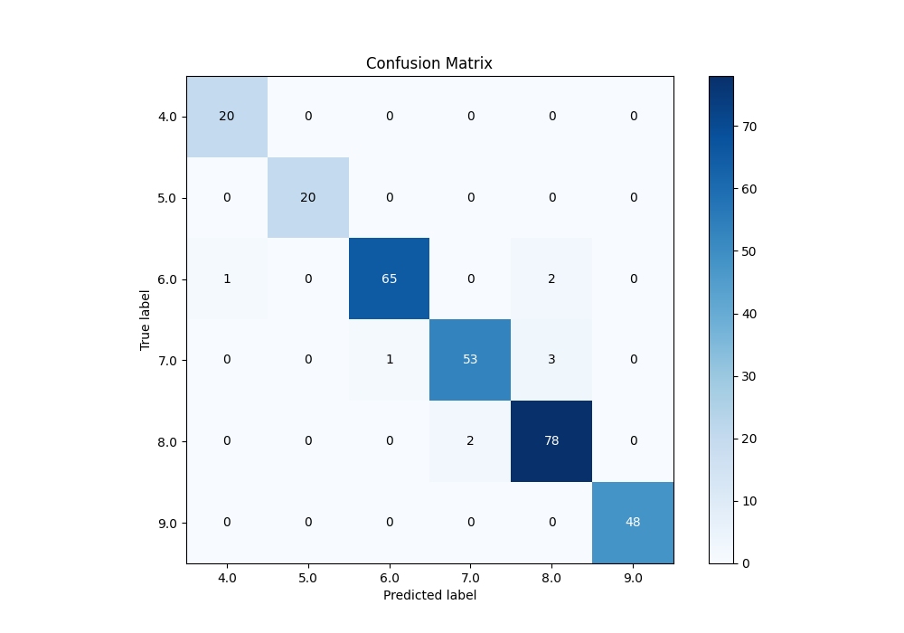
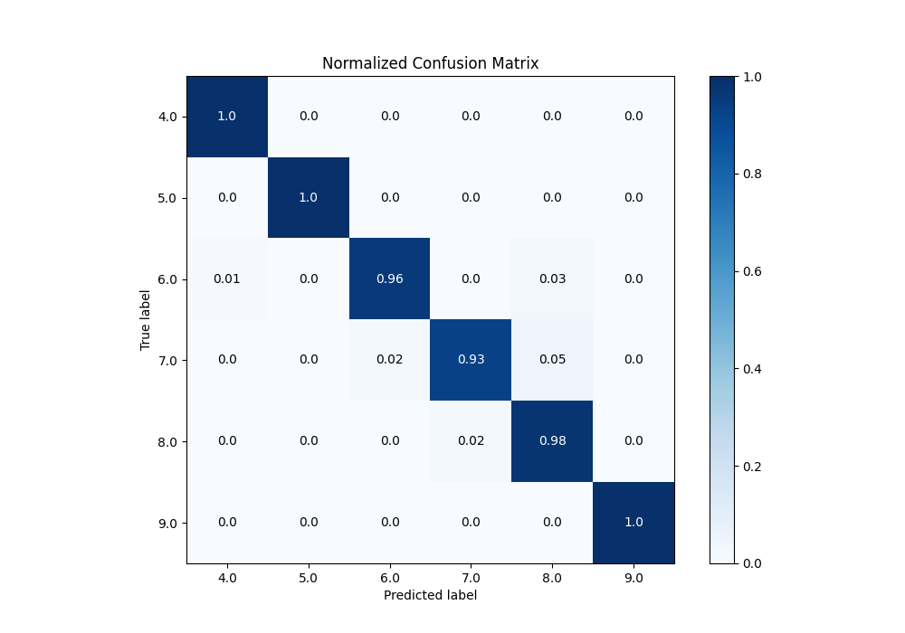
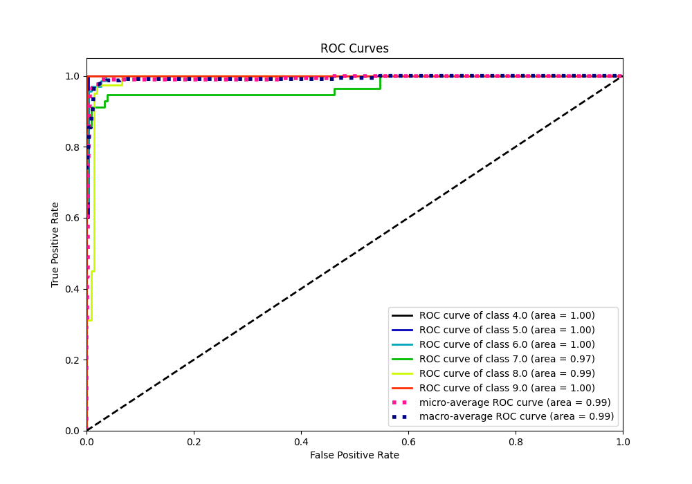
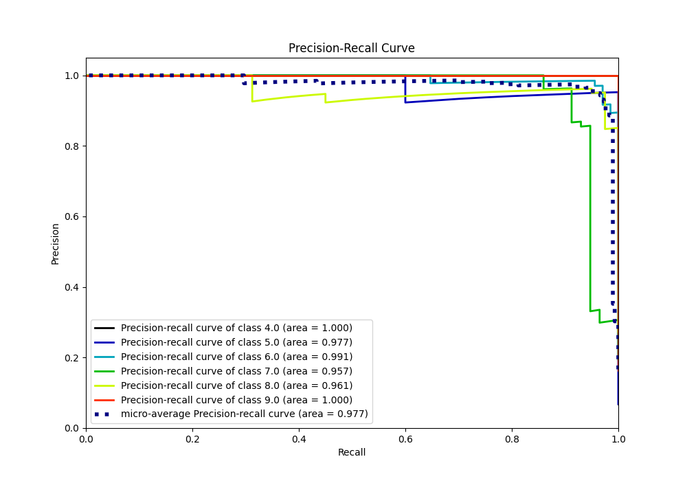

# Summary of 24_LightGBM

[<< Go back](../README.md)

## LightGBM
- **n_jobs**: -1
- **objective**: multiclass
- **num_leaves**: 95
- **learning_rate**: 0.05
- **feature_fraction**: 1.0
- **bagging_fraction**: 1.0
- **min_data_in_leaf**: 10
- **metric**: custom
- **custom_eval_metric_name**: accuracy
- **num_class**: 6
- **explain_level**: 0

## Validation
 - **validation_type**: kfold
 - **k_folds**: 5

## Optimized metric
accuracy

## Training time

5.8 seconds

### Metric details
|           |       4.0 |   5.0 |       6.0 |       7.0 |       8.0 |   9.0 |   accuracy |   macro avg |   weighted avg |   logloss |
|:----------|----------:|------:|----------:|----------:|----------:|------:|-----------:|------------:|---------------:|----------:|
| precision |  0.952381 |     1 |  0.984848 |  0.963636 |  0.939759 |     1 |   0.969283 |    0.973437 |       0.969711 |  0.374645 |
| recall    |  1        |     1 |  0.955882 |  0.929825 |  0.975    |     1 |   0.969283 |    0.976784 |       0.969283 |  0.374645 |
| f1-score  |  0.97561  |     1 |  0.970149 |  0.946429 |  0.957055 |     1 |   0.969283 |    0.974874 |       0.96926  |  0.374645 |
| support   | 20        |    20 | 68        | 57        | 80        |    48 |   0.969283 |  293        |     293        |  0.374645 |

## Confusion matrix
|                |   Predicted as 4.0 |   Predicted as 5.0 |   Predicted as 6.0 |   Predicted as 7.0 |   Predicted as 8.0 |   Predicted as 9.0 |
|:---------------|-------------------:|-------------------:|-------------------:|-------------------:|-------------------:|-------------------:|
| Labeled as 4.0 |                 20 |                  0 |                  0 |                  0 |                  0 |                  0 |
| Labeled as 5.0 |                  0 |                 20 |                  0 |                  0 |                  0 |                  0 |
| Labeled as 6.0 |                  1 |                  0 |                 65 |                  0 |                  2 |                  0 |
| Labeled as 7.0 |                  0 |                  0 |                  1 |                 53 |                  3 |                  0 |
| Labeled as 8.0 |                  0 |                  0 |                  0 |                  2 |                 78 |                  0 |
| Labeled as 9.0 |                  0 |                  0 |                  0 |                  0 |                  0 |                 48 |

## Learning curves

## Confusion Matrix

## Normalized Confusion Matrix

## ROC Curve

## Precision Recall Curve

[<< Go back](../README.md)
