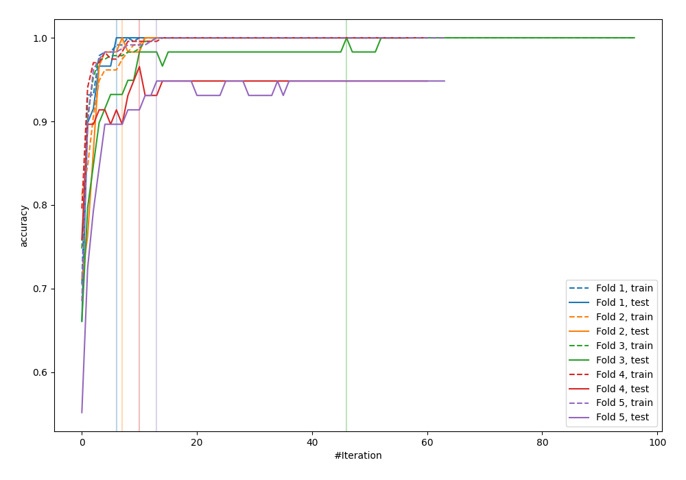
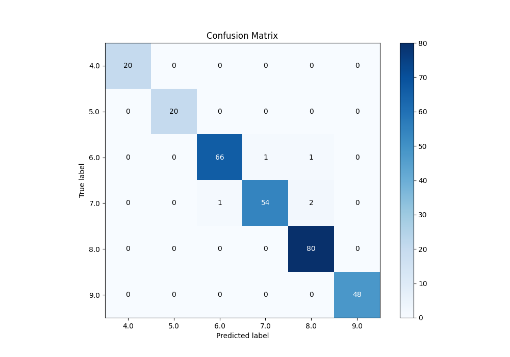
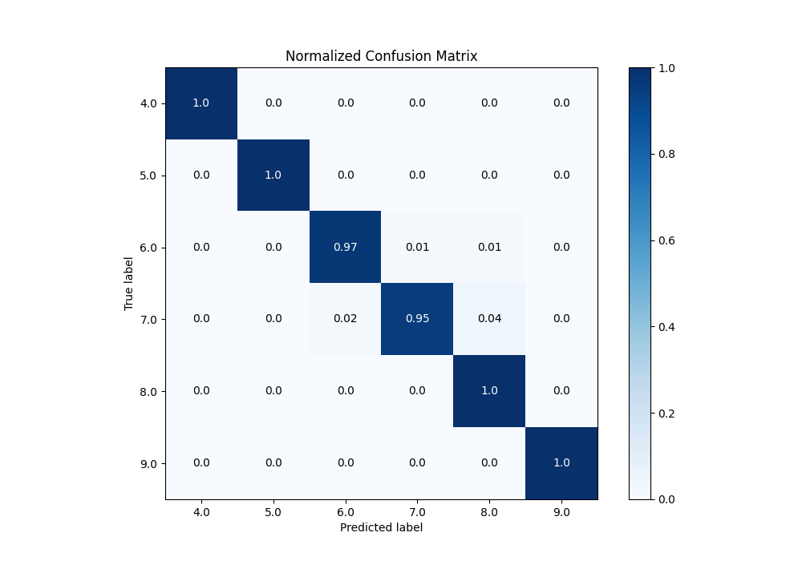
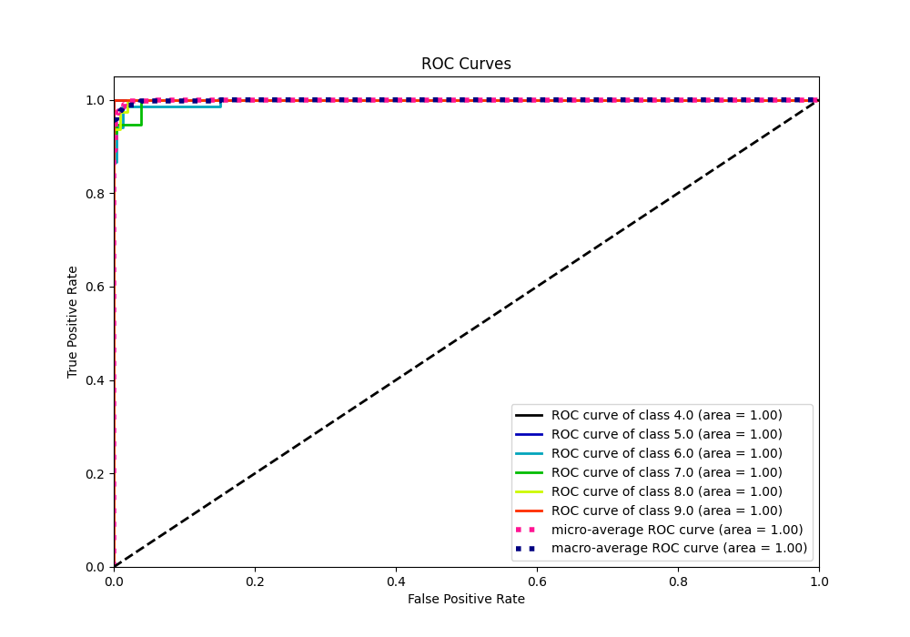
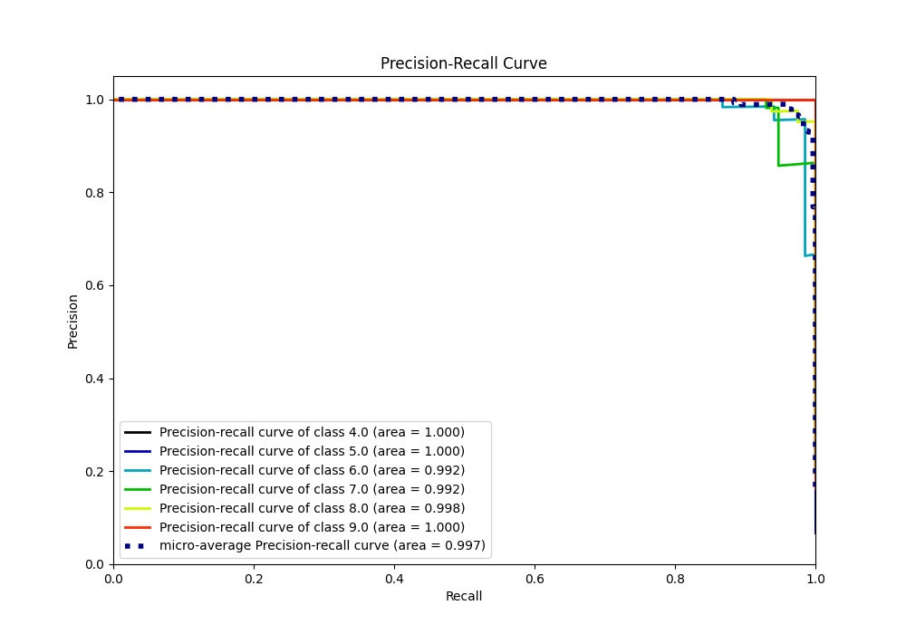

# Summary of 25_LightGBM

[<< Go back](../README.md)

## LightGBM
- **n_jobs**: -1
- **objective**: multiclass
- **num_leaves**: 63
- **learning_rate**: 0.2
- **feature_fraction**: 0.5
- **bagging_fraction**: 1.0
- **min_data_in_leaf**: 30
- **metric**: custom
- **custom_eval_metric_name**: accuracy
- **num_class**: 6
- **explain_level**: 0

## Validation
 - **validation_type**: kfold
 - **k_folds**: 5

## Optimized metric
accuracy

## Training time

4.4 seconds

### Metric details
|           |   4.0 |   5.0 |       6.0 |       7.0 |       8.0 |   9.0 |   accuracy |   macro avg |   weighted avg |   logloss |
|:----------|------:|------:|----------:|----------:|----------:|------:|-----------:|------------:|---------------:|----------:|
| precision |     1 |     1 |  0.985075 |  0.981818 |  0.963855 |     1 |   0.982935 |    0.988458 |       0.98313  |  0.187687 |
| recall    |     1 |     1 |  0.970588 |  0.947368 |  1        |     1 |   0.982935 |    0.986326 |       0.982935 |  0.187687 |
| f1-score  |     1 |     1 |  0.977778 |  0.964286 |  0.981595 |     1 |   0.982935 |    0.987276 |       0.98287  |  0.187687 |
| support   |    20 |    20 | 68        | 57        | 80        |    48 |   0.982935 |  293        |     293        |  0.187687 |

## Confusion matrix
|                |   Predicted as 4.0 |   Predicted as 5.0 |   Predicted as 6.0 |   Predicted as 7.0 |   Predicted as 8.0 |   Predicted as 9.0 |
|:---------------|-------------------:|-------------------:|-------------------:|-------------------:|-------------------:|-------------------:|
| Labeled as 4.0 |                 20 |                  0 |                  0 |                  0 |                  0 |                  0 |
| Labeled as 5.0 |                  0 |                 20 |                  0 |                  0 |                  0 |                  0 |
| Labeled as 6.0 |                  0 |                  0 |                 66 |                  1 |                  1 |                  0 |
| Labeled as 7.0 |                  0 |                  0 |                  1 |                 54 |                  2 |                  0 |
| Labeled as 8.0 |                  0 |                  0 |                  0 |                  0 |                 80 |                  0 |
| Labeled as 9.0 |                  0 |                  0 |                  0 |                  0 |                  0 |                 48 |

## Learning curves

## Confusion Matrix

## Normalized Confusion Matrix

## ROC Curve

## Precision Recall Curve

[<< Go back](../README.md)
