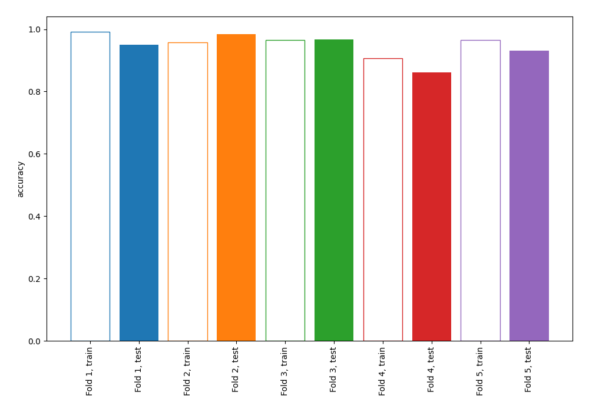
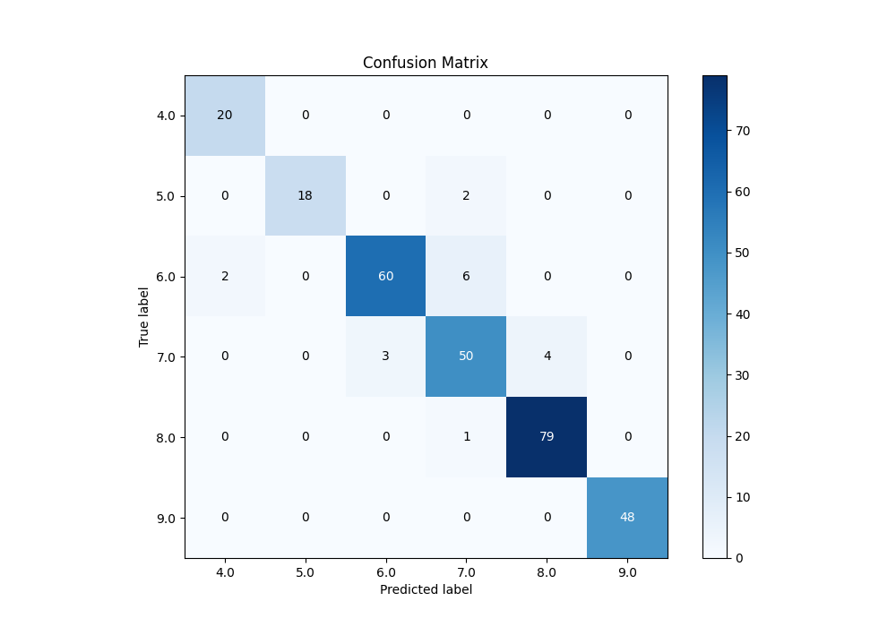
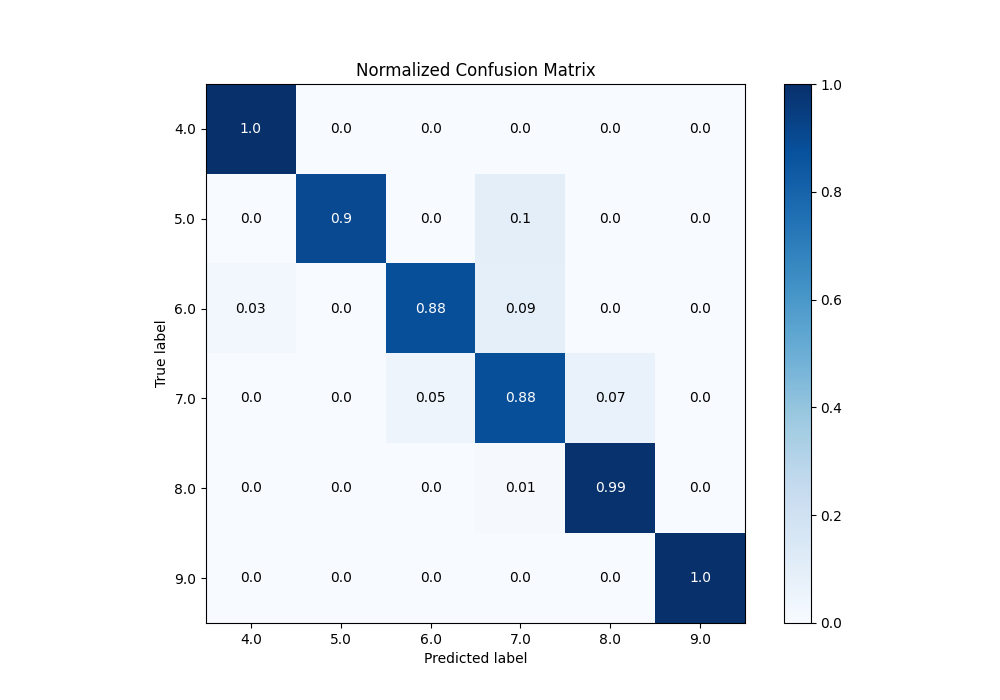
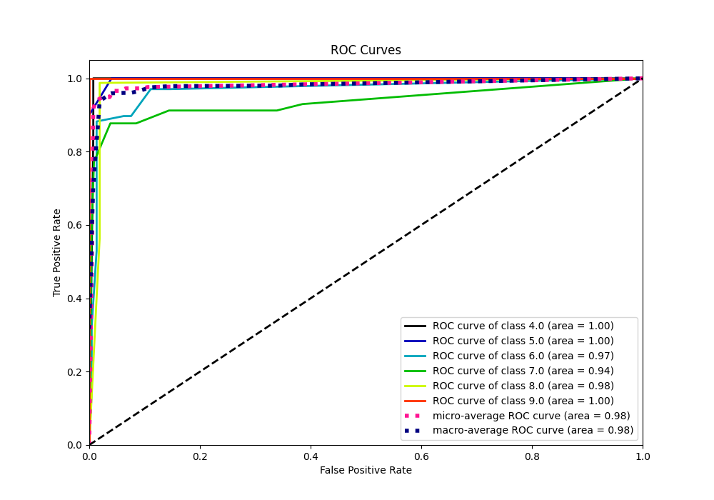
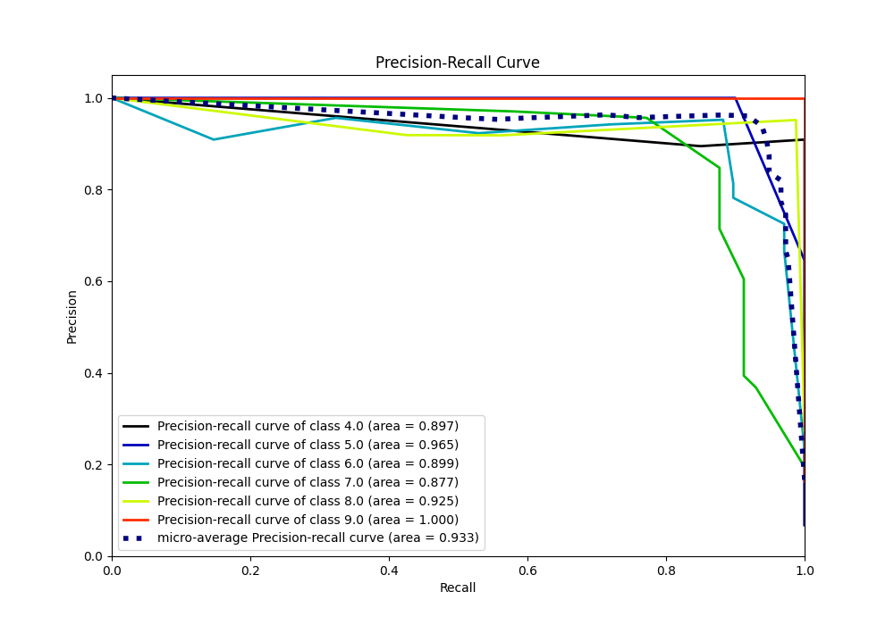

# Summary of 2_DecisionTree

[<< Go back](../README.md)

## Decision Tree
- **n_jobs**: -1
- **criterion**: gini
- **max_depth**: 4
- **num_class**: 6
- **explain_level**: 0

## Validation
 - **validation_type**: kfold
 - **k_folds**: 5

## Optimized metric
accuracy

## Training time

2.1 seconds

### Metric details
|           |       4.0 |       5.0 |       6.0 |       7.0 |       8.0 |   9.0 |   accuracy |   macro avg |   weighted avg |   logloss |
|:----------|----------:|----------:|----------:|----------:|----------:|------:|-----------:|------------:|---------------:|----------:|
| precision |  0.909091 |  1        |  0.952381 |  0.847458 |  0.951807 |     1 |   0.938567 |    0.943456 |       0.939909 |  0.511856 |
| recall    |  1        |  0.9      |  0.882353 |  0.877193 |  0.9875   |     1 |   0.938567 |    0.941174 |       0.938567 |  0.511856 |
| f1-score  |  0.952381 |  0.947368 |  0.916031 |  0.862069 |  0.969325 |     1 |   0.938567 |    0.941196 |       0.938461 |  0.511856 |
| support   | 20        | 20        | 68        | 57        | 80        |    48 |   0.938567 |  293        |     293        |  0.511856 |

## Confusion matrix
|                |   Predicted as 4.0 |   Predicted as 5.0 |   Predicted as 6.0 |   Predicted as 7.0 |   Predicted as 8.0 |   Predicted as 9.0 |
|:---------------|-------------------:|-------------------:|-------------------:|-------------------:|-------------------:|-------------------:|
| Labeled as 4.0 |                 20 |                  0 |                  0 |                  0 |                  0 |                  0 |
| Labeled as 5.0 |                  0 |                 18 |                  0 |                  2 |                  0 |                  0 |
| Labeled as 6.0 |                  2 |                  0 |                 60 |                  6 |                  0 |                  0 |
| Labeled as 7.0 |                  0 |                  0 |                  3 |                 50 |                  4 |                  0 |
| Labeled as 8.0 |                  0 |                  0 |                  0 |                  1 |                 79 |                  0 |
| Labeled as 9.0 |                  0 |                  0 |                  0 |                  0 |                  0 |                 48 |

## Learning curves

## Confusion Matrix

## Normalized Confusion Matrix

## ROC Curve

## Precision Recall Curve

[<< Go back](../README.md)
