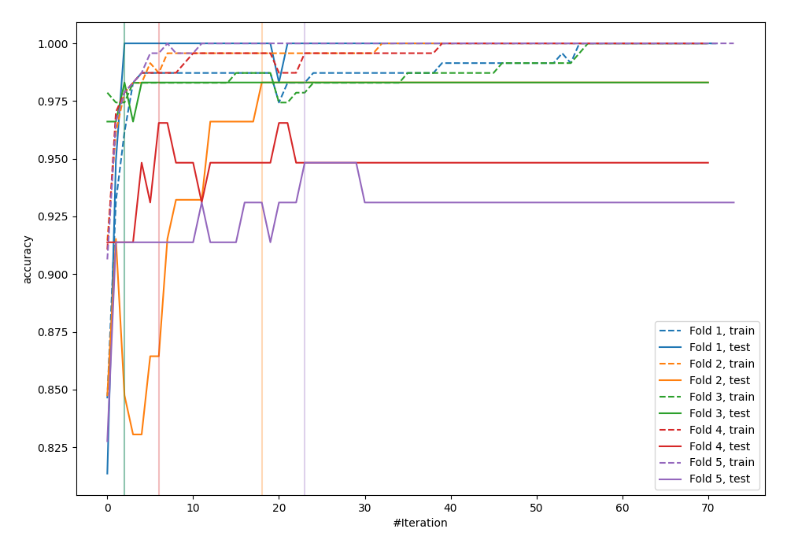
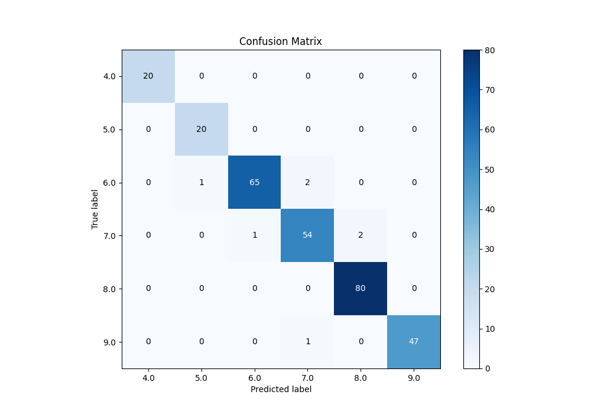
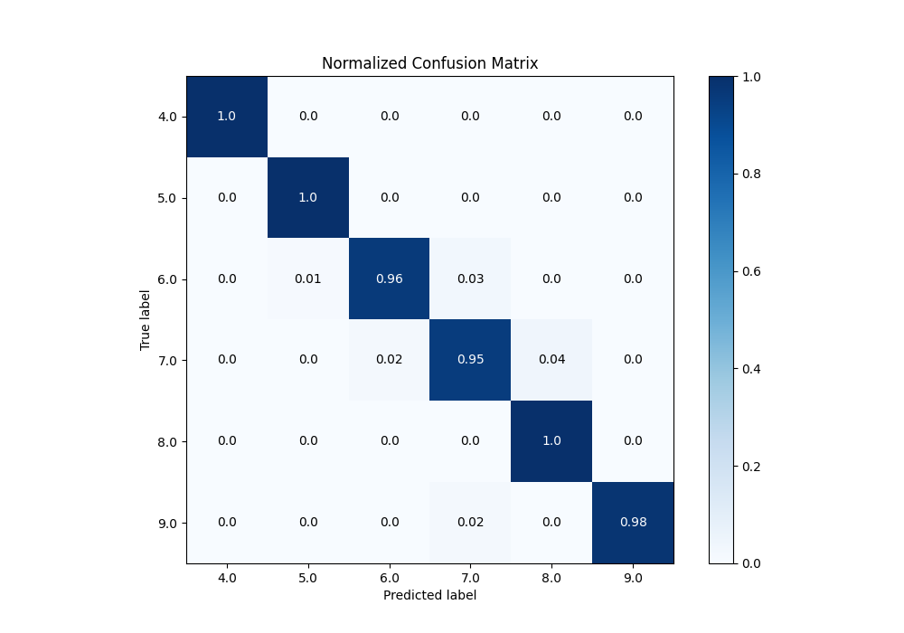
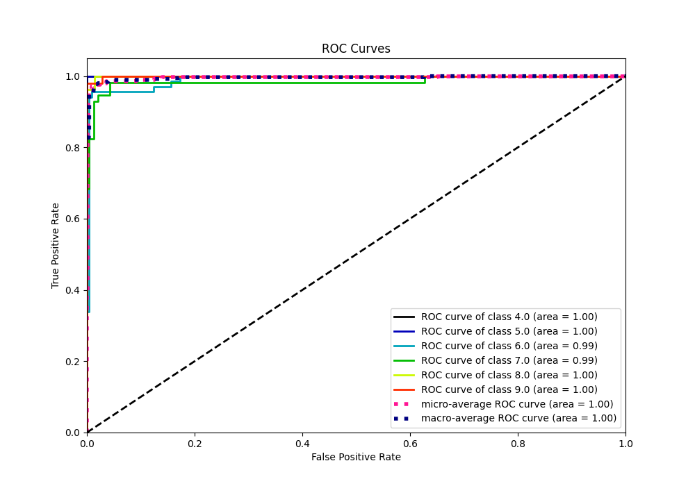
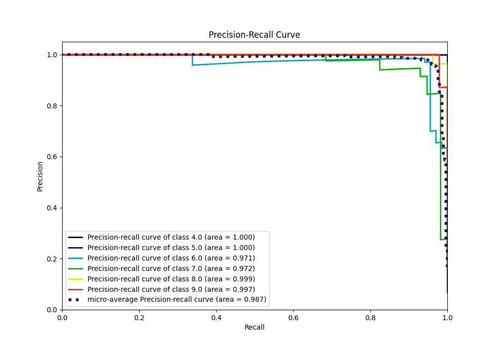

# Summary of 31_CatBoost_Stacked

[<< Go back](../README.md)

## CatBoost
- **n_jobs**: -1
- **learning_rate**: 0.2
- **depth**: 5
- **rsm**: 0.7
- **loss_function**: MultiClass
- **eval_metric**: Accuracy
- **num_class**: 6
- **explain_level**: 0

## Validation
 - **validation_type**: kfold
 - **k_folds**: 5

## Optimized metric
accuracy

## Training time

17.5 seconds

### Metric details
|           |   4.0 |       5.0 |       6.0 |       7.0 |       8.0 |       9.0 |   accuracy |   macro avg |   weighted avg |   logloss |
|:----------|------:|----------:|----------:|----------:|----------:|----------:|-----------:|------------:|---------------:|----------:|
| precision |     1 |  0.952381 |  0.984848 |  0.947368 |  0.97561  |  1        |   0.976109 |    0.976701 |       0.976335 |  0.448824 |
| recall    |     1 |  1        |  0.955882 |  0.947368 |  1        |  0.979167 |   0.976109 |    0.980403 |       0.976109 |  0.448824 |
| f1-score  |     1 |  0.97561  |  0.970149 |  0.947368 |  0.987654 |  0.989474 |   0.976109 |    0.978376 |       0.976073 |  0.448824 |
| support   |    20 | 20        | 68        | 57        | 80        | 48        |   0.976109 |  293        |     293        |  0.448824 |

## Confusion matrix
|                |   Predicted as 4.0 |   Predicted as 5.0 |   Predicted as 6.0 |   Predicted as 7.0 |   Predicted as 8.0 |   Predicted as 9.0 |
|:---------------|-------------------:|-------------------:|-------------------:|-------------------:|-------------------:|-------------------:|
| Labeled as 4.0 |                 20 |                  0 |                  0 |                  0 |                  0 |                  0 |
| Labeled as 5.0 |                  0 |                 20 |                  0 |                  0 |                  0 |                  0 |
| Labeled as 6.0 |                  0 |                  1 |                 65 |                  2 |                  0 |                  0 |
| Labeled as 7.0 |                  0 |                  0 |                  1 |                 54 |                  2 |                  0 |
| Labeled as 8.0 |                  0 |                  0 |                  0 |                  0 |                 80 |                  0 |
| Labeled as 9.0 |                  0 |                  0 |                  0 |                  1 |                  0 |                 47 |

## Learning curves

## Confusion Matrix

## Normalized Confusion Matrix

## ROC Curve

## Precision Recall Curve

[<< Go back](../README.md)
