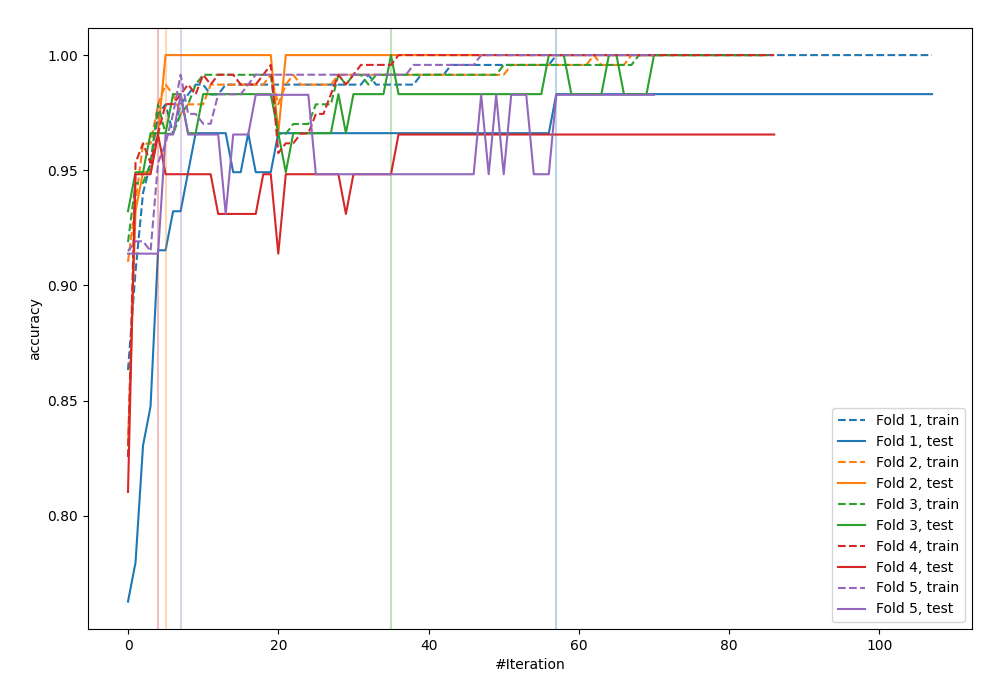
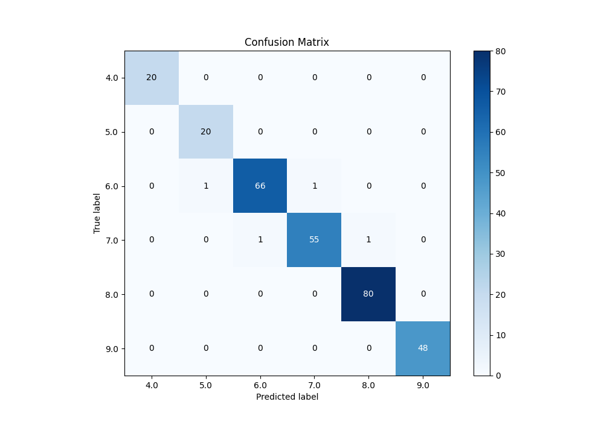
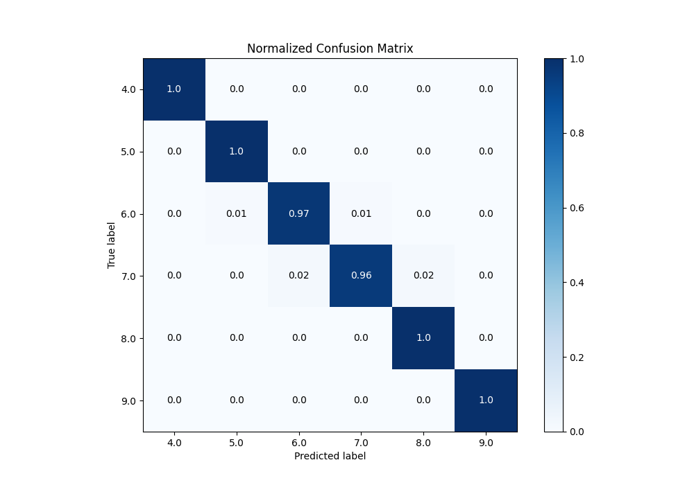
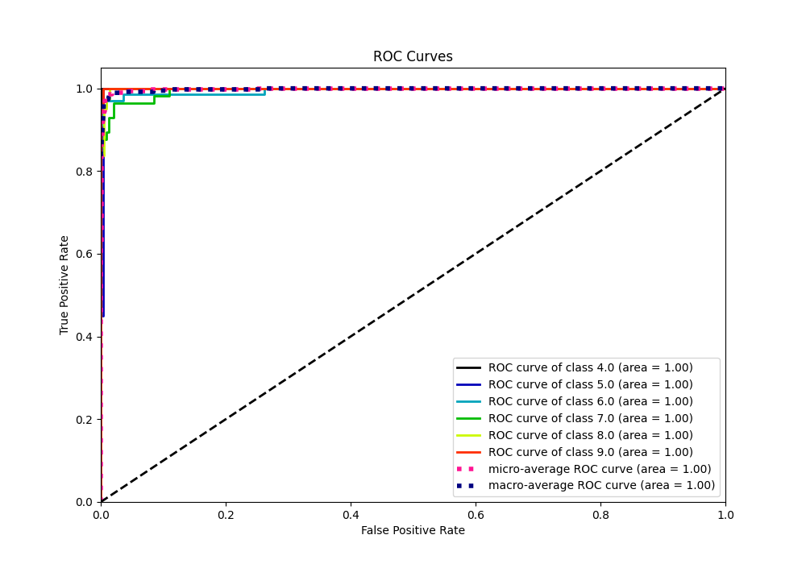
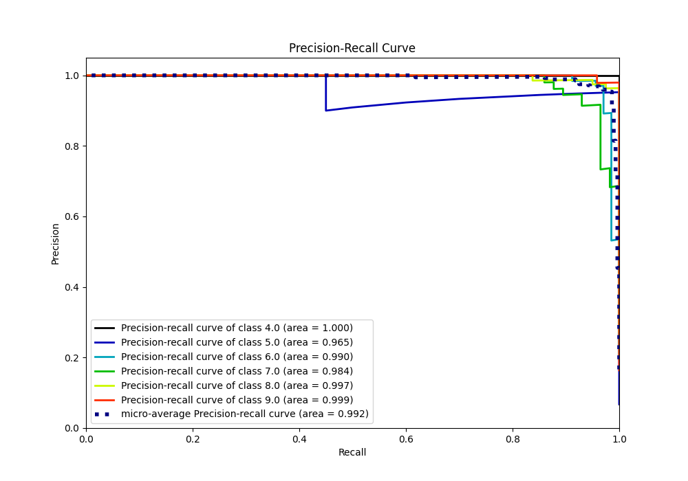

# Summary of 33_CatBoost

[<< Go back](../README.md)

## CatBoost
- **n_jobs**: -1
- **learning_rate**: 0.15
- **depth**: 6
- **rsm**: 0.8
- **loss_function**: MultiClass
- **eval_metric**: Accuracy
- **num_class**: 6
- **explain_level**: 0

## Validation
 - **validation_type**: kfold
 - **k_folds**: 5

## Optimized metric
accuracy

## Training time

4.1 seconds

### Metric details
|           |   4.0 |       5.0 |       6.0 |       7.0 |       8.0 |   9.0 |   accuracy |   macro avg |   weighted avg |   logloss |
|:----------|------:|----------:|----------:|----------:|----------:|------:|-----------:|------------:|---------------:|----------:|
| precision |     1 |  0.952381 |  0.985075 |  0.982143 |  0.987654 |     1 |   0.986348 |    0.984542 |       0.986441 |  0.416476 |
| recall    |     1 |  1        |  0.970588 |  0.964912 |  1        |     1 |   0.986348 |    0.98925  |       0.986348 |  0.416476 |
| f1-score  |     1 |  0.97561  |  0.977778 |  0.973451 |  0.993789 |     1 |   0.986348 |    0.986771 |       0.986317 |  0.416476 |
| support   |    20 | 20        | 68        | 57        | 80        |    48 |   0.986348 |  293        |     293        |  0.416476 |

## Confusion matrix
|                |   Predicted as 4.0 |   Predicted as 5.0 |   Predicted as 6.0 |   Predicted as 7.0 |   Predicted as 8.0 |   Predicted as 9.0 |
|:---------------|-------------------:|-------------------:|-------------------:|-------------------:|-------------------:|-------------------:|
| Labeled as 4.0 |                 20 |                  0 |                  0 |                  0 |                  0 |                  0 |
| Labeled as 5.0 |                  0 |                 20 |                  0 |                  0 |                  0 |                  0 |
| Labeled as 6.0 |                  0 |                  1 |                 66 |                  1 |                  0 |                  0 |
| Labeled as 7.0 |                  0 |                  0 |                  1 |                 55 |                  1 |                  0 |
| Labeled as 8.0 |                  0 |                  0 |                  0 |                  0 |                 80 |                  0 |
| Labeled as 9.0 |                  0 |                  0 |                  0 |                  0 |                  0 |                 48 |

## Learning curves

## Confusion Matrix

## Normalized Confusion Matrix

## ROC Curve

## Precision Recall Curve

[<< Go back](../README.md)
