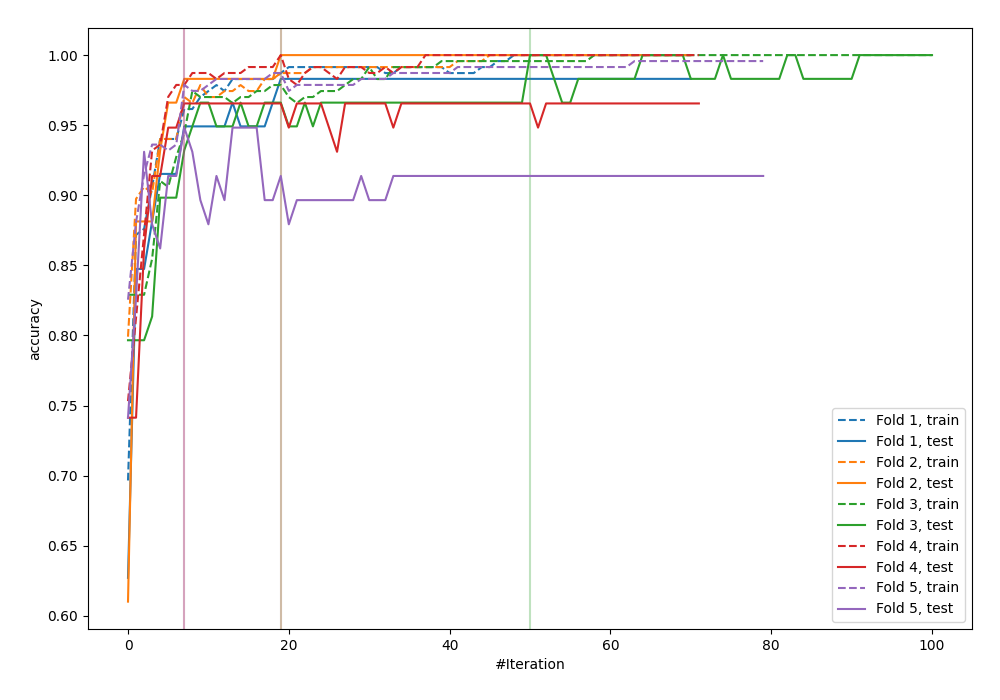
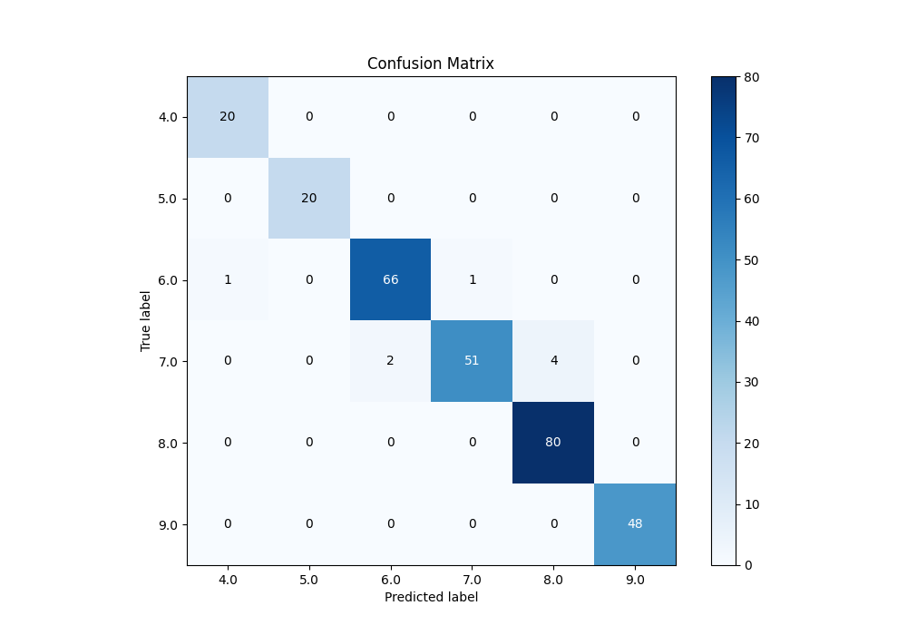
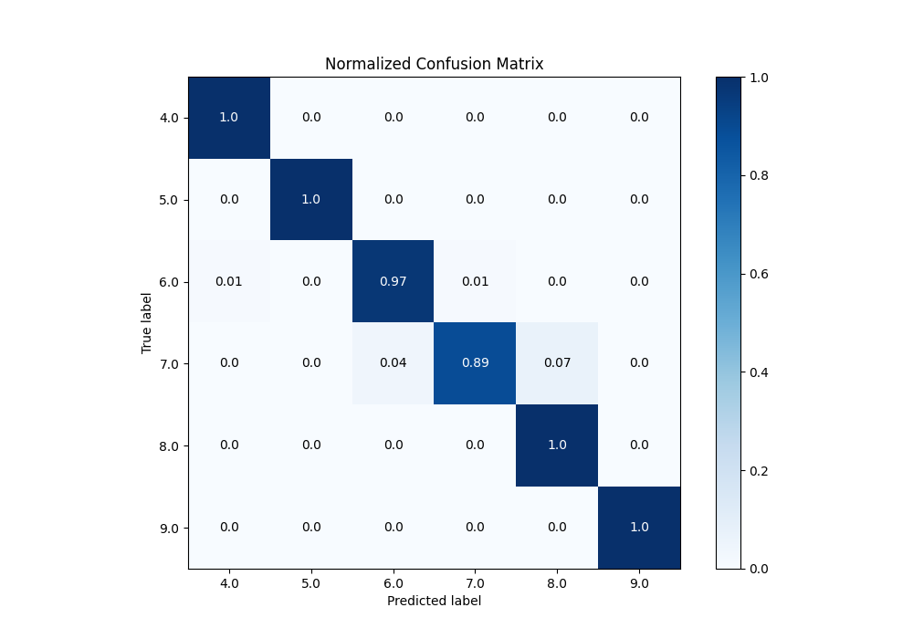
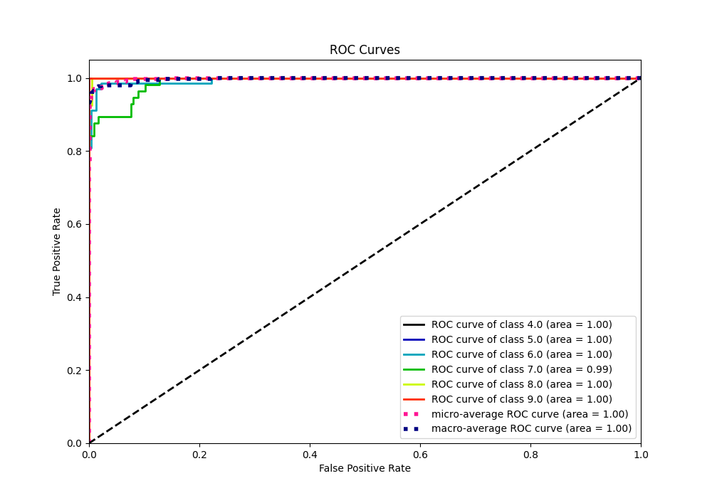
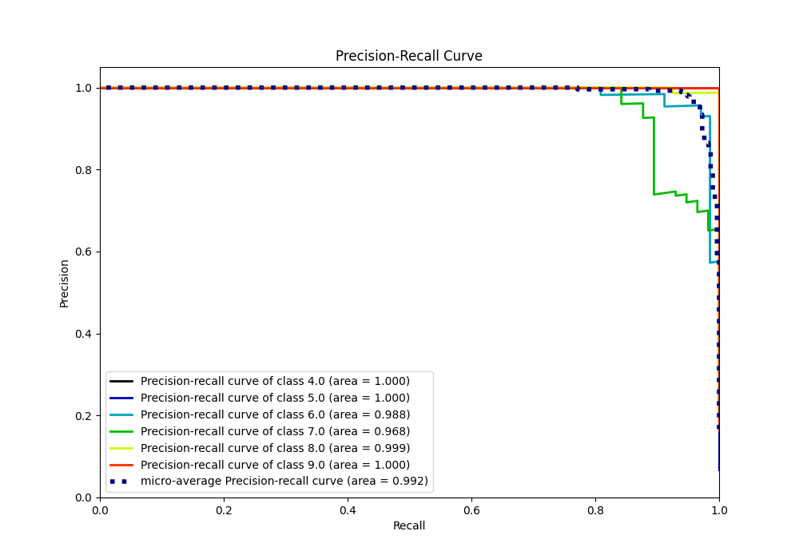

# Summary of 37_CatBoost_KMeansFeatures

[<< Go back](../README.md)

## CatBoost
- **n_jobs**: -1
- **learning_rate**: 0.2
- **depth**: 4
- **rsm**: 1.0
- **loss_function**: MultiClass
- **eval_metric**: Accuracy
- **num_class**: 6
- **explain_level**: 0

## Validation
 - **validation_type**: kfold
 - **k_folds**: 5

## Optimized metric
accuracy

## Training time

6.6 seconds

### Metric details
|           |       4.0 |   5.0 |       6.0 |       7.0 |       8.0 |   9.0 |   accuracy |   macro avg |   weighted avg |   logloss |
|:----------|----------:|------:|----------:|----------:|----------:|------:|-----------:|------------:|---------------:|----------:|
| precision |  0.952381 |     1 |  0.970588 |  0.980769 |  0.952381 |     1 |   0.972696 |    0.97602  |       0.973181 |  0.323483 |
| recall    |  1        |     1 |  0.970588 |  0.894737 |  1        |     1 |   0.972696 |    0.977554 |       0.972696 |  0.323483 |
| f1-score  |  0.97561  |     1 |  0.970588 |  0.93578  |  0.97561  |     1 |   0.972696 |    0.976265 |       0.972356 |  0.323483 |
| support   | 20        |    20 | 68        | 57        | 80        |    48 |   0.972696 |  293        |     293        |  0.323483 |

## Confusion matrix
|                |   Predicted as 4.0 |   Predicted as 5.0 |   Predicted as 6.0 |   Predicted as 7.0 |   Predicted as 8.0 |   Predicted as 9.0 |
|:---------------|-------------------:|-------------------:|-------------------:|-------------------:|-------------------:|-------------------:|
| Labeled as 4.0 |                 20 |                  0 |                  0 |                  0 |                  0 |                  0 |
| Labeled as 5.0 |                  0 |                 20 |                  0 |                  0 |                  0 |                  0 |
| Labeled as 6.0 |                  1 |                  0 |                 66 |                  1 |                  0 |                  0 |
| Labeled as 7.0 |                  0 |                  0 |                  2 |                 51 |                  4 |                  0 |
| Labeled as 8.0 |                  0 |                  0 |                  0 |                  0 |                 80 |                  0 |
| Labeled as 9.0 |                  0 |                  0 |                  0 |                  0 |                  0 |                 48 |

## Learning curves

## Confusion Matrix

## Normalized Confusion Matrix

## ROC Curve

## Precision Recall Curve

[<< Go back](../README.md)
