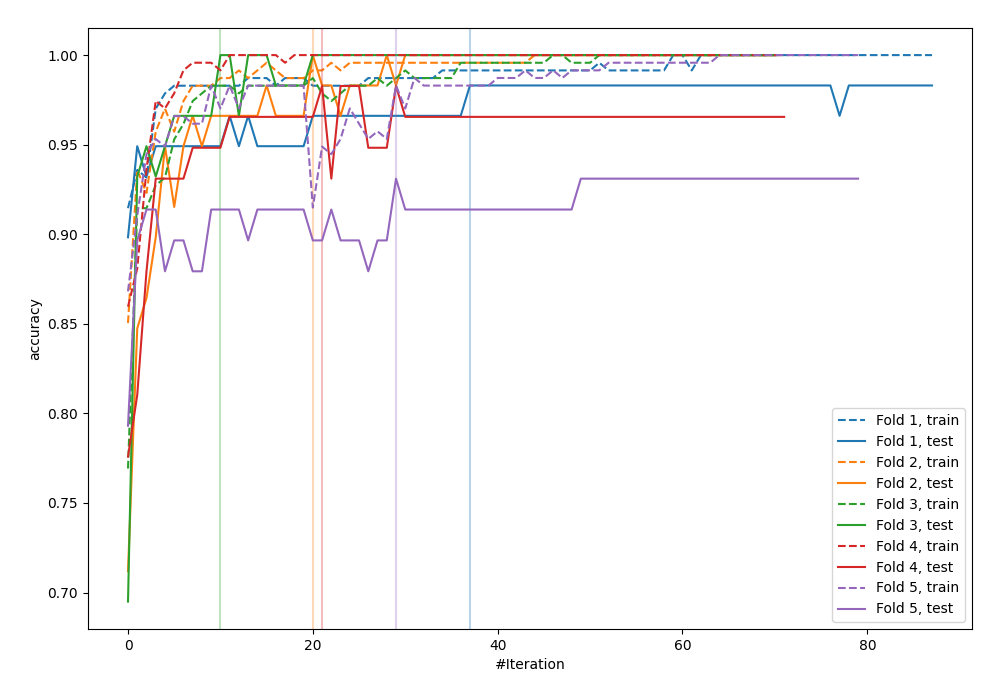
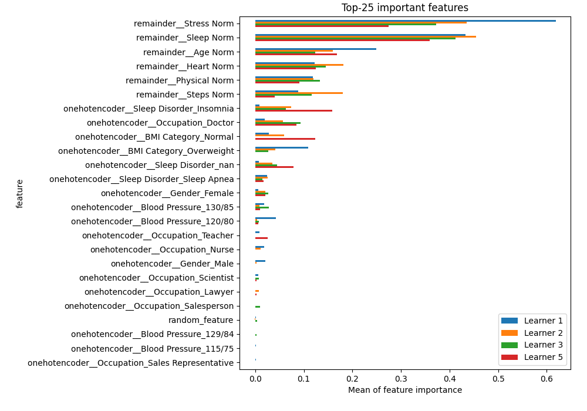
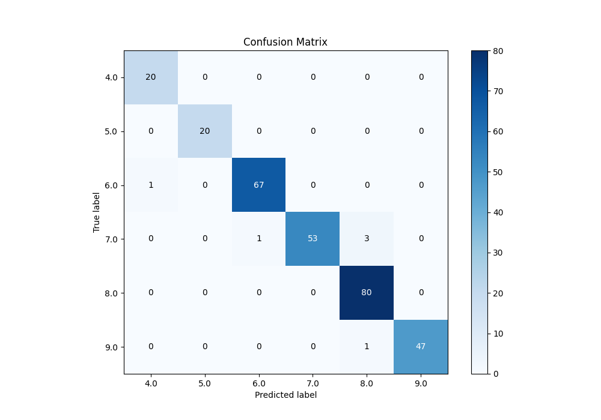
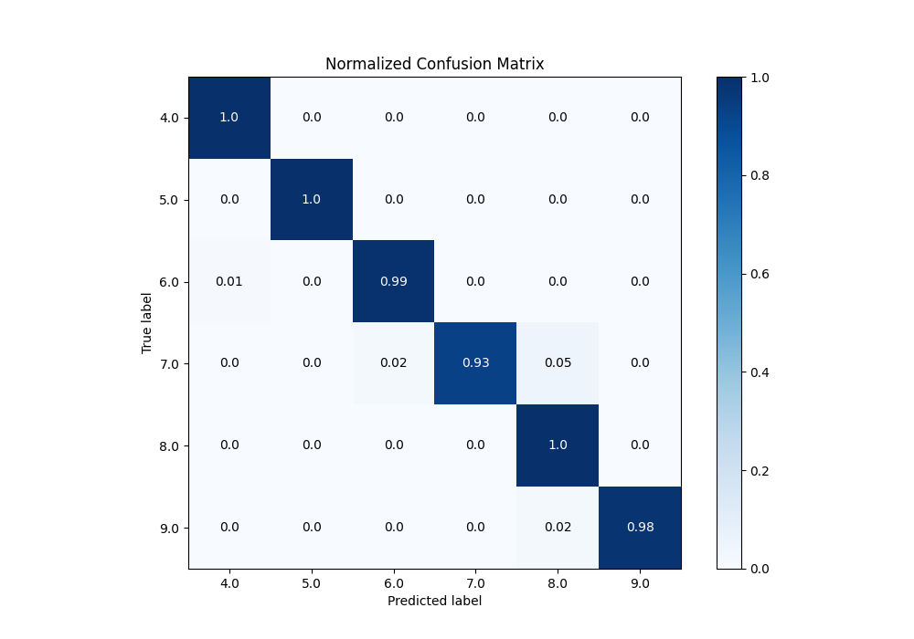
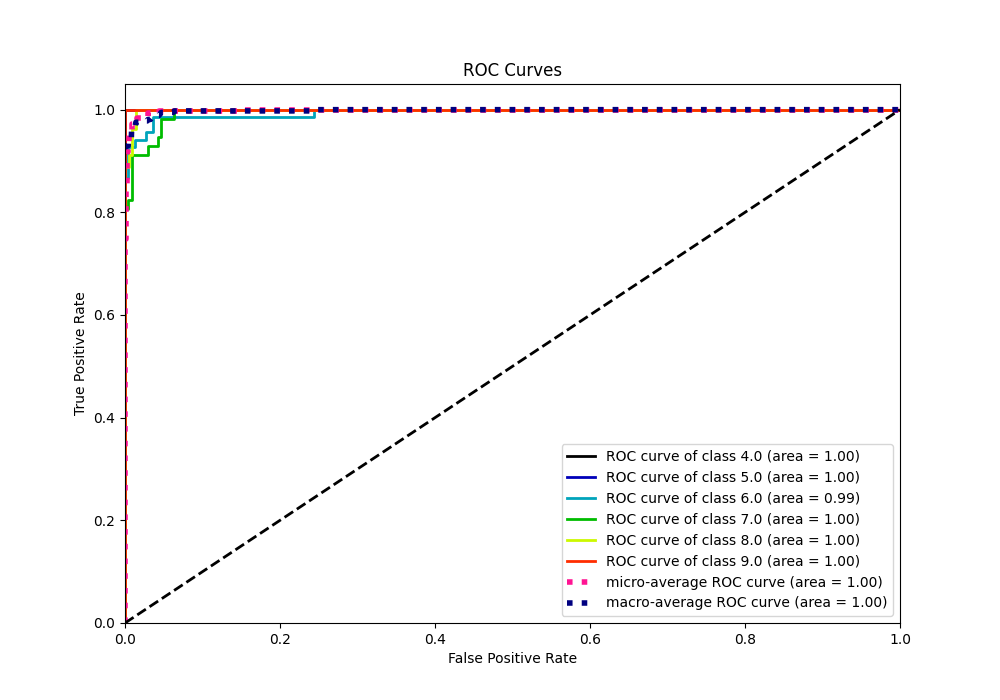
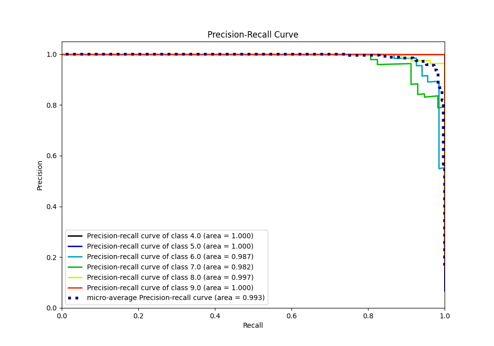

# Summary of 38_CatBoost_RandomFeature

[<< Go back](../README.md)

## CatBoost
- **n_jobs**: -1
- **learning_rate**: 0.1
- **depth**: 6
- **rsm**: 0.9
- **loss_function**: MultiClass
- **eval_metric**: Accuracy
- **num_class**: 6
- **explain_level**: 1

## Validation
 - **validation_type**: kfold
 - **k_folds**: 5

## Optimized metric
accuracy

## Training time

7.5 seconds

### Metric details
|           |       4.0 |   5.0 |       6.0 |       7.0 |       8.0 |       9.0 |   accuracy |   macro avg |   weighted avg |   logloss |
|:----------|----------:|------:|----------:|----------:|----------:|----------:|-----------:|------------:|---------------:|----------:|
| precision |  0.952381 |     1 |  0.985294 |  1        |  0.952381 |  1        |   0.979522 |    0.981676 |       0.980335 |  0.576003 |
| recall    |  1        |     1 |  0.985294 |  0.929825 |  1        |  0.979167 |   0.979522 |    0.982381 |       0.979522 |  0.576003 |
| f1-score  |  0.97561  |     1 |  0.985294 |  0.963636 |  0.97561  |  0.989474 |   0.979522 |    0.981604 |       0.979464 |  0.576003 |
| support   | 20        |    20 | 68        | 57        | 80        | 48        |   0.979522 |  293        |     293        |  0.576003 |

## Confusion matrix
|                |   Predicted as 4.0 |   Predicted as 5.0 |   Predicted as 6.0 |   Predicted as 7.0 |   Predicted as 8.0 |   Predicted as 9.0 |
|:---------------|-------------------:|-------------------:|-------------------:|-------------------:|-------------------:|-------------------:|
| Labeled as 4.0 |                 20 |                  0 |                  0 |                  0 |                  0 |                  0 |
| Labeled as 5.0 |                  0 |                 20 |                  0 |                  0 |                  0 |                  0 |
| Labeled as 6.0 |                  1 |                  0 |                 67 |                  0 |                  0 |                  0 |
| Labeled as 7.0 |                  0 |                  0 |                  1 |                 53 |                  3 |                  0 |
| Labeled as 8.0 |                  0 |                  0 |                  0 |                  0 |                 80 |                  0 |
| Labeled as 9.0 |                  0 |                  0 |                  0 |                  0 |                  1 |                 47 |

## Learning curves

## Permutation-based Importance

## Confusion Matrix

## Normalized Confusion Matrix

## ROC Curve

## Precision Recall Curve

[<< Go back](../README.md)
