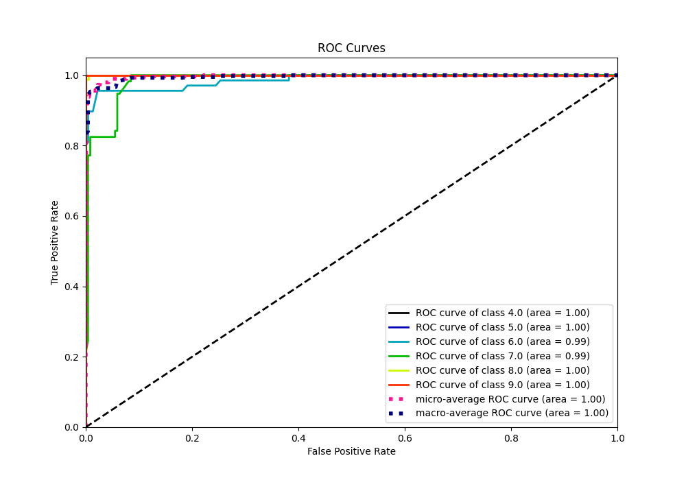

# Summary of 39_RandomForest

[<< Go back](../README.md)

## Random Forest
- **n_jobs**: -1
- **criterion**: gini
- **max_features**: 0.5
- **min_samples_split**: 20
- **max_depth**: 4
- **eval_metric_name**: accuracy
- **num_class**: 6
- **explain_level**: 0

## Validation
 - **validation_type**: kfold
 - **k_folds**: 5

## Optimized metric
accuracy

## Training time

4.0 seconds

### Metric details
|           |   4.0 |       5.0 |       6.0 |       7.0 |   8.0 |   9.0 |   accuracy |   macro avg |   weighted avg |   logloss |
|:----------|------:|----------:|----------:|----------:|------:|------:|-----------:|------------:|---------------:|----------:|
| precision |     1 |  0.952381 |  0.928571 |  0.962963 |     1 |     1 |   0.972696 |    0.973986 |       0.972967 |  0.223168 |
| recall    |     1 |  1        |  0.955882 |  0.912281 |     1 |     1 |   0.972696 |    0.978027 |       0.972696 |  0.223168 |
| f1-score  |     1 |  0.97561  |  0.942029 |  0.936937 |     1 |     1 |   0.972696 |    0.975763 |       0.972613 |  0.223168 |
| support   |    20 | 20        | 68        | 57        |    80 |    48 |   0.972696 |  293        |     293        |  0.223168 |

## Confusion matrix
|                |   Predicted as 4.0 |   Predicted as 5.0 |   Predicted as 6.0 |   Predicted as 7.0 |   Predicted as 8.0 |   Predicted as 9.0 |
|:---------------|-------------------:|-------------------:|-------------------:|-------------------:|-------------------:|-------------------:|
| Labeled as 4.0 |                 20 |                  0 |                  0 |                  0 |                  0 |                  0 |
| Labeled as 5.0 |                  0 |                 20 |                  0 |                  0 |                  0 |                  0 |
| Labeled as 6.0 |                  0 |                  1 |                 65 |                  2 |                  0 |                  0 |
| Labeled as 7.0 |                  0 |                  0 |                  5 |                 52 |                  0 |                  0 |
| Labeled as 8.0 |                  0 |                  0 |                  0 |                  0 |                 80 |                  0 |
| Labeled as 9.0 |                  0 |                  0 |                  0 |                  0 |                  0 |                 48 |

## Learning curves

## Confusion Matrix

## Normalized Confusion Matrix

## ROC Curve

## Precision Recall Curve

[<< Go back](../README.md)
