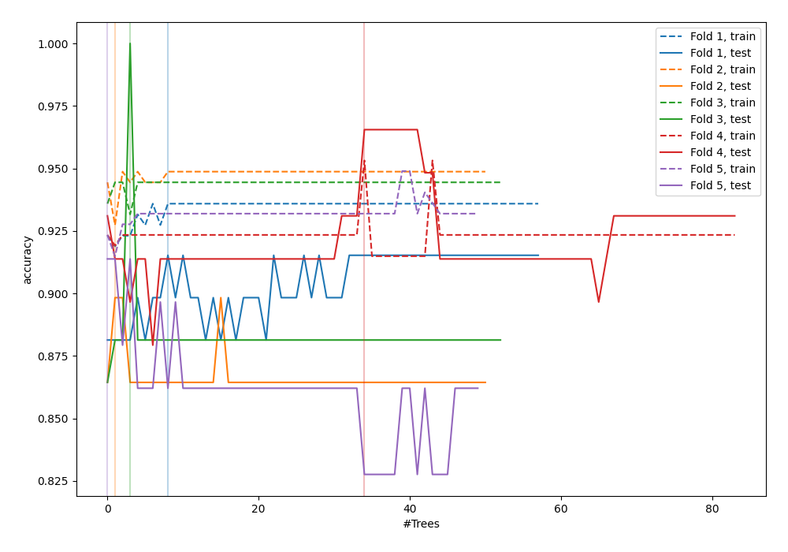
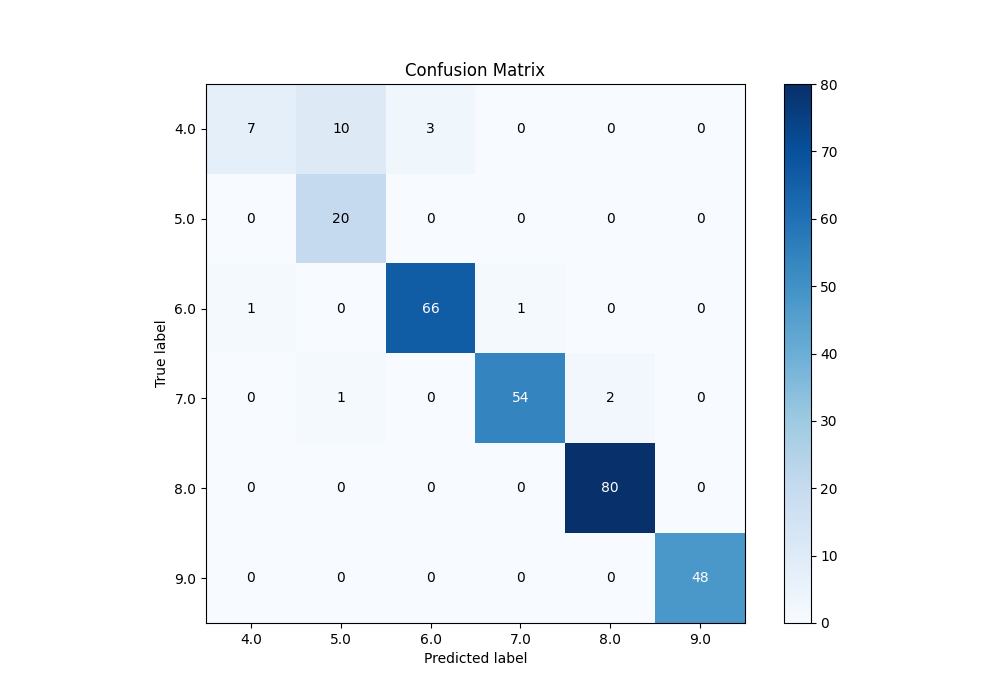
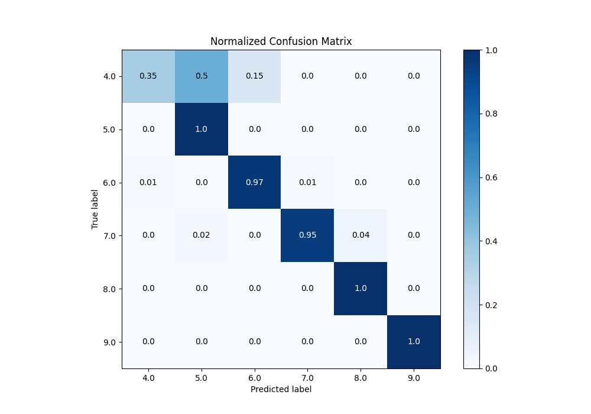
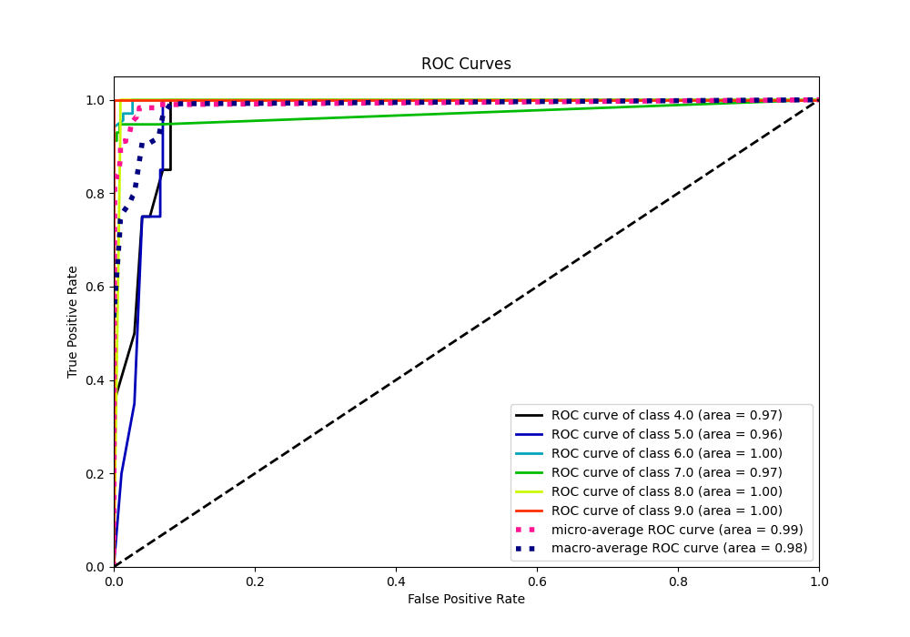
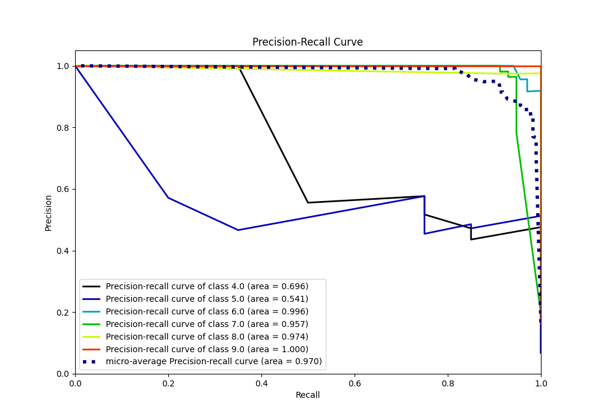

# Summary of 39_RandomForest_Stacked

[<< Go back](../README.md)

## Random Forest
- **n_jobs**: -1
- **criterion**: gini
- **max_features**: 0.5
- **min_samples_split**: 20
- **max_depth**: 4
- **eval_metric_name**: accuracy
- **num_class**: 6
- **explain_level**: 0

## Validation
 - **validation_type**: kfold
 - **k_folds**: 5

## Optimized metric
accuracy

## Training time

17.1 seconds

### Metric details
|           |    4.0 |       5.0 |       6.0 |       7.0 |       8.0 |   9.0 |   accuracy |   macro avg |   weighted avg |   logloss |
|:----------|-------:|----------:|----------:|----------:|----------:|------:|-----------:|------------:|---------------:|----------:|
| precision |  0.875 |  0.645161 |  0.956522 |  0.981818 |  0.97561  |     1 |   0.938567 |    0.905685 |       0.946959 |   0.30934 |
| recall    |  0.35  |  1        |  0.970588 |  0.947368 |  1        |     1 |   0.938567 |    0.877993 |       0.938567 |   0.30934 |
| f1-score  |  0.5   |  0.784314 |  0.963504 |  0.964286 |  0.987654 |     1 |   0.938567 |    0.866626 |       0.932359 |   0.30934 |
| support   | 20     | 20        | 68        | 57        | 80        |    48 |   0.938567 |  293        |     293        |   0.30934 |

## Confusion matrix
|                |   Predicted as 4.0 |   Predicted as 5.0 |   Predicted as 6.0 |   Predicted as 7.0 |   Predicted as 8.0 |   Predicted as 9.0 |
|:---------------|-------------------:|-------------------:|-------------------:|-------------------:|-------------------:|-------------------:|
| Labeled as 4.0 |                  7 |                 10 |                  3 |                  0 |                  0 |                  0 |
| Labeled as 5.0 |                  0 |                 20 |                  0 |                  0 |                  0 |                  0 |
| Labeled as 6.0 |                  1 |                  0 |                 66 |                  1 |                  0 |                  0 |
| Labeled as 7.0 |                  0 |                  1 |                  0 |                 54 |                  2 |                  0 |
| Labeled as 8.0 |                  0 |                  0 |                  0 |                  0 |                 80 |                  0 |
| Labeled as 9.0 |                  0 |                  0 |                  0 |                  0 |                  0 |                 48 |

## Learning curves

## Confusion Matrix

## Normalized Confusion Matrix

## ROC Curve

## Precision Recall Curve

[<< Go back](../README.md)
