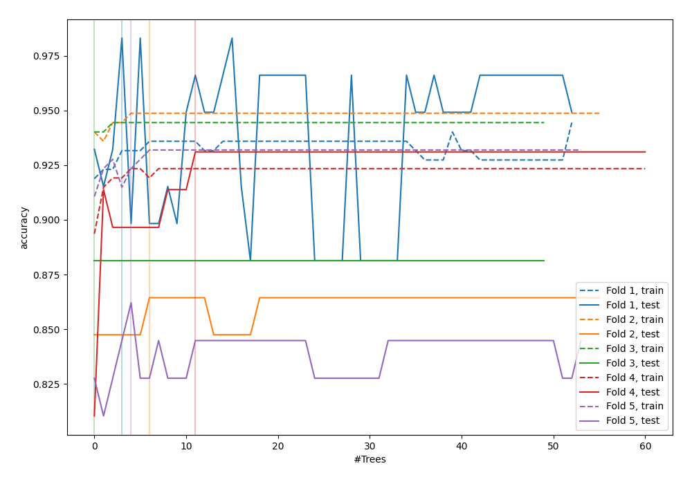
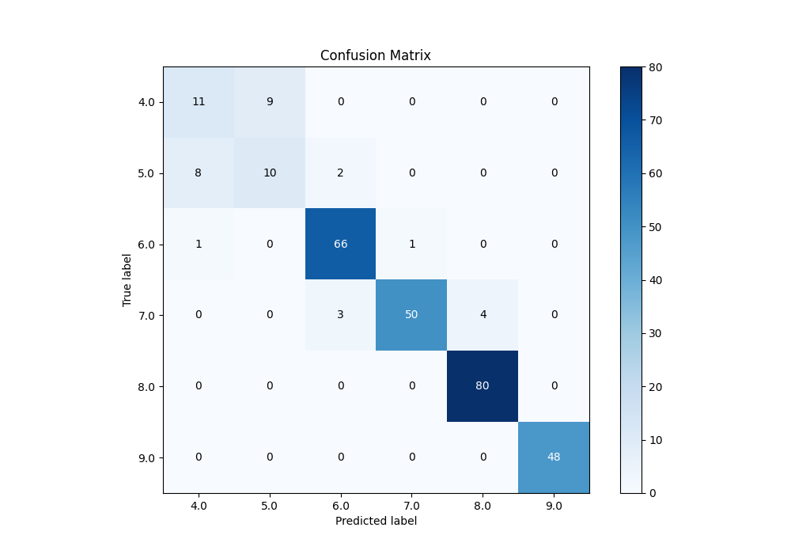
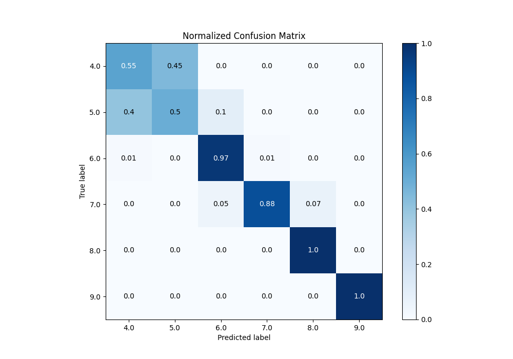
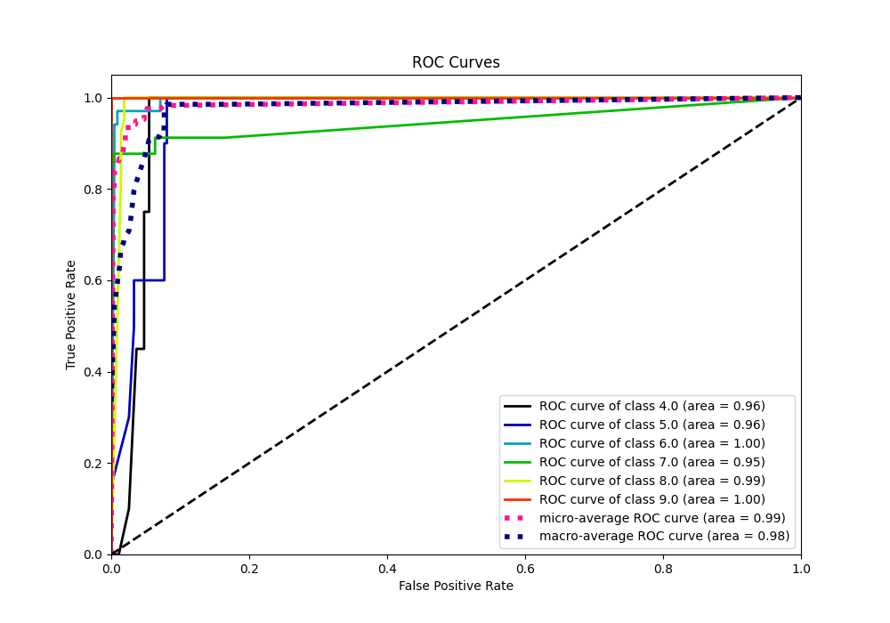
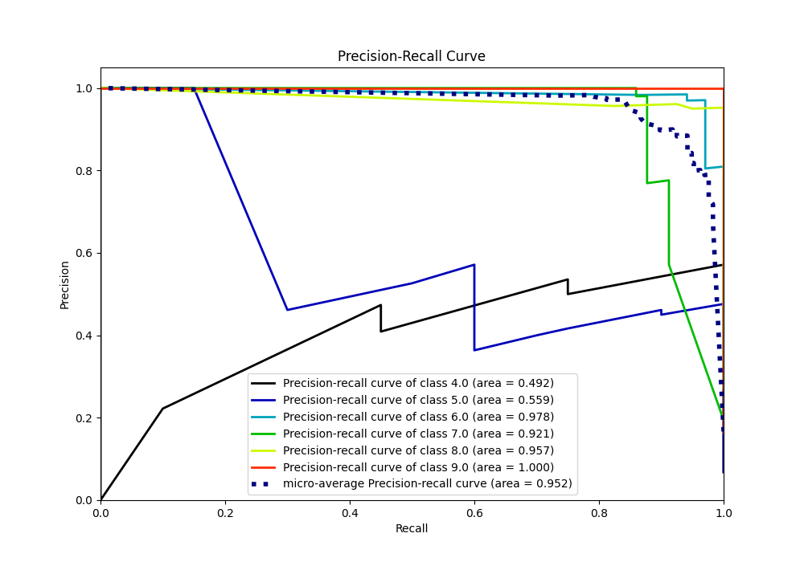

# Summary of 40_RandomForest_Stacked

[<< Go back](../README.md)

## Random Forest
- **n_jobs**: -1
- **criterion**: gini
- **max_features**: 0.7
- **min_samples_split**: 30
- **max_depth**: 7
- **eval_metric_name**: accuracy
- **num_class**: 6
- **explain_level**: 0

## Validation
 - **validation_type**: kfold
 - **k_folds**: 5

## Optimized metric
accuracy

## Training time

16.5 seconds

### Metric details
|           |   4.0 |       5.0 |       6.0 |       7.0 |       8.0 |   9.0 |   accuracy |   macro avg |   weighted avg |   logloss |
|:----------|------:|----------:|----------:|----------:|----------:|------:|-----------:|------------:|---------------:|----------:|
| precision |  0.55 |  0.526316 |  0.929577 |  0.980392 |  0.952381 |     1 |   0.904437 |    0.823111 |       0.90379  |  0.447066 |
| recall    |  0.55 |  0.5      |  0.970588 |  0.877193 |  1        |     1 |   0.904437 |    0.816297 |       0.904437 |  0.447066 |
| f1-score  |  0.55 |  0.512821 |  0.94964  |  0.925926 |  0.97561  |     1 |   0.904437 |    0.818999 |       0.903271 |  0.447066 |
| support   | 20    | 20        | 68        | 57        | 80        |    48 |   0.904437 |  293        |     293        |  0.447066 |

## Confusion matrix
|                |   Predicted as 4.0 |   Predicted as 5.0 |   Predicted as 6.0 |   Predicted as 7.0 |   Predicted as 8.0 |   Predicted as 9.0 |
|:---------------|-------------------:|-------------------:|-------------------:|-------------------:|-------------------:|-------------------:|
| Labeled as 4.0 |                 11 |                  9 |                  0 |                  0 |                  0 |                  0 |
| Labeled as 5.0 |                  8 |                 10 |                  2 |                  0 |                  0 |                  0 |
| Labeled as 6.0 |                  1 |                  0 |                 66 |                  1 |                  0 |                  0 |
| Labeled as 7.0 |                  0 |                  0 |                  3 |                 50 |                  4 |                  0 |
| Labeled as 8.0 |                  0 |                  0 |                  0 |                  0 |                 80 |                  0 |
| Labeled as 9.0 |                  0 |                  0 |                  0 |                  0 |                  0 |                 48 |

## Learning curves

## Confusion Matrix

## Normalized Confusion Matrix

## ROC Curve

## Precision Recall Curve

[<< Go back](../README.md)
