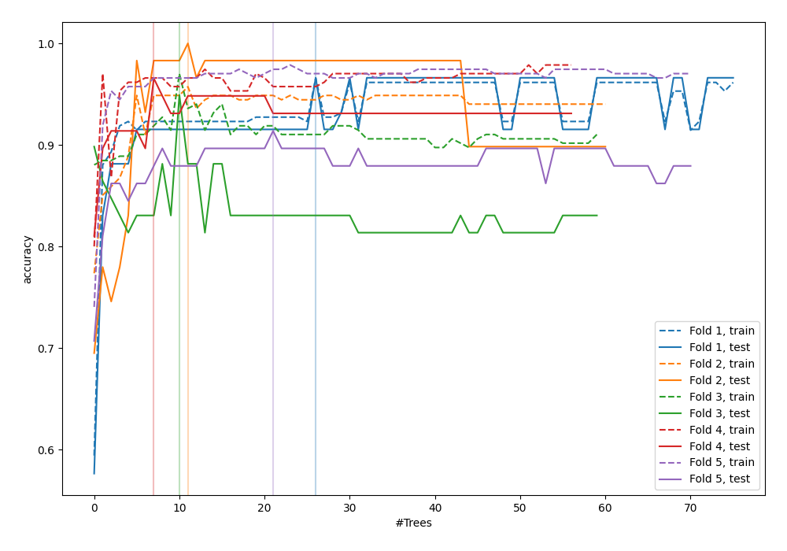
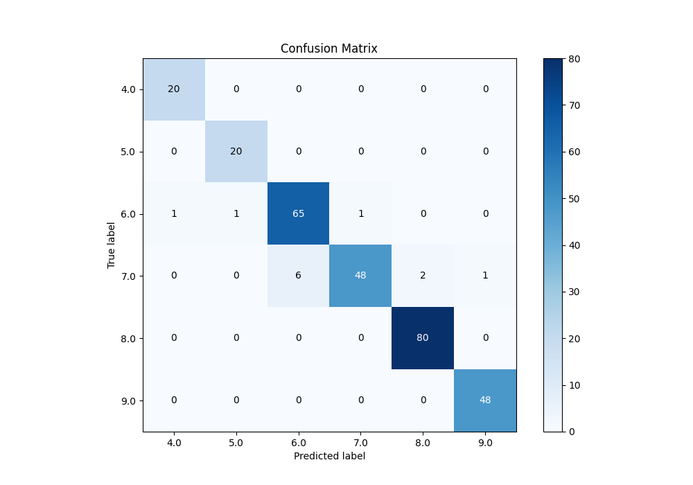
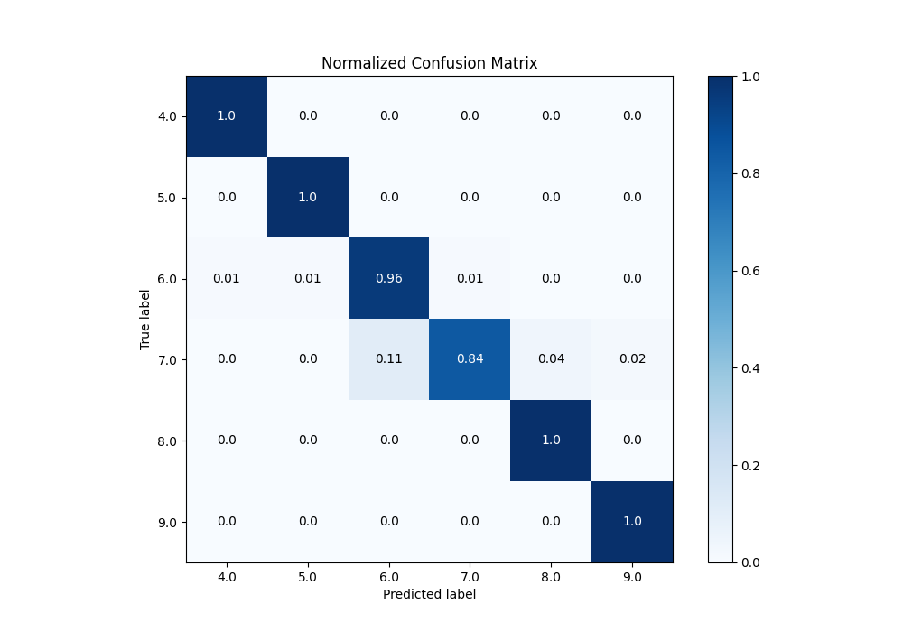
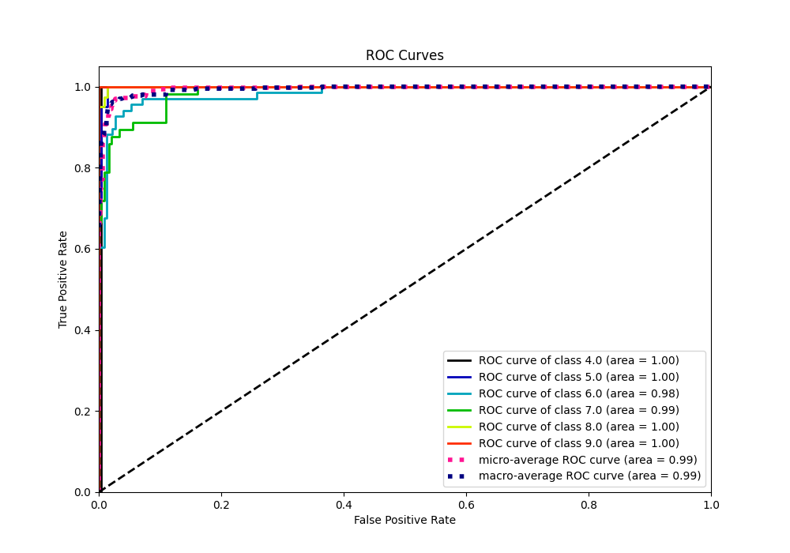
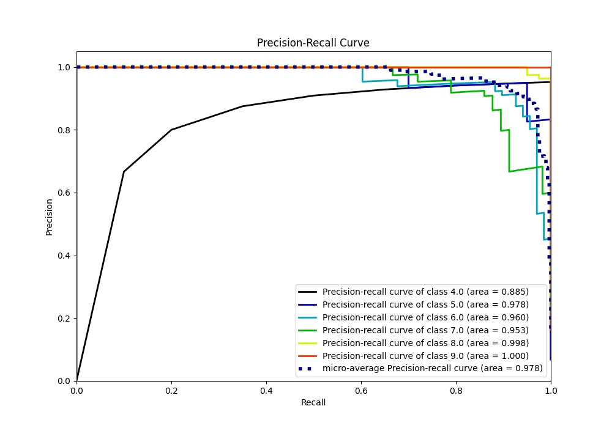

# Summary of 42_RandomForest

[<< Go back](../README.md)

## Random Forest
- **n_jobs**: -1
- **criterion**: entropy
- **max_features**: 0.6
- **min_samples_split**: 50
- **max_depth**: 6
- **eval_metric_name**: accuracy
- **num_class**: 6
- **explain_level**: 0

## Validation
 - **validation_type**: kfold
 - **k_folds**: 5

## Optimized metric
accuracy

## Training time

4.8 seconds

### Metric details
|           |       4.0 |       5.0 |       6.0 |       7.0 |       8.0 |       9.0 |   accuracy |   macro avg |   weighted avg |   logloss |
|:----------|----------:|----------:|----------:|----------:|----------:|----------:|-----------:|------------:|---------------:|----------:|
| precision |  0.952381 |  0.952381 |  0.915493 |  0.979592 |  0.97561  |  0.979592 |   0.959044 |    0.959175 |       0.959914 |  0.375966 |
| recall    |  1        |  1        |  0.955882 |  0.842105 |  1        |  1        |   0.959044 |    0.966331 |       0.959044 |  0.375966 |
| f1-score  |  0.97561  |  0.97561  |  0.935252 |  0.90566  |  0.987654 |  0.989691 |   0.959044 |    0.961579 |       0.958231 |  0.375966 |
| support   | 20        | 20        | 68        | 57        | 80        | 48        |   0.959044 |  293        |     293        |  0.375966 |

## Confusion matrix
|                |   Predicted as 4.0 |   Predicted as 5.0 |   Predicted as 6.0 |   Predicted as 7.0 |   Predicted as 8.0 |   Predicted as 9.0 |
|:---------------|-------------------:|-------------------:|-------------------:|-------------------:|-------------------:|-------------------:|
| Labeled as 4.0 |                 20 |                  0 |                  0 |                  0 |                  0 |                  0 |
| Labeled as 5.0 |                  0 |                 20 |                  0 |                  0 |                  0 |                  0 |
| Labeled as 6.0 |                  1 |                  1 |                 65 |                  1 |                  0 |                  0 |
| Labeled as 7.0 |                  0 |                  0 |                  6 |                 48 |                  2 |                  1 |
| Labeled as 8.0 |                  0 |                  0 |                  0 |                  0 |                 80 |                  0 |
| Labeled as 9.0 |                  0 |                  0 |                  0 |                  0 |                  0 |                 48 |

## Learning curves

## Confusion Matrix

## Normalized Confusion Matrix

## ROC Curve

## Precision Recall Curve

[<< Go back](../README.md)
