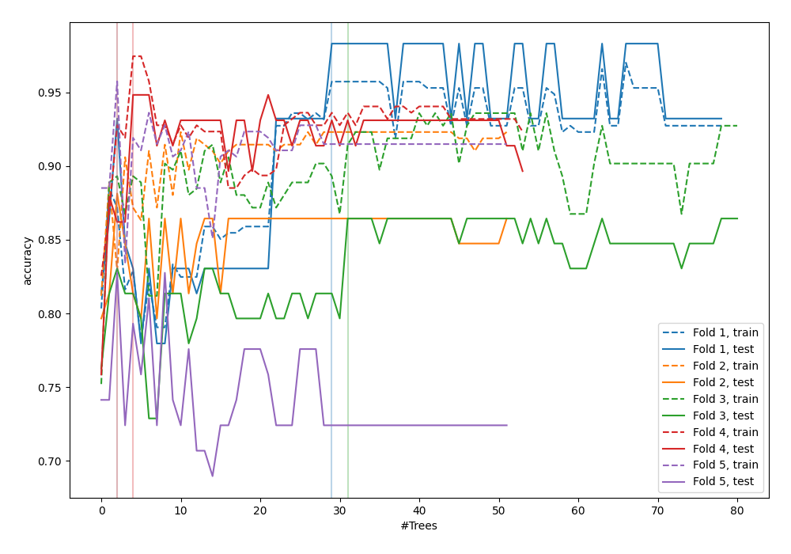
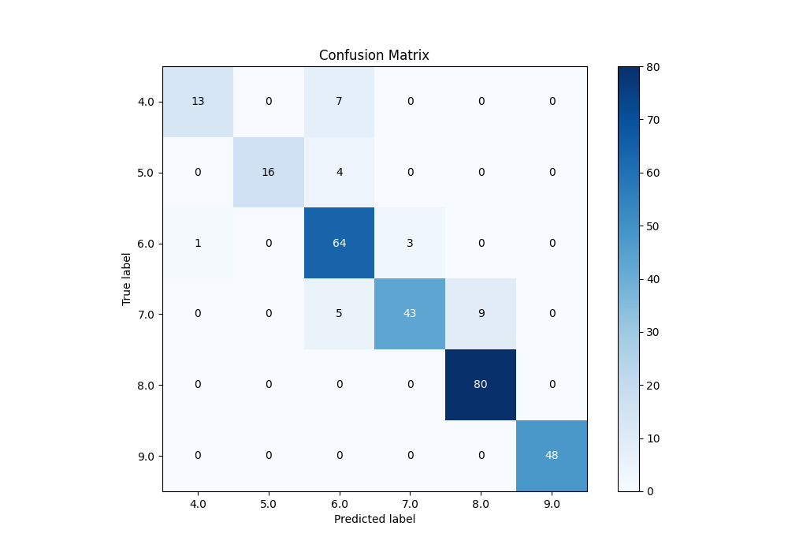
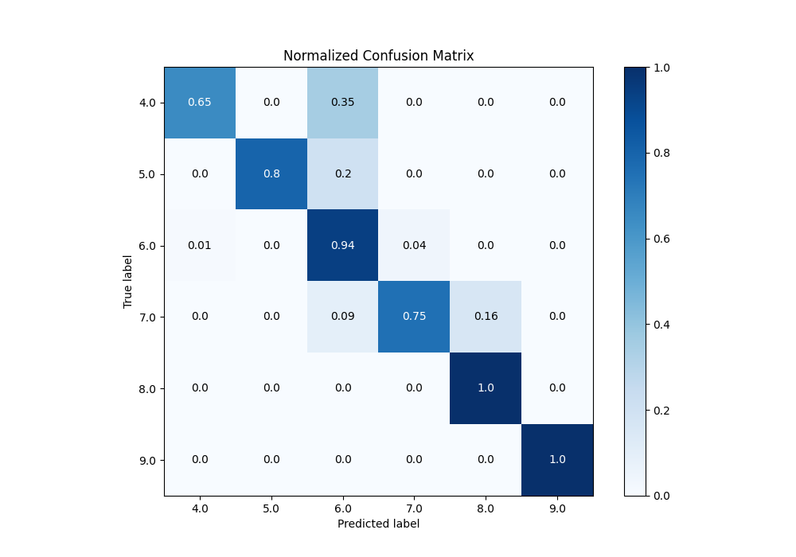
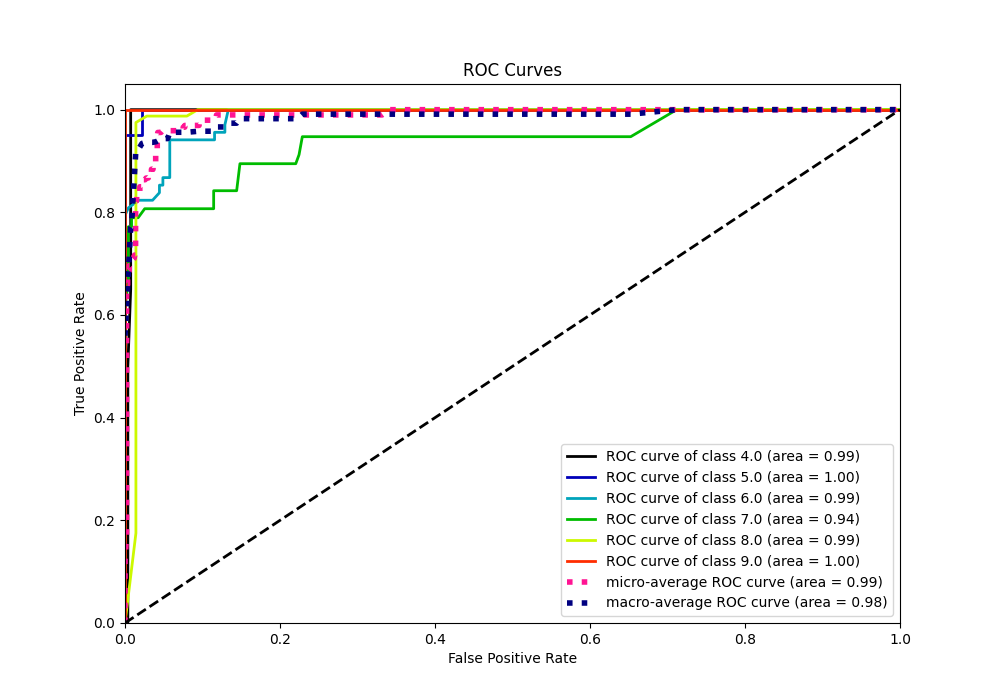
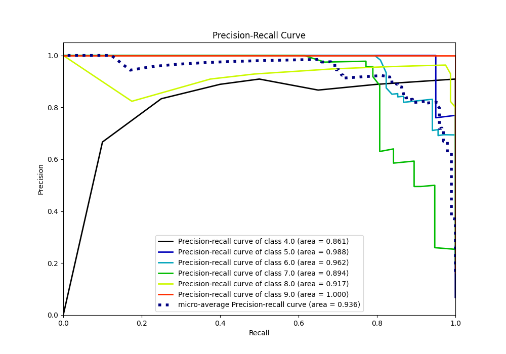

# Summary of 43_RandomForest

[<< Go back](../README.md)

## Random Forest
- **n_jobs**: -1
- **criterion**: gini
- **max_features**: 0.7
- **min_samples_split**: 50
- **max_depth**: 3
- **eval_metric_name**: accuracy
- **num_class**: 6
- **explain_level**: 0

## Validation
 - **validation_type**: kfold
 - **k_folds**: 5

## Optimized metric
accuracy

## Training time

5.1 seconds

### Metric details
|           |       4.0 |       5.0 |       6.0 |       7.0 |       8.0 |   9.0 |   accuracy |   macro avg |   weighted avg |   logloss |
|:----------|----------:|----------:|----------:|----------:|----------:|------:|-----------:|------------:|---------------:|----------:|
| precision |  0.928571 |  1        |  0.8      |  0.934783 |  0.898876 |     1 |   0.901024 |    0.927038 |       0.90841  |  0.448385 |
| recall    |  0.65     |  0.8      |  0.941176 |  0.754386 |  1        |     1 |   0.901024 |    0.857594 |       0.901024 |  0.448385 |
| f1-score  |  0.764706 |  0.888889 |  0.864865 |  0.834951 |  0.946746 |     1 |   0.901024 |    0.883359 |       0.898343 |  0.448385 |
| support   | 20        | 20        | 68        | 57        | 80        |    48 |   0.901024 |  293        |     293        |  0.448385 |

## Confusion matrix
|                |   Predicted as 4.0 |   Predicted as 5.0 |   Predicted as 6.0 |   Predicted as 7.0 |   Predicted as 8.0 |   Predicted as 9.0 |
|:---------------|-------------------:|-------------------:|-------------------:|-------------------:|-------------------:|-------------------:|
| Labeled as 4.0 |                 13 |                  0 |                  7 |                  0 |                  0 |                  0 |
| Labeled as 5.0 |                  0 |                 16 |                  4 |                  0 |                  0 |                  0 |
| Labeled as 6.0 |                  1 |                  0 |                 64 |                  3 |                  0 |                  0 |
| Labeled as 7.0 |                  0 |                  0 |                  5 |                 43 |                  9 |                  0 |
| Labeled as 8.0 |                  0 |                  0 |                  0 |                  0 |                 80 |                  0 |
| Labeled as 9.0 |                  0 |                  0 |                  0 |                  0 |                  0 |                 48 |

## Learning curves

## Confusion Matrix

## Normalized Confusion Matrix

## ROC Curve

## Precision Recall Curve

[<< Go back](../README.md)
