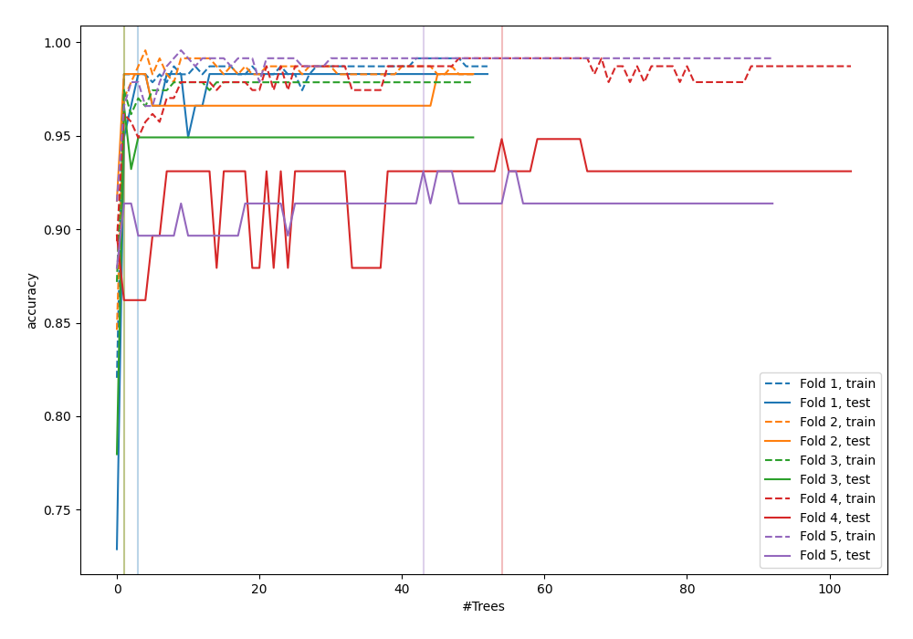
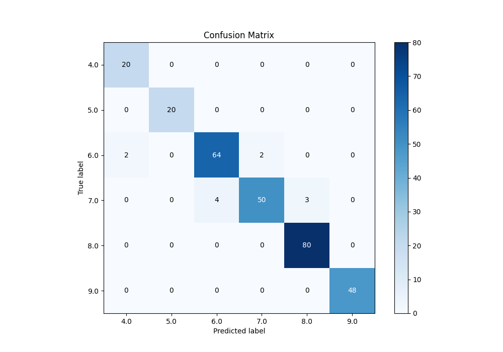
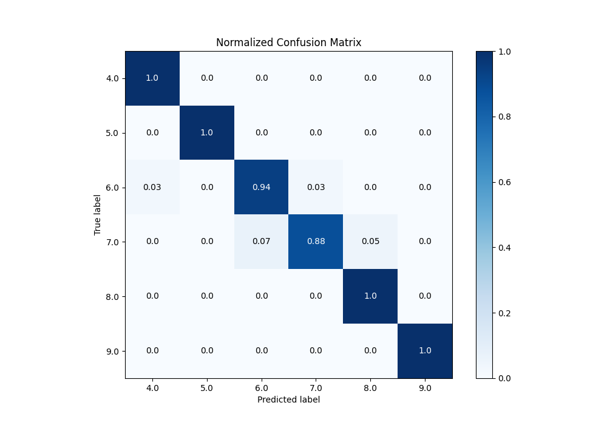
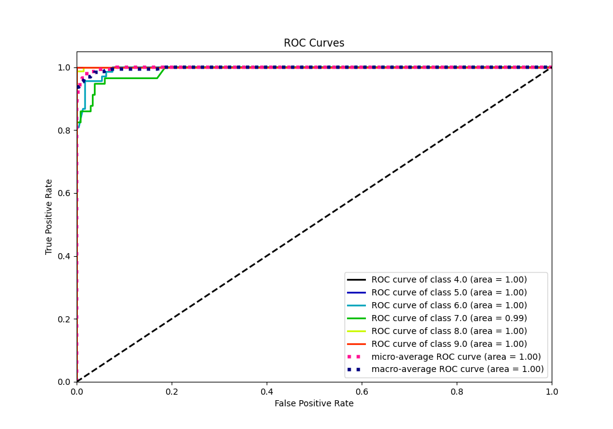
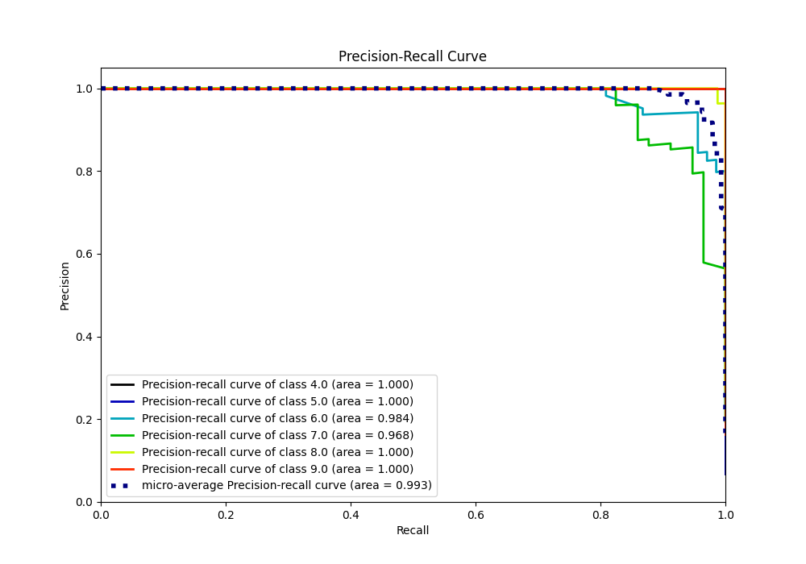

# Summary of 46_RandomForest

[<< Go back](../README.md)

## Random Forest
- **n_jobs**: -1
- **criterion**: gini
- **max_features**: 0.6
- **min_samples_split**: 20
- **max_depth**: 4
- **eval_metric_name**: accuracy
- **num_class**: 6
- **explain_level**: 0

## Validation
 - **validation_type**: kfold
 - **k_folds**: 5

## Optimized metric
accuracy

## Training time

5.8 seconds

### Metric details
|           |       4.0 |   5.0 |       6.0 |       7.0 |       8.0 |   9.0 |   accuracy |   macro avg |   weighted avg |   logloss |
|:----------|----------:|------:|----------:|----------:|----------:|------:|-----------:|------------:|---------------:|----------:|
| precision |  0.909091 |     1 |  0.941176 |  0.961538 |  0.963855 |     1 |   0.962457 |    0.96261  |       0.962792 |  0.203516 |
| recall    |  1        |     1 |  0.941176 |  0.877193 |  1        |     1 |   0.962457 |    0.969728 |       0.962457 |  0.203516 |
| f1-score  |  0.952381 |     1 |  0.941176 |  0.917431 |  0.981595 |     1 |   0.962457 |    0.965431 |       0.96201  |  0.203516 |
| support   | 20        |    20 | 68        | 57        | 80        |    48 |   0.962457 |  293        |     293        |  0.203516 |

## Confusion matrix
|                |   Predicted as 4.0 |   Predicted as 5.0 |   Predicted as 6.0 |   Predicted as 7.0 |   Predicted as 8.0 |   Predicted as 9.0 |
|:---------------|-------------------:|-------------------:|-------------------:|-------------------:|-------------------:|-------------------:|
| Labeled as 4.0 |                 20 |                  0 |                  0 |                  0 |                  0 |                  0 |
| Labeled as 5.0 |                  0 |                 20 |                  0 |                  0 |                  0 |                  0 |
| Labeled as 6.0 |                  2 |                  0 |                 64 |                  2 |                  0 |                  0 |
| Labeled as 7.0 |                  0 |                  0 |                  4 |                 50 |                  3 |                  0 |
| Labeled as 8.0 |                  0 |                  0 |                  0 |                  0 |                 80 |                  0 |
| Labeled as 9.0 |                  0 |                  0 |                  0 |                  0 |                  0 |                 48 |

## Learning curves

## Confusion Matrix

## Normalized Confusion Matrix

## ROC Curve

## Precision Recall Curve

[<< Go back](../README.md)
