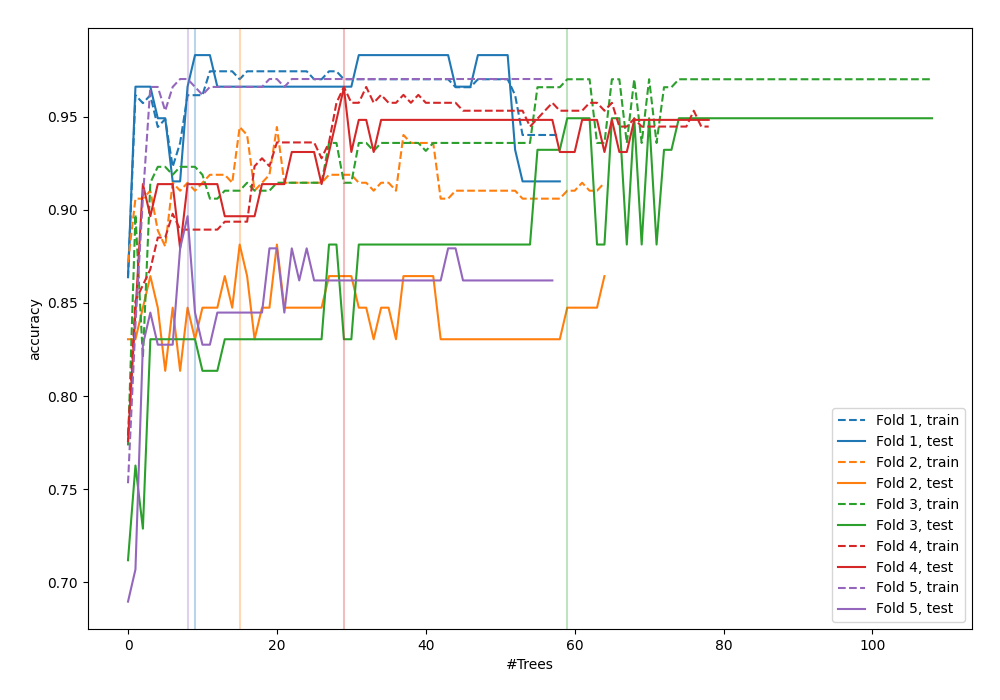
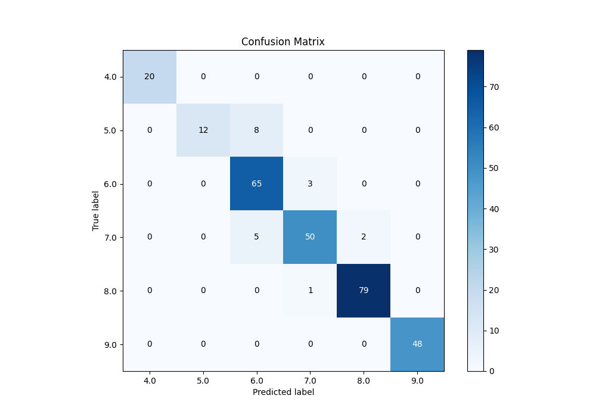
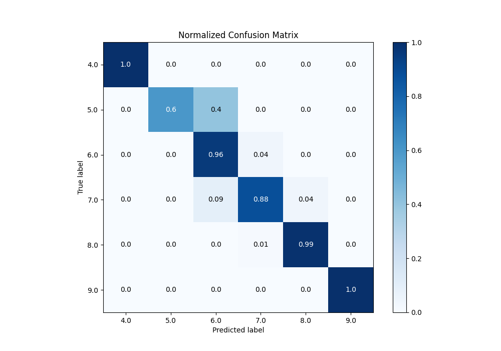
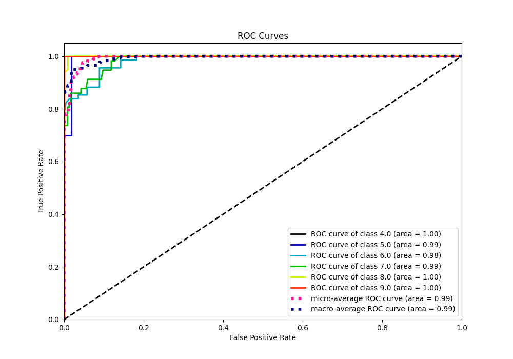
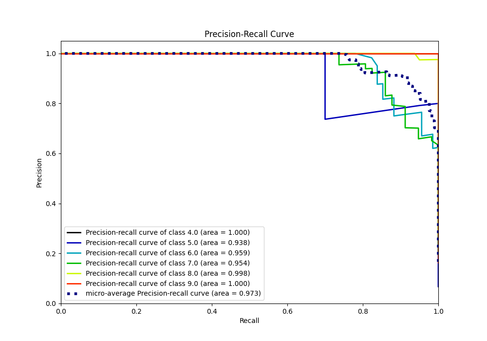

# Summary of 47_RandomForest

[<< Go back](../README.md)

## Random Forest
- **n_jobs**: -1
- **criterion**: gini
- **max_features**: 0.5
- **min_samples_split**: 50
- **max_depth**: 5
- **eval_metric_name**: accuracy
- **num_class**: 6
- **explain_level**: 0

## Validation
 - **validation_type**: kfold
 - **k_folds**: 5

## Optimized metric
accuracy

## Training time

6.3 seconds

### Metric details
|           |   4.0 |   5.0 |       6.0 |       7.0 |       8.0 |   9.0 |   accuracy |   macro avg |   weighted avg |   logloss |
|:----------|------:|------:|----------:|----------:|----------:|------:|-----------:|------------:|---------------:|----------:|
| precision |     1 |  1    |  0.833333 |  0.925926 |  0.975309 |     1 |   0.935154 |    0.955761 |       0.940168 |  0.394854 |
| recall    |     1 |  0.6  |  0.955882 |  0.877193 |  0.9875   |     1 |   0.935154 |    0.903429 |       0.935154 |  0.394854 |
| f1-score  |     1 |  0.75 |  0.890411 |  0.900901 |  0.981366 |     1 |   0.935154 |    0.920446 |       0.933135 |  0.394854 |
| support   |    20 | 20    | 68        | 57        | 80        |    48 |   0.935154 |  293        |     293        |  0.394854 |

## Confusion matrix
|                |   Predicted as 4.0 |   Predicted as 5.0 |   Predicted as 6.0 |   Predicted as 7.0 |   Predicted as 8.0 |   Predicted as 9.0 |
|:---------------|-------------------:|-------------------:|-------------------:|-------------------:|-------------------:|-------------------:|
| Labeled as 4.0 |                 20 |                  0 |                  0 |                  0 |                  0 |                  0 |
| Labeled as 5.0 |                  0 |                 12 |                  8 |                  0 |                  0 |                  0 |
| Labeled as 6.0 |                  0 |                  0 |                 65 |                  3 |                  0 |                  0 |
| Labeled as 7.0 |                  0 |                  0 |                  5 |                 50 |                  2 |                  0 |
| Labeled as 8.0 |                  0 |                  0 |                  0 |                  1 |                 79 |                  0 |
| Labeled as 9.0 |                  0 |                  0 |                  0 |                  0 |                  0 |                 48 |

## Learning curves

## Confusion Matrix

## Normalized Confusion Matrix

## ROC Curve

## Precision Recall Curve

[<< Go back](../README.md)
