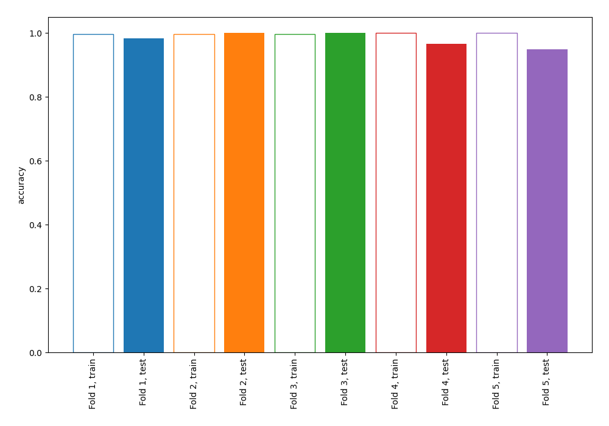
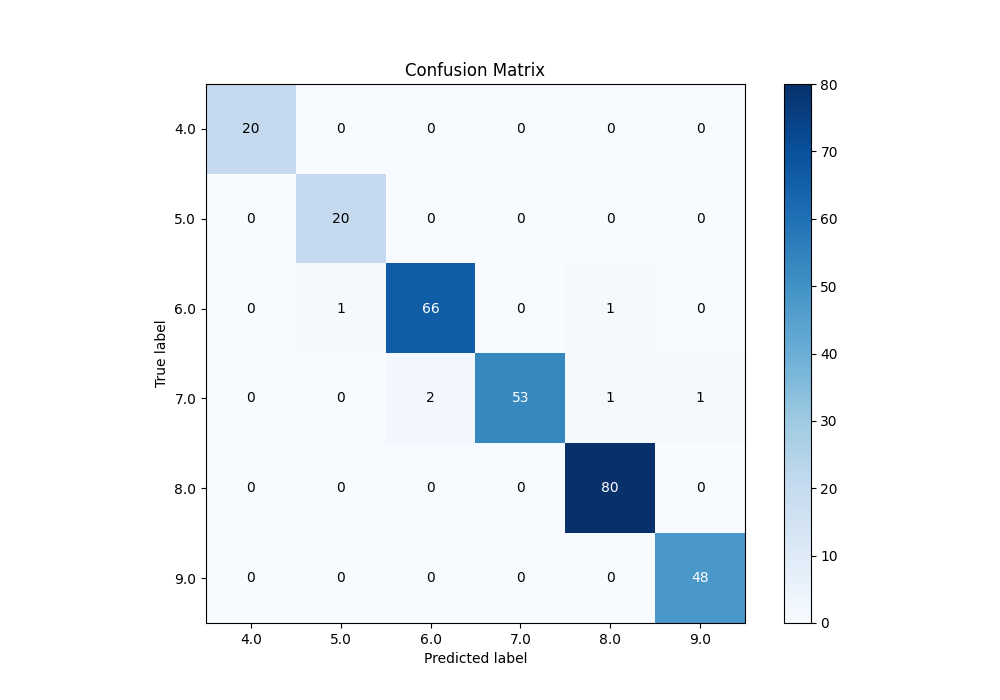
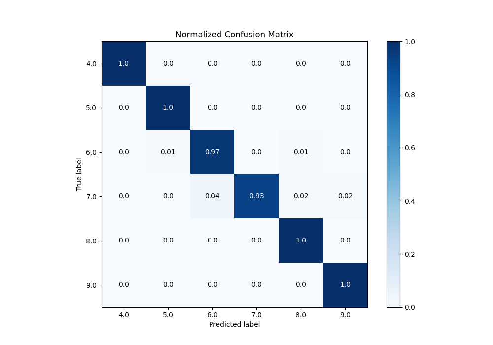
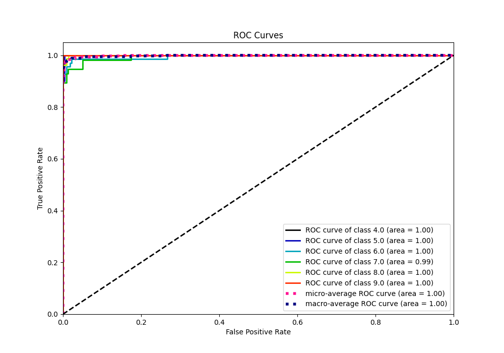
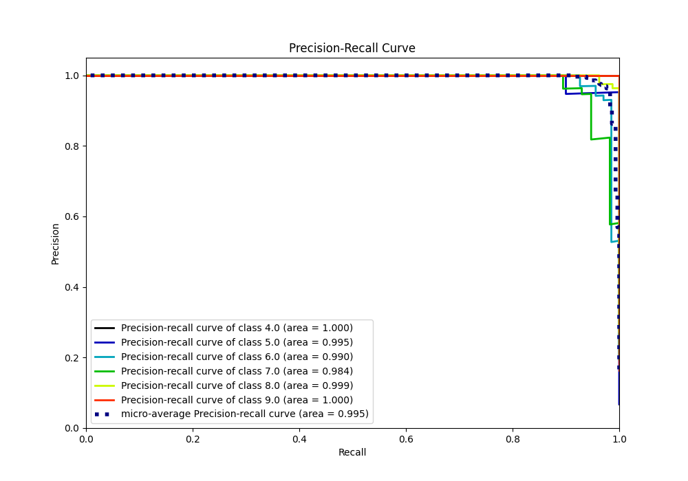

# Summary of 4_Linear

[<< Go back](../README.md)

## Logistic Regression (Linear)
- **n_jobs**: -1
- **num_class**: 6
- **explain_level**: 0

## Validation
 - **validation_type**: kfold
 - **k_folds**: 5

## Optimized metric
accuracy

## Training time

3.5 seconds

### Metric details
|           |   4.0 |       5.0 |       6.0 |       7.0 |       8.0 |       9.0 |   accuracy |   macro avg |   weighted avg |   logloss |
|:----------|------:|----------:|----------:|----------:|----------:|----------:|-----------:|------------:|---------------:|----------:|
| precision |     1 |  0.952381 |  0.970588 |  1        |  0.97561  |  0.979592 |   0.979522 |    0.979695 |       0.979921 |  0.143844 |
| recall    |     1 |  1        |  0.970588 |  0.929825 |  1        |  1        |   0.979522 |    0.983402 |       0.979522 |  0.143844 |
| f1-score  |     1 |  0.97561  |  0.970588 |  0.963636 |  0.987654 |  0.989691 |   0.979522 |    0.981197 |       0.979375 |  0.143844 |
| support   |    20 | 20        | 68        | 57        | 80        | 48        |   0.979522 |  293        |     293        |  0.143844 |

## Confusion matrix
|                |   Predicted as 4.0 |   Predicted as 5.0 |   Predicted as 6.0 |   Predicted as 7.0 |   Predicted as 8.0 |   Predicted as 9.0 |
|:---------------|-------------------:|-------------------:|-------------------:|-------------------:|-------------------:|-------------------:|
| Labeled as 4.0 |                 20 |                  0 |                  0 |                  0 |                  0 |                  0 |
| Labeled as 5.0 |                  0 |                 20 |                  0 |                  0 |                  0 |                  0 |
| Labeled as 6.0 |                  0 |                  1 |                 66 |                  0 |                  1 |                  0 |
| Labeled as 7.0 |                  0 |                  0 |                  2 |                 53 |                  1 |                  1 |
| Labeled as 8.0 |                  0 |                  0 |                  0 |                  0 |                 80 |                  0 |
| Labeled as 9.0 |                  0 |                  0 |                  0 |                  0 |                  0 |                 48 |

## Learning curves

## Confusion Matrix

## Normalized Confusion Matrix

## ROC Curve

## Precision Recall Curve

[<< Go back](../README.md)
