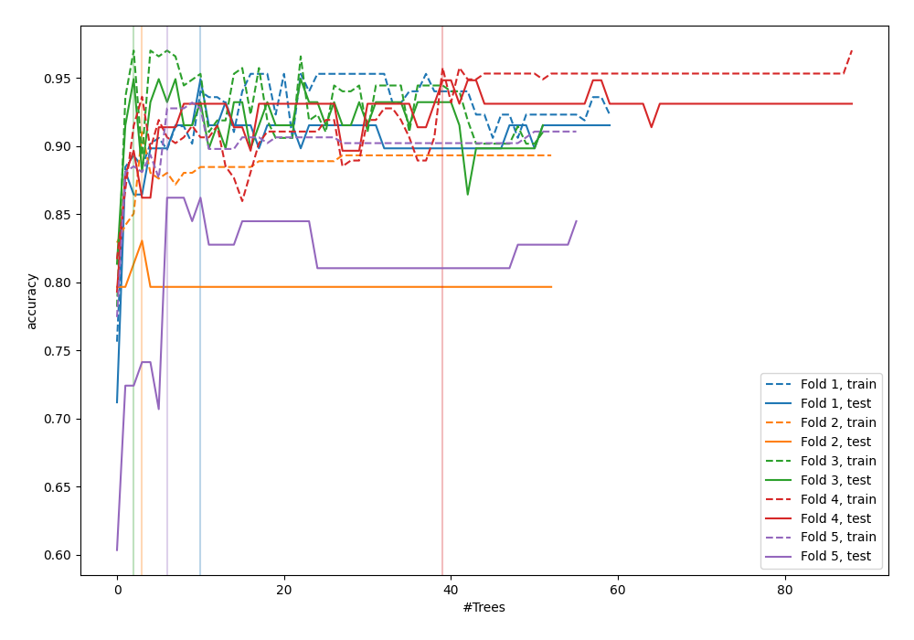
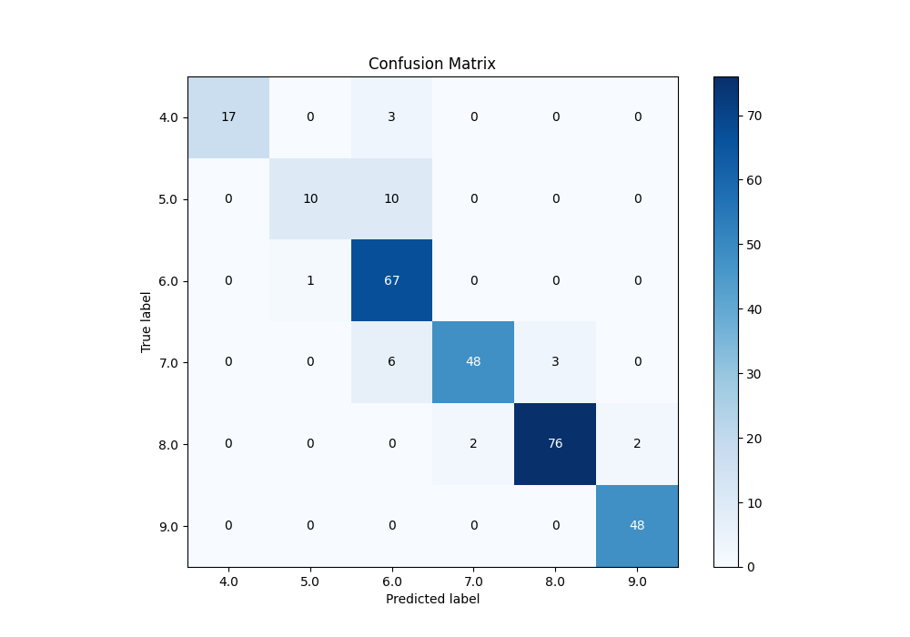
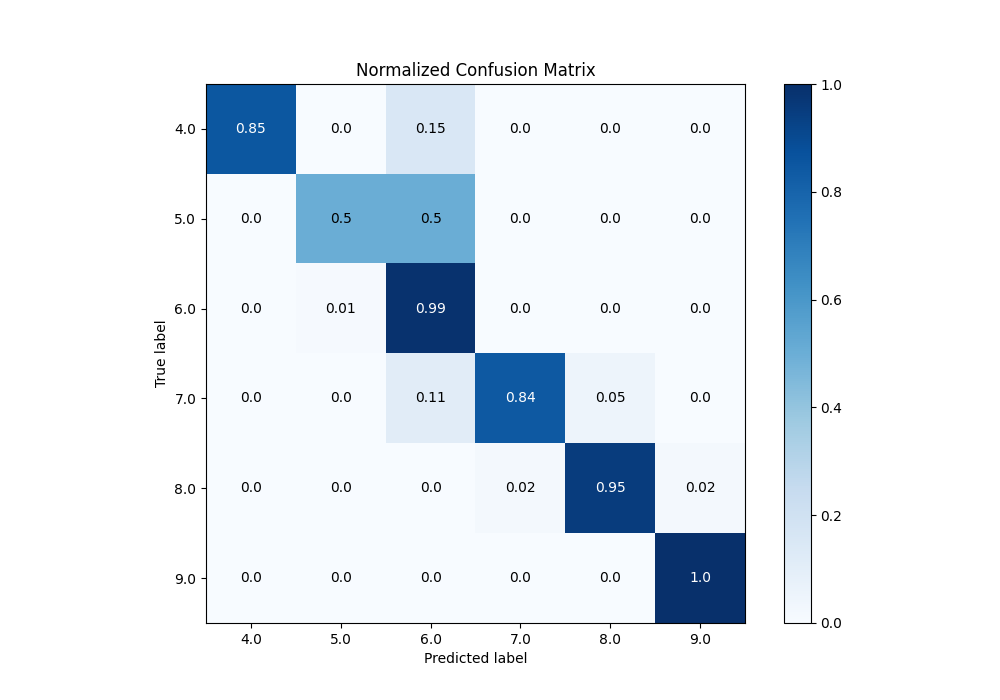
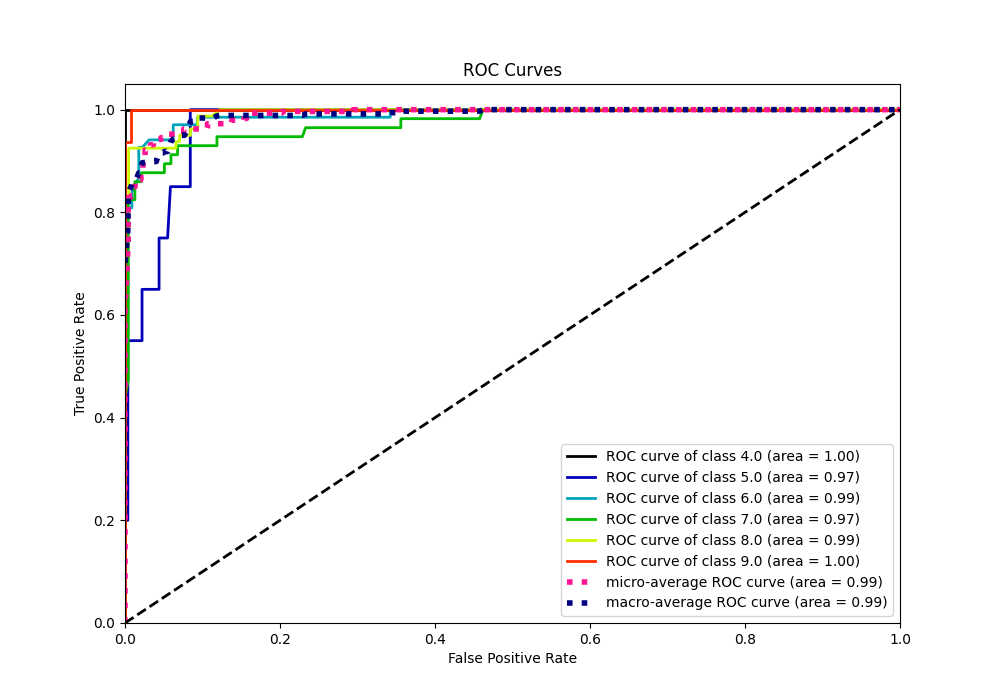
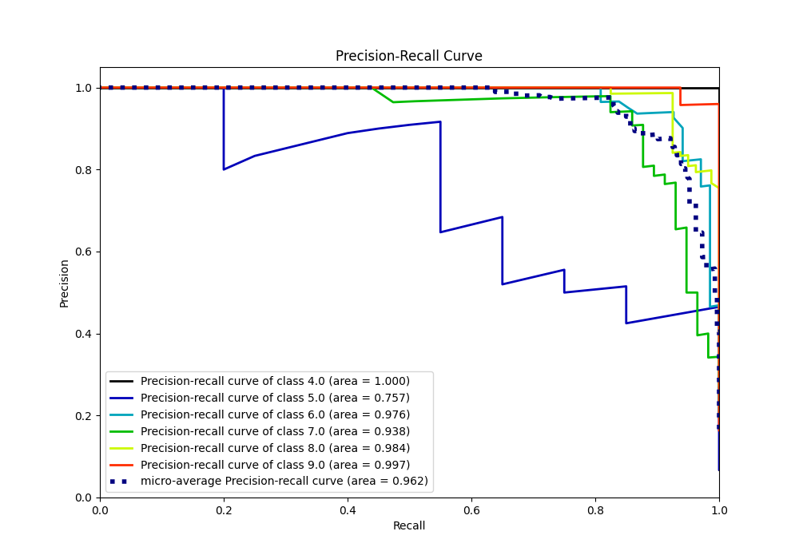

# Summary of 50_ExtraTrees

[<< Go back](../README.md)

## Extra Trees Classifier (Extra Trees)
- **n_jobs**: -1
- **criterion**: gini
- **max_features**: 0.8
- **min_samples_split**: 40
- **max_depth**: 3
- **eval_metric_name**: accuracy
- **num_class**: 6
- **explain_level**: 0

## Validation
 - **validation_type**: kfold
 - **k_folds**: 5

## Optimized metric
accuracy

## Training time

4.5 seconds

### Metric details
|           |       4.0 |       5.0 |       6.0 |       7.0 |       8.0 |       9.0 |   accuracy |   macro avg |   weighted avg |   logloss |
|:----------|----------:|----------:|----------:|----------:|----------:|----------:|-----------:|------------:|---------------:|----------:|
| precision |  1        |  0.909091 |  0.77907  |  0.96     |  0.962025 |  0.96     |    0.90785 |    0.928364 |       0.917818 |  0.455888 |
| recall    |  0.85     |  0.5      |  0.985294 |  0.842105 |  0.95     |  1        |    0.90785 |    0.854567 |       0.90785  |  0.455888 |
| f1-score  |  0.918919 |  0.645161 |  0.87013  |  0.897196 |  0.955975 |  0.979592 |    0.90785 |    0.877829 |       0.904741 |  0.455888 |
| support   | 20        | 20        | 68        | 57        | 80        | 48        |    0.90785 |  293        |     293        |  0.455888 |

## Confusion matrix
|                |   Predicted as 4.0 |   Predicted as 5.0 |   Predicted as 6.0 |   Predicted as 7.0 |   Predicted as 8.0 |   Predicted as 9.0 |
|:---------------|-------------------:|-------------------:|-------------------:|-------------------:|-------------------:|-------------------:|
| Labeled as 4.0 |                 17 |                  0 |                  3 |                  0 |                  0 |                  0 |
| Labeled as 5.0 |                  0 |                 10 |                 10 |                  0 |                  0 |                  0 |
| Labeled as 6.0 |                  0 |                  1 |                 67 |                  0 |                  0 |                  0 |
| Labeled as 7.0 |                  0 |                  0 |                  6 |                 48 |                  3 |                  0 |
| Labeled as 8.0 |                  0 |                  0 |                  0 |                  2 |                 76 |                  2 |
| Labeled as 9.0 |                  0 |                  0 |                  0 |                  0 |                  0 |                 48 |

## Learning curves

## Confusion Matrix

## Normalized Confusion Matrix

## ROC Curve

## Precision Recall Curve

[<< Go back](../README.md)
