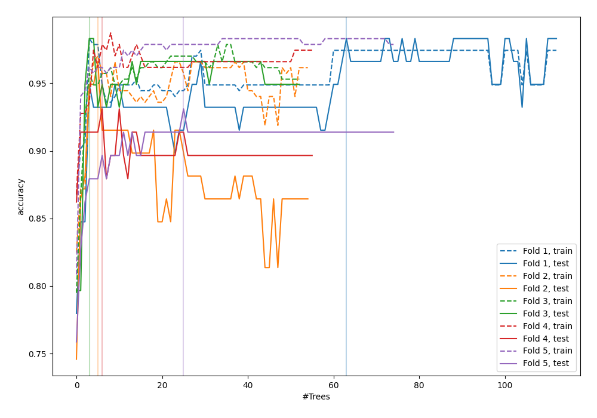
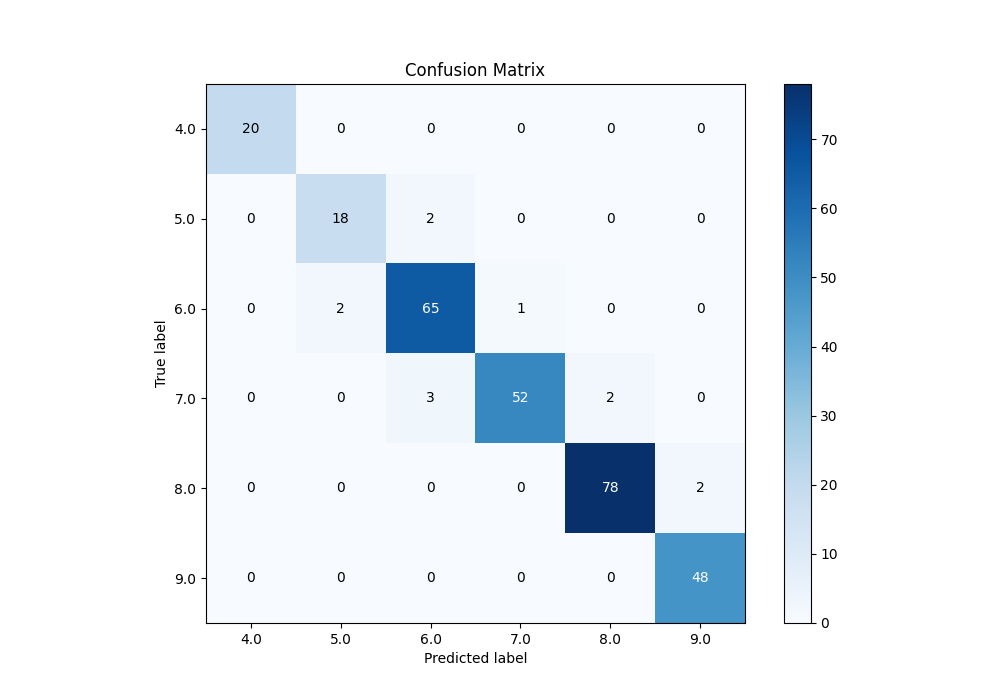
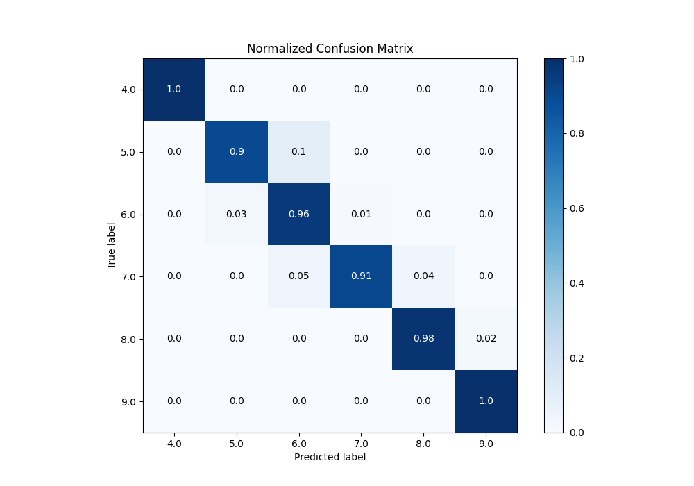
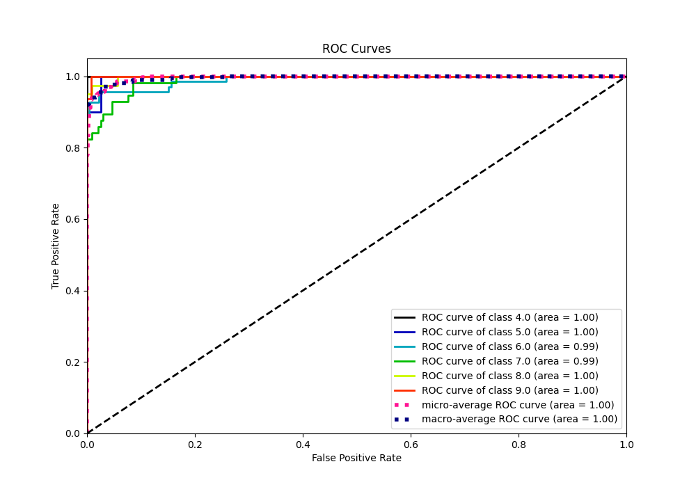
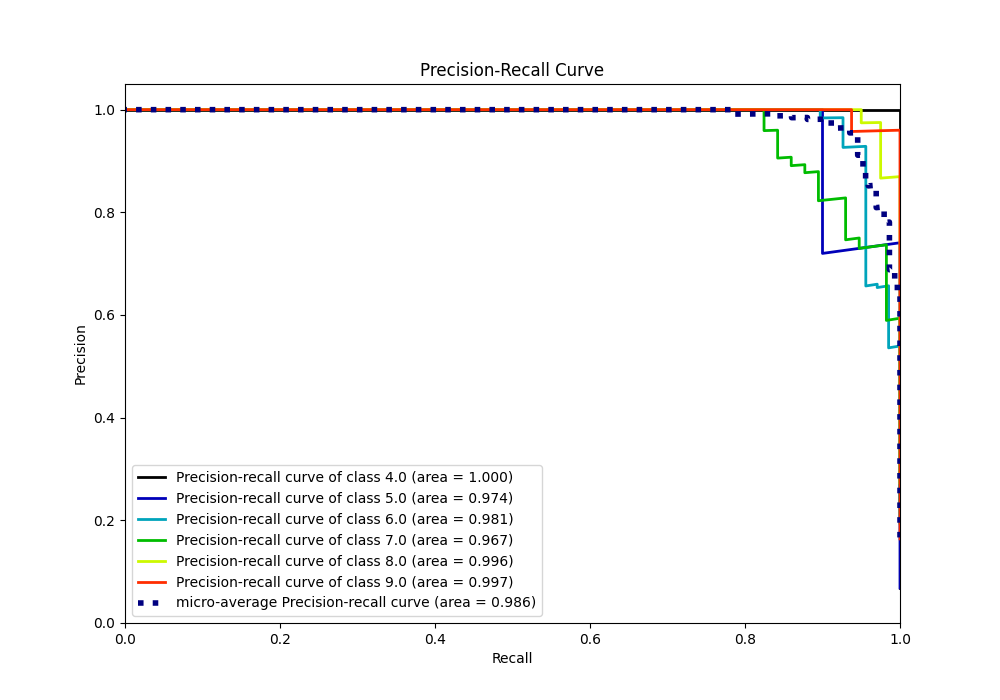

# Summary of 51_ExtraTrees

[<< Go back](../README.md)

## Extra Trees Classifier (Extra Trees)
- **n_jobs**: -1
- **criterion**: entropy
- **max_features**: 0.6
- **min_samples_split**: 50
- **max_depth**: 6
- **eval_metric_name**: accuracy
- **num_class**: 6
- **explain_level**: 0

## Validation
 - **validation_type**: kfold
 - **k_folds**: 5

## Optimized metric
accuracy

## Training time

4.8 seconds

### Metric details
|           |   4.0 |   5.0 |       6.0 |       7.0 |    8.0 |       9.0 |   accuracy |   macro avg |   weighted avg |   logloss |
|:----------|------:|------:|----------:|----------:|-------:|----------:|-----------:|------------:|---------------:|----------:|
| precision |     1 |   0.9 |  0.928571 |  0.981132 |  0.975 |  0.96     |   0.959044 |    0.957451 |       0.959547 |  0.346338 |
| recall    |     1 |   0.9 |  0.955882 |  0.912281 |  0.975 |  1        |   0.959044 |    0.957194 |       0.959044 |  0.346338 |
| f1-score  |     1 |   0.9 |  0.942029 |  0.945455 |  0.975 |  0.979592 |   0.959044 |    0.957013 |       0.95894  |  0.346338 |
| support   |    20 |  20   | 68        | 57        | 80     | 48        |   0.959044 |  293        |     293        |  0.346338 |

## Confusion matrix
|                |   Predicted as 4.0 |   Predicted as 5.0 |   Predicted as 6.0 |   Predicted as 7.0 |   Predicted as 8.0 |   Predicted as 9.0 |
|:---------------|-------------------:|-------------------:|-------------------:|-------------------:|-------------------:|-------------------:|
| Labeled as 4.0 |                 20 |                  0 |                  0 |                  0 |                  0 |                  0 |
| Labeled as 5.0 |                  0 |                 18 |                  2 |                  0 |                  0 |                  0 |
| Labeled as 6.0 |                  0 |                  2 |                 65 |                  1 |                  0 |                  0 |
| Labeled as 7.0 |                  0 |                  0 |                  3 |                 52 |                  2 |                  0 |
| Labeled as 8.0 |                  0 |                  0 |                  0 |                  0 |                 78 |                  2 |
| Labeled as 9.0 |                  0 |                  0 |                  0 |                  0 |                  0 |                 48 |

## Learning curves

## Confusion Matrix

## Normalized Confusion Matrix

## ROC Curve

## Precision Recall Curve

[<< Go back](../README.md)
