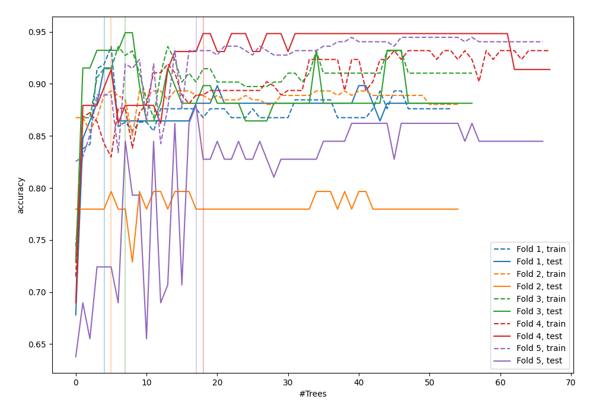

# Summary of 52_ExtraTrees

[<< Go back](../README.md)

## Extra Trees Classifier (Extra Trees)
- **n_jobs**: -1
- **criterion**: gini
- **max_features**: 0.7
- **min_samples_split**: 50
- **max_depth**: 3
- **eval_metric_name**: accuracy
- **num_class**: 6
- **explain_level**: 0

## Validation
 - **validation_type**: kfold
 - **k_folds**: 5

## Optimized metric
accuracy

## Training time

5.0 seconds

### Metric details
|           |       4.0 |       5.0 |       6.0 |       7.0 |       8.0 |   9.0 |   accuracy |   macro avg |   weighted avg |   logloss |
|:----------|----------:|----------:|----------:|----------:|----------:|------:|-----------:|------------:|---------------:|----------:|
| precision |  1        |  1        |  0.731183 |  0.942308 |  0.974684 |     1 |   0.897611 |    0.941362 |       0.919477 |  0.533104 |
| recall    |  0.75     |  0.3      |  1        |  0.859649 |  0.9625   |     1 |   0.897611 |    0.812025 |       0.897611 |  0.533104 |
| f1-score  |  0.857143 |  0.461538 |  0.84472  |  0.899083 |  0.968553 |     1 |   0.897611 |    0.838506 |       0.889238 |  0.533104 |
| support   | 20        | 20        | 68        | 57        | 80        |    48 |   0.897611 |  293        |     293        |  0.533104 |

## Confusion matrix
|                |   Predicted as 4.0 |   Predicted as 5.0 |   Predicted as 6.0 |   Predicted as 7.0 |   Predicted as 8.0 |   Predicted as 9.0 |
|:---------------|-------------------:|-------------------:|-------------------:|-------------------:|-------------------:|-------------------:|
| Labeled as 4.0 |                 15 |                  0 |                  5 |                  0 |                  0 |                  0 |
| Labeled as 5.0 |                  0 |                  6 |                 14 |                  0 |                  0 |                  0 |
| Labeled as 6.0 |                  0 |                  0 |                 68 |                  0 |                  0 |                  0 |
| Labeled as 7.0 |                  0 |                  0 |                  6 |                 49 |                  2 |                  0 |
| Labeled as 8.0 |                  0 |                  0 |                  0 |                  3 |                 77 |                  0 |
| Labeled as 9.0 |                  0 |                  0 |                  0 |                  0 |                  0 |                 48 |

## Learning curves

## Confusion Matrix

## Normalized Confusion Matrix

## ROC Curve

## Precision Recall Curve

[<< Go back](../README.md)
