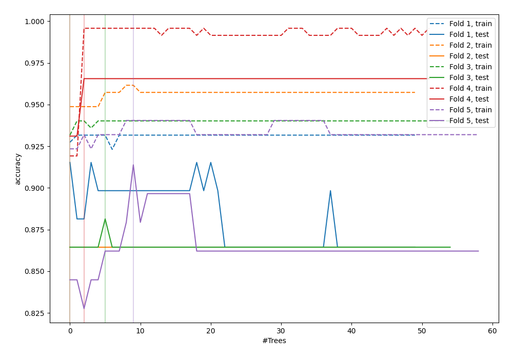

# Summary of 53_ExtraTrees_Stacked

[<< Go back](../README.md)

## Extra Trees Classifier (Extra Trees)
- **n_jobs**: -1
- **criterion**: gini
- **max_features**: 1.0
- **min_samples_split**: 40
- **max_depth**: 7
- **eval_metric_name**: accuracy
- **num_class**: 6
- **explain_level**: 0

## Validation
 - **validation_type**: kfold
 - **k_folds**: 5

## Optimized metric
accuracy

## Training time

15.6 seconds

### Metric details
|           |       4.0 |   5.0 |       6.0 |       7.0 |       8.0 |   9.0 |   accuracy |   macro avg |   weighted avg |   logloss |
|:----------|----------:|------:|----------:|----------:|----------:|------:|-----------:|------------:|---------------:|----------:|
| precision |  0.380952 |   0.4 |  0.985075 |  1        |  0.987654 |     1 |    0.90785 |    0.79228  |       0.909954 |  0.198946 |
| recall    |  0.4      |   0.4 |  0.970588 |  0.982456 |  1        |     1 |    0.90785 |    0.792174 |       0.90785  |  0.198946 |
| f1-score  |  0.390244 |   0.4 |  0.977778 |  0.99115  |  0.993789 |     1 |    0.90785 |    0.79216  |       0.908848 |  0.198946 |
| support   | 20        |  20   | 68        | 57        | 80        |    48 |    0.90785 |  293        |     293        |  0.198946 |

## Confusion matrix
|                |   Predicted as 4.0 |   Predicted as 5.0 |   Predicted as 6.0 |   Predicted as 7.0 |   Predicted as 8.0 |   Predicted as 9.0 |
|:---------------|-------------------:|-------------------:|-------------------:|-------------------:|-------------------:|-------------------:|
| Labeled as 4.0 |                  8 |                 12 |                  0 |                  0 |                  0 |                  0 |
| Labeled as 5.0 |                 12 |                  8 |                  0 |                  0 |                  0 |                  0 |
| Labeled as 6.0 |                  1 |                  0 |                 66 |                  0 |                  1 |                  0 |
| Labeled as 7.0 |                  0 |                  0 |                  1 |                 56 |                  0 |                  0 |
| Labeled as 8.0 |                  0 |                  0 |                  0 |                  0 |                 80 |                  0 |
| Labeled as 9.0 |                  0 |                  0 |                  0 |                  0 |                  0 |                 48 |

## Learning curves

## Confusion Matrix

## Normalized Confusion Matrix

## ROC Curve

## Precision Recall Curve

[<< Go back](../README.md)
