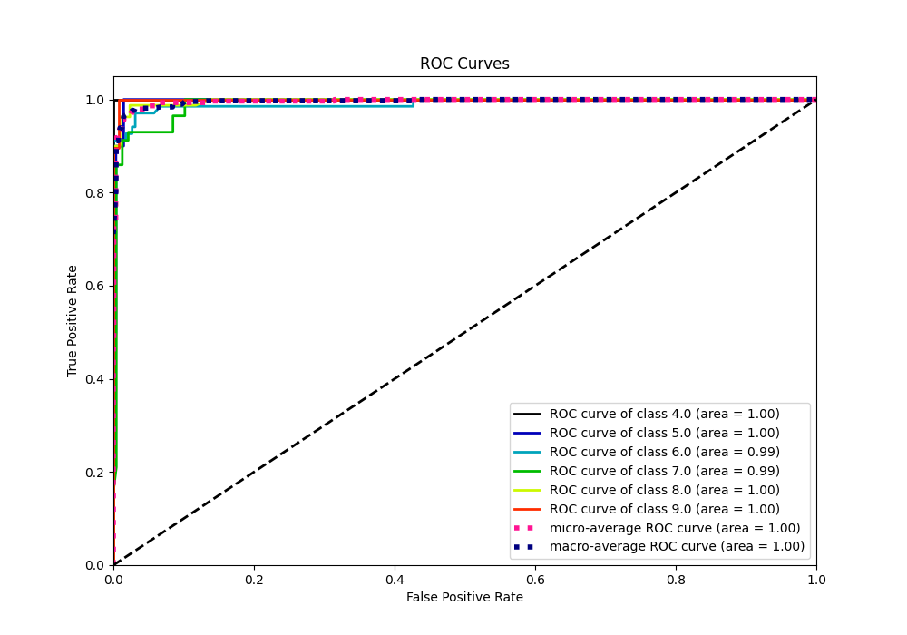

# Summary of 54_ExtraTrees

[<< Go back](../README.md)

## Extra Trees Classifier (Extra Trees)
- **n_jobs**: -1
- **criterion**: gini
- **max_features**: 0.9
- **min_samples_split**: 40
- **max_depth**: 5
- **eval_metric_name**: accuracy
- **num_class**: 6
- **explain_level**: 0

## Validation
 - **validation_type**: kfold
 - **k_folds**: 5

## Optimized metric
accuracy

## Training time

5.4 seconds

### Metric details
|           |       4.0 |       5.0 |       6.0 |       7.0 |       8.0 |       9.0 |   accuracy |   macro avg |   weighted avg |   logloss |
|:----------|----------:|----------:|----------:|----------:|----------:|----------:|-----------:|------------:|---------------:|----------:|
| precision |  0.952381 |  0.947368 |  0.942857 |  0.981132 |  0.974684 |  0.941176 |   0.959044 |    0.9566   |       0.959676 |  0.246329 |
| recall    |  1        |  0.9      |  0.970588 |  0.912281 |  0.9625   |  1        |   0.959044 |    0.957561 |       0.959044 |  0.246329 |
| f1-score  |  0.97561  |  0.923077 |  0.956522 |  0.945455 |  0.968553 |  0.969697 |   0.959044 |    0.956486 |       0.958832 |  0.246329 |
| support   | 20        | 20        | 68        | 57        | 80        | 48        |   0.959044 |  293        |     293        |  0.246329 |

## Confusion matrix
|                |   Predicted as 4.0 |   Predicted as 5.0 |   Predicted as 6.0 |   Predicted as 7.0 |   Predicted as 8.0 |   Predicted as 9.0 |
|:---------------|-------------------:|-------------------:|-------------------:|-------------------:|-------------------:|-------------------:|
| Labeled as 4.0 |                 20 |                  0 |                  0 |                  0 |                  0 |                  0 |
| Labeled as 5.0 |                  0 |                 18 |                  2 |                  0 |                  0 |                  0 |
| Labeled as 6.0 |                  1 |                  1 |                 66 |                  0 |                  0 |                  0 |
| Labeled as 7.0 |                  0 |                  0 |                  2 |                 52 |                  2 |                  1 |
| Labeled as 8.0 |                  0 |                  0 |                  0 |                  1 |                 77 |                  2 |
| Labeled as 9.0 |                  0 |                  0 |                  0 |                  0 |                  0 |                 48 |

## Learning curves

## Confusion Matrix

## Normalized Confusion Matrix

## ROC Curve

## Precision Recall Curve

[<< Go back](../README.md)
