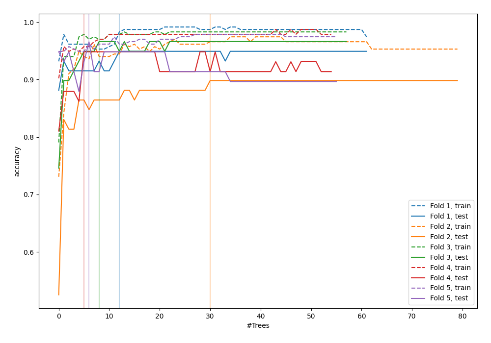
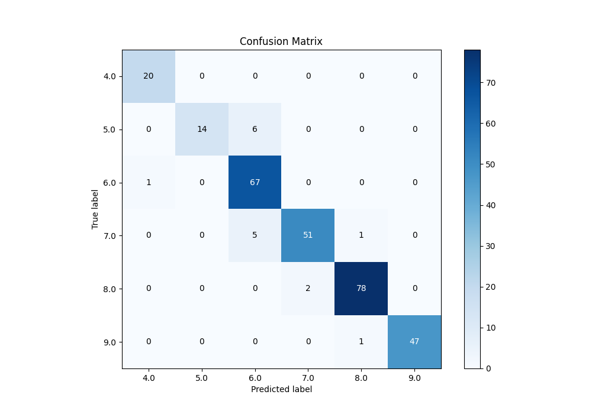
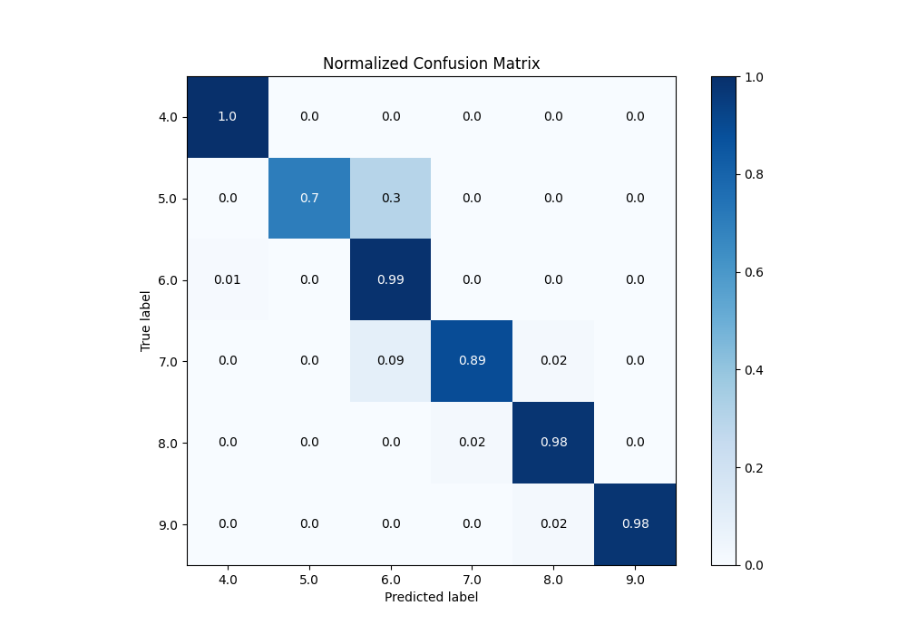
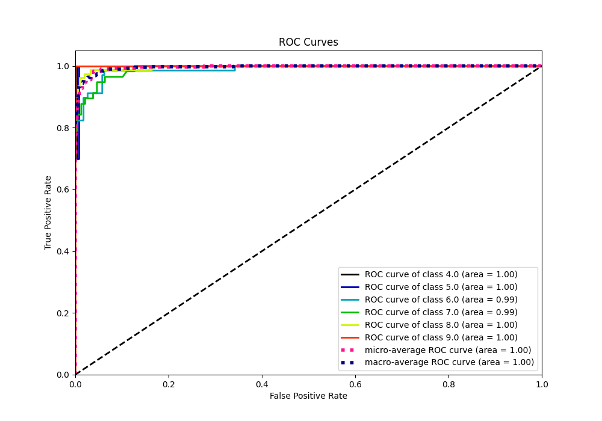
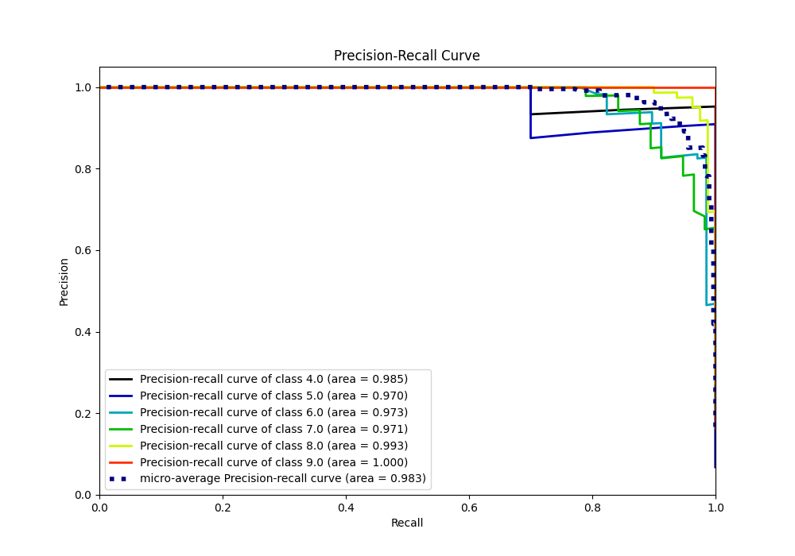

# Summary of 55_ExtraTrees

[<< Go back](../README.md)

## Extra Trees Classifier (Extra Trees)
- **n_jobs**: -1
- **criterion**: gini
- **max_features**: 0.6
- **min_samples_split**: 20
- **max_depth**: 4
- **eval_metric_name**: accuracy
- **num_class**: 6
- **explain_level**: 0

## Validation
 - **validation_type**: kfold
 - **k_folds**: 5

## Optimized metric
accuracy

## Training time

5.5 seconds

### Metric details
|           |       4.0 |       5.0 |       6.0 |       7.0 |    8.0 |       9.0 |   accuracy |   macro avg |   weighted avg |   logloss |
|:----------|----------:|----------:|----------:|----------:|-------:|----------:|-----------:|------------:|---------------:|----------:|
| precision |  0.952381 |  1        |  0.858974 |  0.962264 |  0.975 |  1        |   0.945392 |    0.958103 |       0.949853 |  0.313822 |
| recall    |  1        |  0.7      |  0.985294 |  0.894737 |  0.975 |  0.979167 |   0.945392 |    0.922366 |       0.945392 |  0.313822 |
| f1-score  |  0.97561  |  0.823529 |  0.917808 |  0.927273 |  0.975 |  0.989474 |   0.945392 |    0.934782 |       0.944515 |  0.313822 |
| support   | 20        | 20        | 68        | 57        | 80     | 48        |   0.945392 |  293        |     293        |  0.313822 |

## Confusion matrix
|                |   Predicted as 4.0 |   Predicted as 5.0 |   Predicted as 6.0 |   Predicted as 7.0 |   Predicted as 8.0 |   Predicted as 9.0 |
|:---------------|-------------------:|-------------------:|-------------------:|-------------------:|-------------------:|-------------------:|
| Labeled as 4.0 |                 20 |                  0 |                  0 |                  0 |                  0 |                  0 |
| Labeled as 5.0 |                  0 |                 14 |                  6 |                  0 |                  0 |                  0 |
| Labeled as 6.0 |                  1 |                  0 |                 67 |                  0 |                  0 |                  0 |
| Labeled as 7.0 |                  0 |                  0 |                  5 |                 51 |                  1 |                  0 |
| Labeled as 8.0 |                  0 |                  0 |                  0 |                  2 |                 78 |                  0 |
| Labeled as 9.0 |                  0 |                  0 |                  0 |                  0 |                  1 |                 47 |

## Learning curves

## Confusion Matrix

## Normalized Confusion Matrix

## ROC Curve

## Precision Recall Curve

[<< Go back](../README.md)
