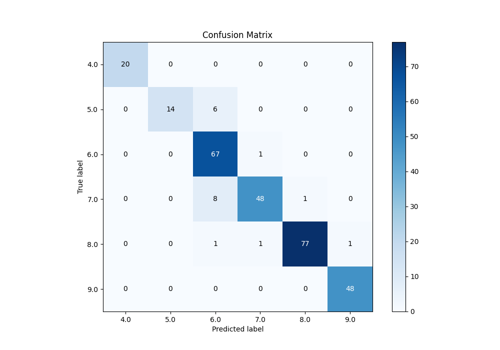

# Summary of 56_ExtraTrees

[<< Go back](../README.md)

## Extra Trees Classifier (Extra Trees)
- **n_jobs**: -1
- **criterion**: gini
- **max_features**: 0.5
- **min_samples_split**: 50
- **max_depth**: 5
- **eval_metric_name**: accuracy
- **num_class**: 6
- **explain_level**: 0

## Validation
 - **validation_type**: kfold
 - **k_folds**: 5

## Optimized metric
accuracy

## Training time

5.7 seconds

### Metric details
|           |   4.0 |       5.0 |       6.0 |       7.0 |       8.0 |       9.0 |   accuracy |   macro avg |   weighted avg |   logloss |
|:----------|------:|----------:|----------:|----------:|----------:|----------:|-----------:|------------:|---------------:|----------:|
| precision |     1 |  1        |  0.817073 |  0.96     |  0.987179 |  0.979592 |   0.935154 |    0.957307 |       0.942921 |  0.407451 |
| recall    |     1 |  0.7      |  0.985294 |  0.842105 |  0.9625   |  1        |   0.935154 |    0.914983 |       0.935154 |  0.407451 |
| f1-score  |     1 |  0.823529 |  0.893333 |  0.897196 |  0.974684 |  0.989691 |   0.935154 |    0.929739 |       0.934598 |  0.407451 |
| support   |    20 | 20        | 68        | 57        | 80        | 48        |   0.935154 |  293        |     293        |  0.407451 |

## Confusion matrix
|                |   Predicted as 4.0 |   Predicted as 5.0 |   Predicted as 6.0 |   Predicted as 7.0 |   Predicted as 8.0 |   Predicted as 9.0 |
|:---------------|-------------------:|-------------------:|-------------------:|-------------------:|-------------------:|-------------------:|
| Labeled as 4.0 |                 20 |                  0 |                  0 |                  0 |                  0 |                  0 |
| Labeled as 5.0 |                  0 |                 14 |                  6 |                  0 |                  0 |                  0 |
| Labeled as 6.0 |                  0 |                  0 |                 67 |                  1 |                  0 |                  0 |
| Labeled as 7.0 |                  0 |                  0 |                  8 |                 48 |                  1 |                  0 |
| Labeled as 8.0 |                  0 |                  0 |                  1 |                  1 |                 77 |                  1 |
| Labeled as 9.0 |                  0 |                  0 |                  0 |                  0 |                  0 |                 48 |

## Learning curves

## Confusion Matrix

## Normalized Confusion Matrix

## ROC Curve

## Precision Recall Curve

[<< Go back](../README.md)
