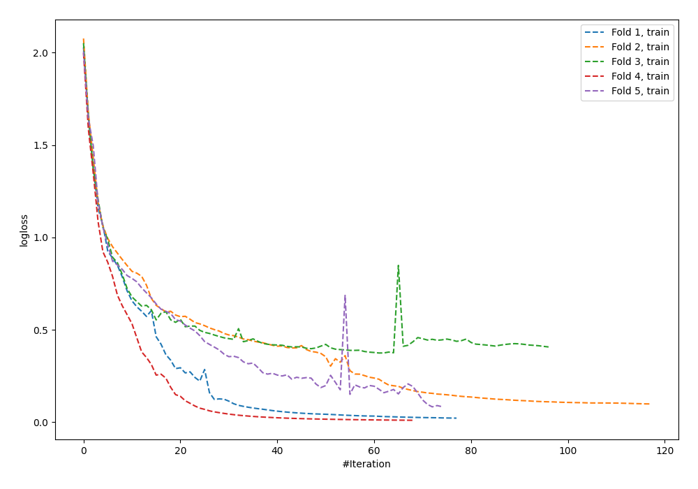
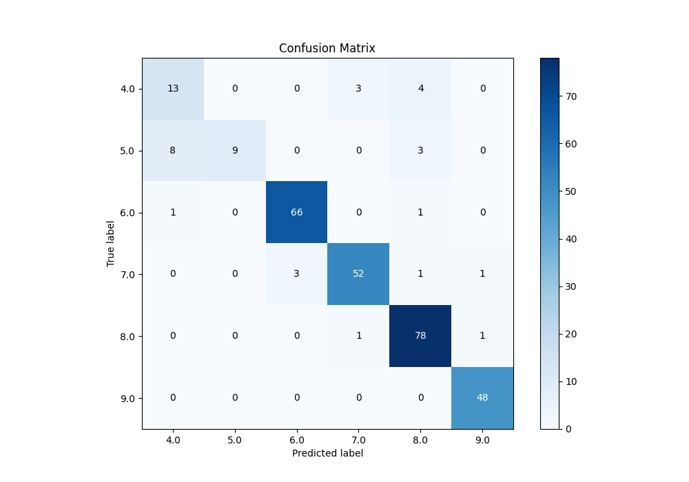
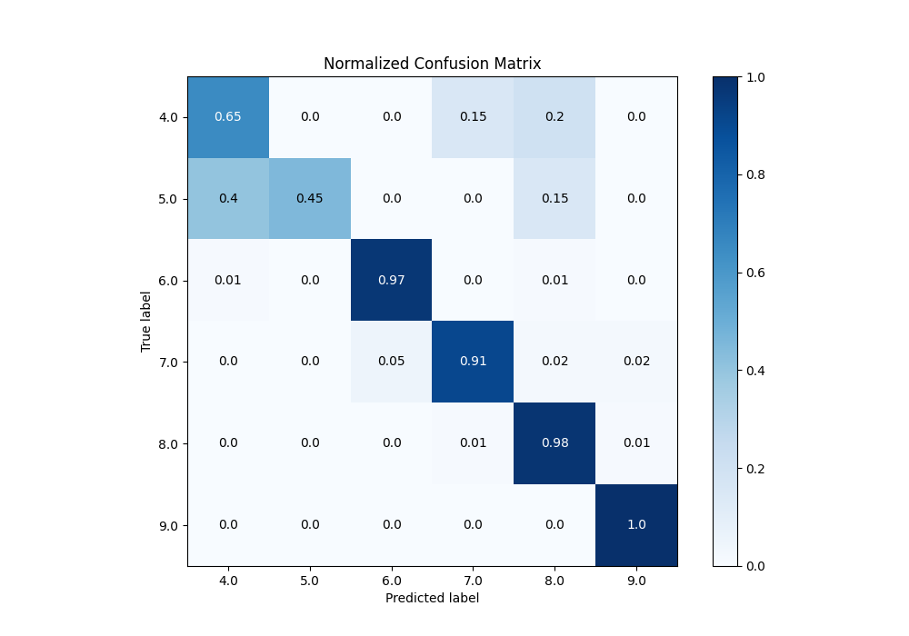
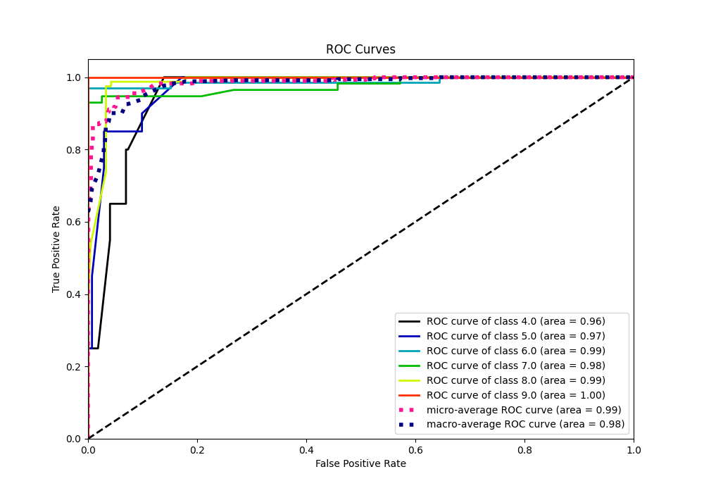
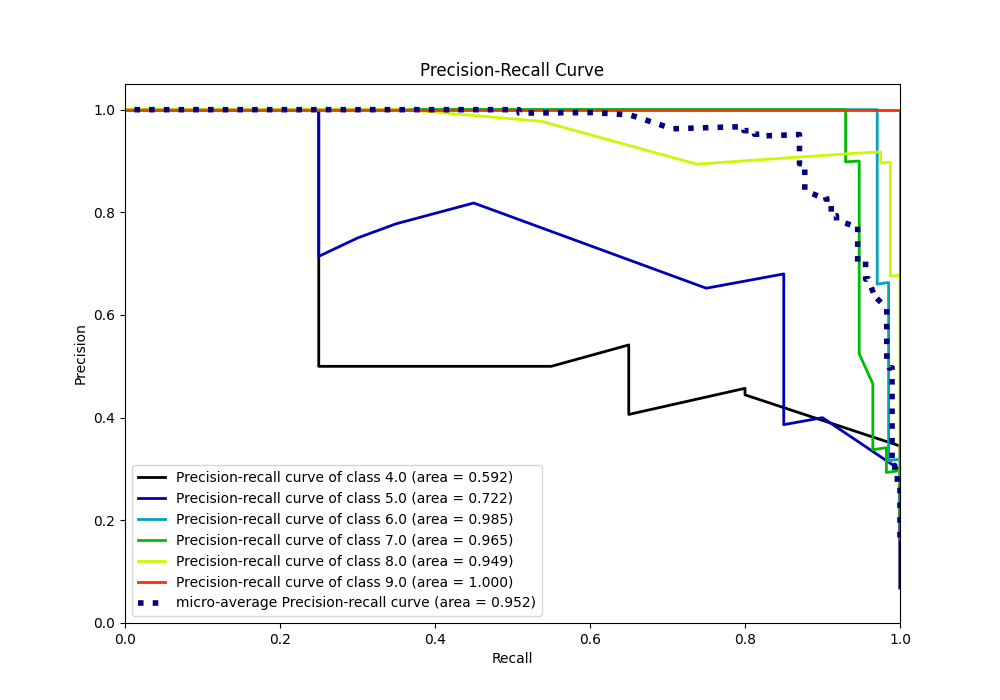

# Summary of 57_NeuralNetwork

[<< Go back](../README.md)

## Neural Network
- **n_jobs**: -1
- **dense_1_size**: 32
- **dense_2_size**: 4
- **learning_rate**: 0.05
- **num_class**: 6
- **explain_level**: 0

## Validation
 - **validation_type**: kfold
 - **k_folds**: 5

## Optimized metric
accuracy

## Training time

3.8 seconds

### Metric details
|           |       4.0 |      5.0 |       6.0 |       7.0 |       8.0 |       9.0 |   accuracy |   macro avg |   weighted avg |   logloss |
|:----------|----------:|---------:|----------:|----------:|----------:|----------:|-----------:|------------:|---------------:|----------:|
| precision |  0.590909 |  1       |  0.956522 |  0.928571 |  0.896552 |  0.96     |    0.90785 |    0.888759 |       0.913291 |  0.416095 |
| recall    |  0.65     |  0.45    |  0.970588 |  0.912281 |  0.975    |  1        |    0.90785 |    0.826311 |       0.90785  |  0.416095 |
| f1-score  |  0.619048 |  0.62069 |  0.963504 |  0.920354 |  0.934132 |  0.979592 |    0.90785 |    0.839553 |       0.902813 |  0.416095 |
| support   | 20        | 20       | 68        | 57        | 80        | 48        |    0.90785 |  293        |     293        |  0.416095 |

## Confusion matrix
|                |   Predicted as 4.0 |   Predicted as 5.0 |   Predicted as 6.0 |   Predicted as 7.0 |   Predicted as 8.0 |   Predicted as 9.0 |
|:---------------|-------------------:|-------------------:|-------------------:|-------------------:|-------------------:|-------------------:|
| Labeled as 4.0 |                 13 |                  0 |                  0 |                  3 |                  4 |                  0 |
| Labeled as 5.0 |                  8 |                  9 |                  0 |                  0 |                  3 |                  0 |
| Labeled as 6.0 |                  1 |                  0 |                 66 |                  0 |                  1 |                  0 |
| Labeled as 7.0 |                  0 |                  0 |                  3 |                 52 |                  1 |                  1 |
| Labeled as 8.0 |                  0 |                  0 |                  0 |                  1 |                 78 |                  1 |
| Labeled as 9.0 |                  0 |                  0 |                  0 |                  0 |                  0 |                 48 |

## Learning curves

## Confusion Matrix

## Normalized Confusion Matrix

## ROC Curve

## Precision Recall Curve

[<< Go back](../README.md)
