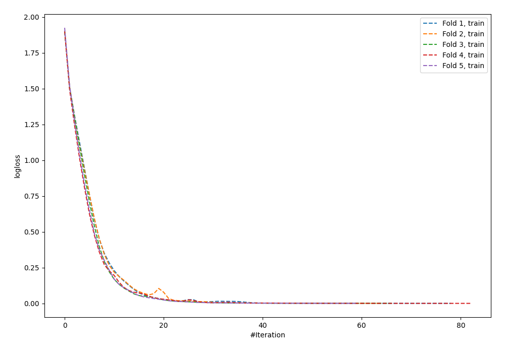
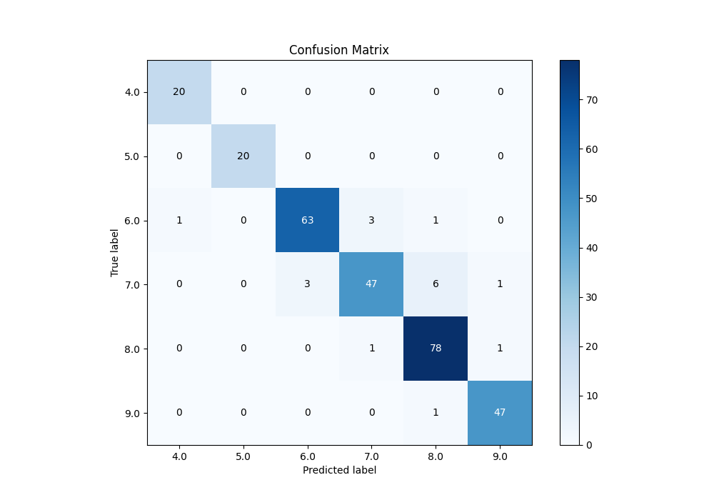
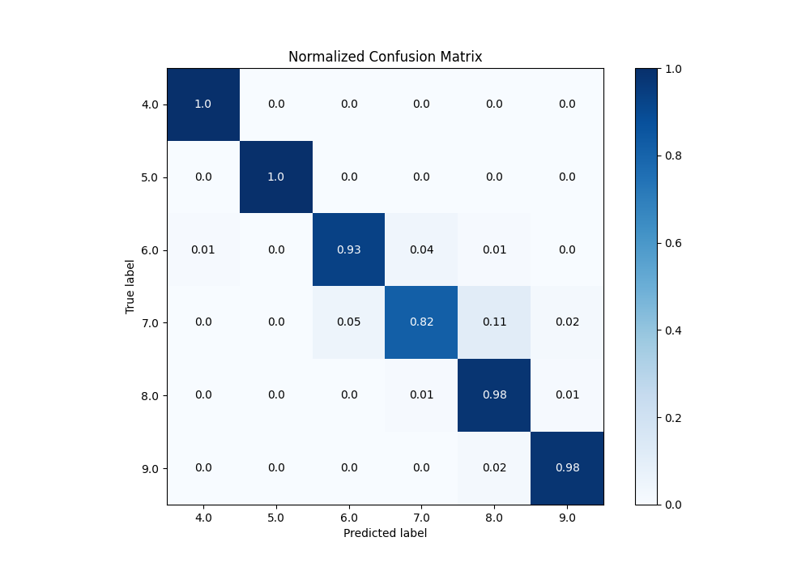
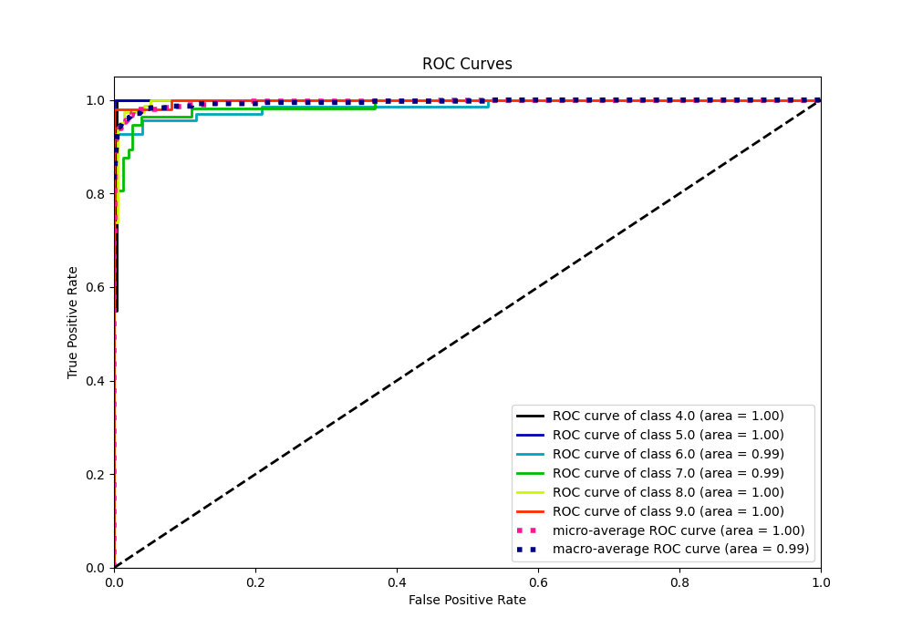
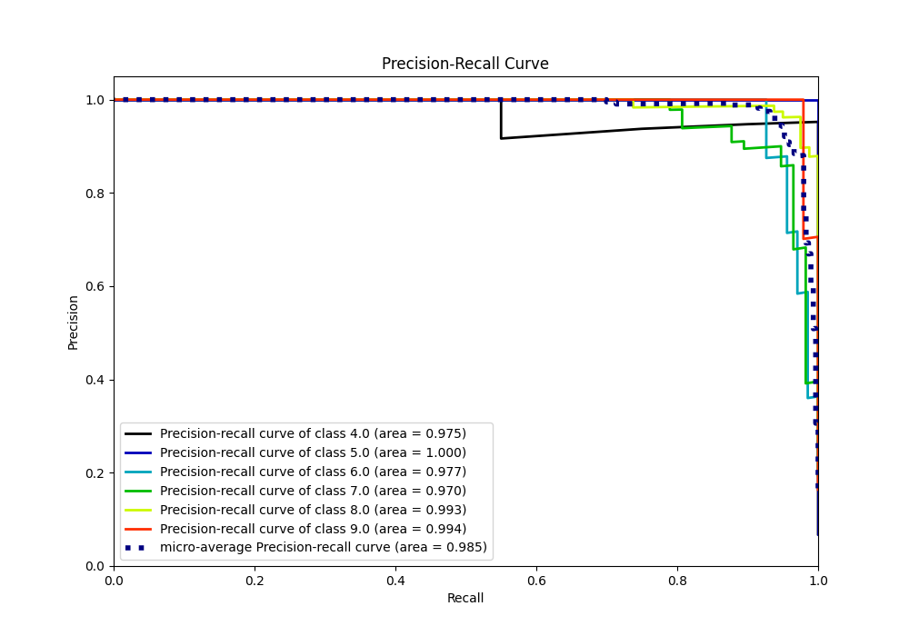

# Summary of 58_NeuralNetwork

[<< Go back](../README.md)

## Neural Network
- **n_jobs**: -1
- **dense_1_size**: 64
- **dense_2_size**: 16
- **learning_rate**: 0.01
- **num_class**: 6
- **explain_level**: 0

## Validation
 - **validation_type**: kfold
 - **k_folds**: 5

## Optimized metric
accuracy

## Training time

3.8 seconds

### Metric details
|           |       4.0 |   5.0 |       6.0 |       7.0 |       8.0 |       9.0 |   accuracy |   macro avg |   weighted avg |   logloss |
|:----------|----------:|------:|----------:|----------:|----------:|----------:|-----------:|------------:|---------------:|----------:|
| precision |  0.952381 |     1 |  0.954545 |  0.921569 |  0.906977 |  0.959184 |   0.938567 |    0.949109 |       0.938857 |  0.193482 |
| recall    |  1        |     1 |  0.926471 |  0.824561 |  0.975    |  0.979167 |   0.938567 |    0.950866 |       0.938567 |  0.193482 |
| f1-score  |  0.97561  |     1 |  0.940299 |  0.87037  |  0.939759 |  0.969072 |   0.938567 |    0.949185 |       0.937747 |  0.193482 |
| support   | 20        |    20 | 68        | 57        | 80        | 48        |   0.938567 |  293        |     293        |  0.193482 |

## Confusion matrix
|                |   Predicted as 4.0 |   Predicted as 5.0 |   Predicted as 6.0 |   Predicted as 7.0 |   Predicted as 8.0 |   Predicted as 9.0 |
|:---------------|-------------------:|-------------------:|-------------------:|-------------------:|-------------------:|-------------------:|
| Labeled as 4.0 |                 20 |                  0 |                  0 |                  0 |                  0 |                  0 |
| Labeled as 5.0 |                  0 |                 20 |                  0 |                  0 |                  0 |                  0 |
| Labeled as 6.0 |                  1 |                  0 |                 63 |                  3 |                  1 |                  0 |
| Labeled as 7.0 |                  0 |                  0 |                  3 |                 47 |                  6 |                  1 |
| Labeled as 8.0 |                  0 |                  0 |                  0 |                  1 |                 78 |                  1 |
| Labeled as 9.0 |                  0 |                  0 |                  0 |                  0 |                  1 |                 47 |

## Learning curves

## Confusion Matrix

## Normalized Confusion Matrix

## ROC Curve

## Precision Recall Curve

[<< Go back](../README.md)
