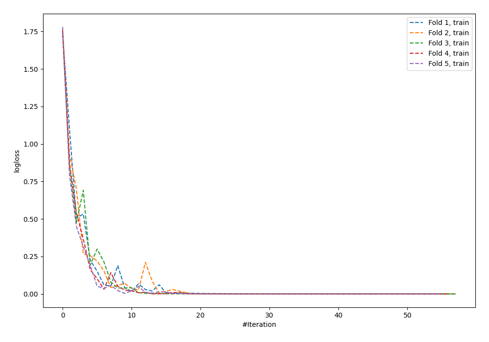
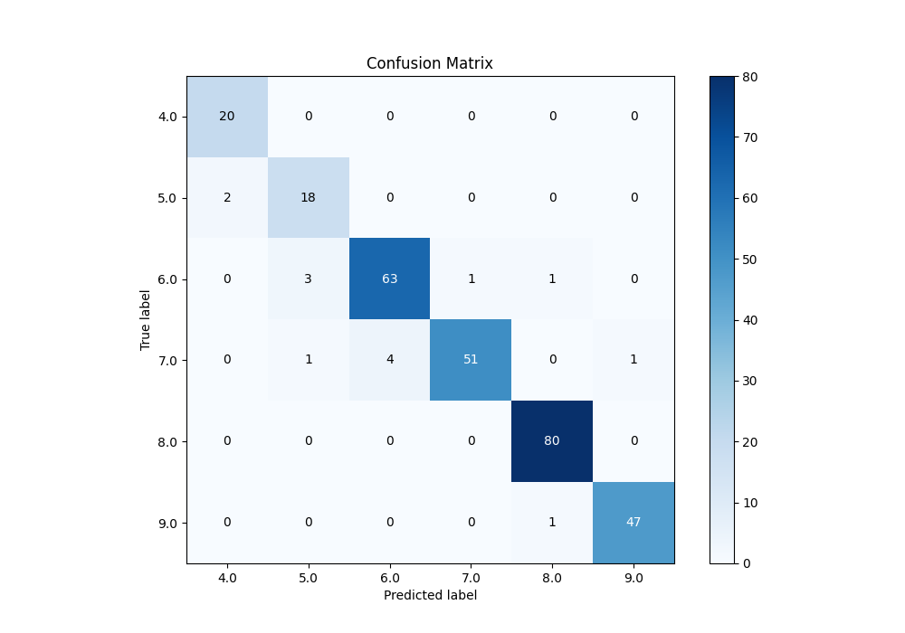
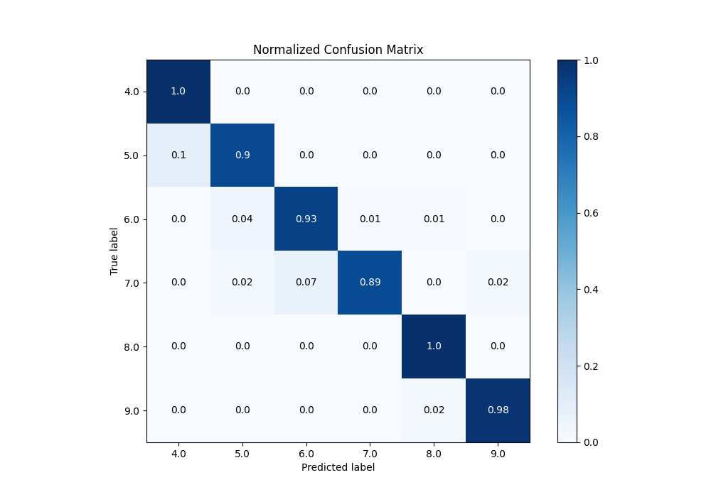
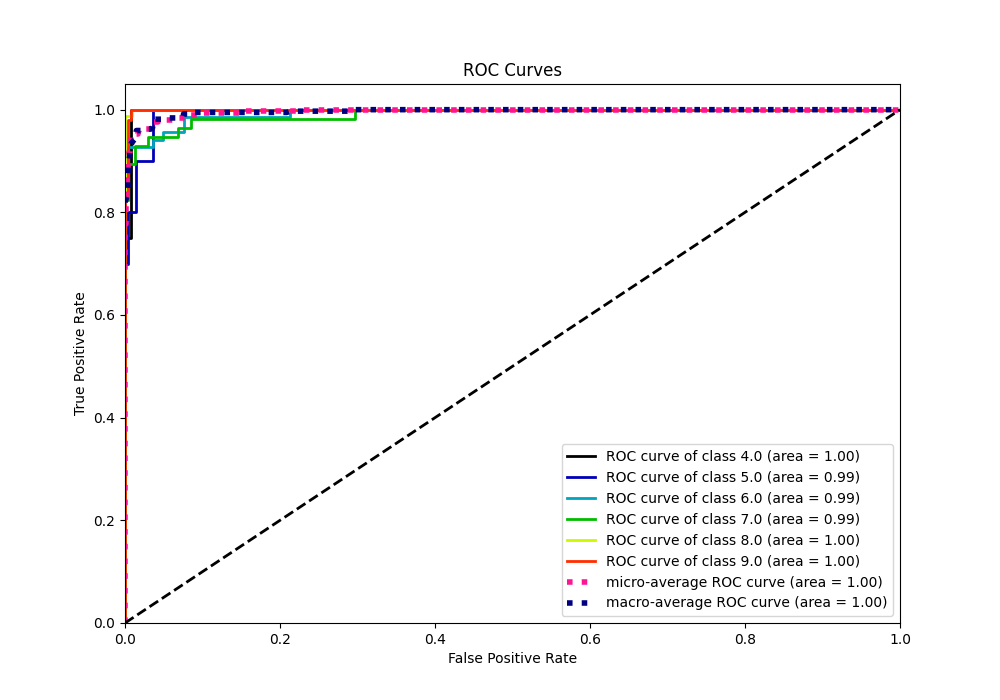
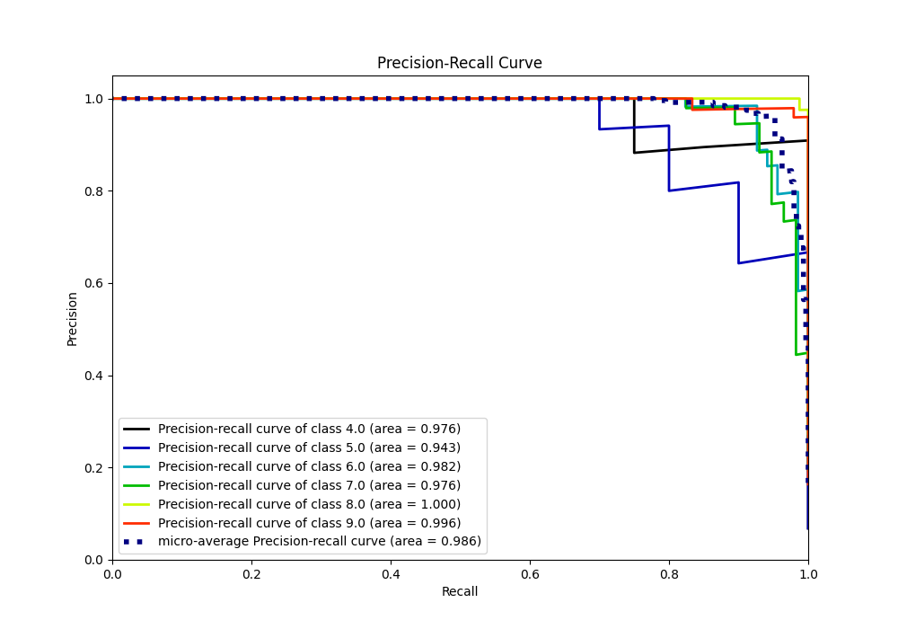

# Summary of 60_NeuralNetwork

[<< Go back](../README.md)

## Neural Network
- **n_jobs**: -1
- **dense_1_size**: 32
- **dense_2_size**: 32
- **learning_rate**: 0.05
- **num_class**: 6
- **explain_level**: 0

## Validation
 - **validation_type**: kfold
 - **k_folds**: 5

## Optimized metric
accuracy

## Training time

4.5 seconds

### Metric details
|           |       4.0 |       5.0 |       6.0 |       7.0 |       8.0 |       9.0 |   accuracy |   macro avg |   weighted avg |   logloss |
|:----------|----------:|----------:|----------:|----------:|----------:|----------:|-----------:|------------:|---------------:|----------:|
| precision |  0.909091 |  0.818182 |  0.940299 |  0.980769 |  0.97561  |  0.979167 |   0.952218 |    0.933853 |       0.953715 |  0.204099 |
| recall    |  1        |  0.9      |  0.926471 |  0.894737 |  1        |  0.979167 |   0.952218 |    0.950062 |       0.952218 |  0.204099 |
| f1-score  |  0.952381 |  0.857143 |  0.933333 |  0.93578  |  0.987654 |  0.979167 |   0.952218 |    0.94091  |       0.952249 |  0.204099 |
| support   | 20        | 20        | 68        | 57        | 80        | 48        |   0.952218 |  293        |     293        |  0.204099 |

## Confusion matrix
|                |   Predicted as 4.0 |   Predicted as 5.0 |   Predicted as 6.0 |   Predicted as 7.0 |   Predicted as 8.0 |   Predicted as 9.0 |
|:---------------|-------------------:|-------------------:|-------------------:|-------------------:|-------------------:|-------------------:|
| Labeled as 4.0 |                 20 |                  0 |                  0 |                  0 |                  0 |                  0 |
| Labeled as 5.0 |                  2 |                 18 |                  0 |                  0 |                  0 |                  0 |
| Labeled as 6.0 |                  0 |                  3 |                 63 |                  1 |                  1 |                  0 |
| Labeled as 7.0 |                  0 |                  1 |                  4 |                 51 |                  0 |                  1 |
| Labeled as 8.0 |                  0 |                  0 |                  0 |                  0 |                 80 |                  0 |
| Labeled as 9.0 |                  0 |                  0 |                  0 |                  0 |                  1 |                 47 |

## Learning curves

## Confusion Matrix

## Normalized Confusion Matrix

## ROC Curve

## Precision Recall Curve

[<< Go back](../README.md)
