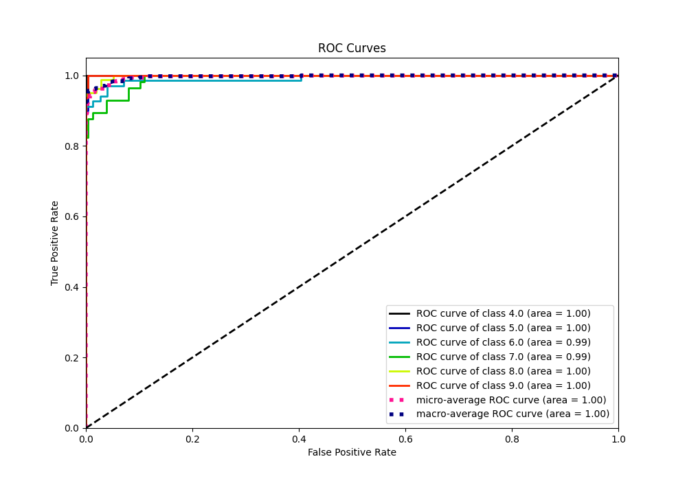
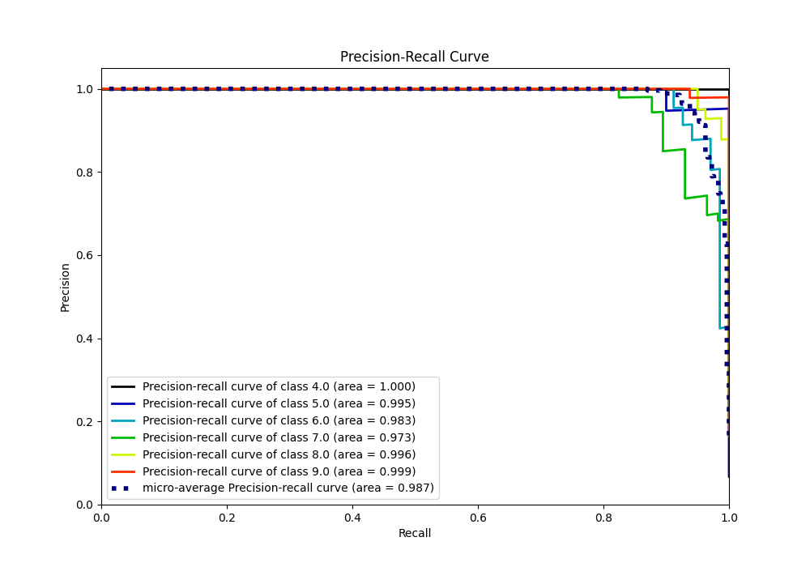

# Summary of 61_NeuralNetwork

[<< Go back](../README.md)

## Neural Network
- **n_jobs**: -1
- **dense_1_size**: 64
- **dense_2_size**: 16
- **learning_rate**: 0.01
- **num_class**: 6
- **explain_level**: 0

## Validation
 - **validation_type**: kfold
 - **k_folds**: 5

## Optimized metric
accuracy

## Training time

4.4 seconds

### Metric details
|           |       4.0 |       5.0 |       6.0 |       7.0 |       8.0 |       9.0 |   accuracy |   macro avg |   weighted avg |   logloss |
|:----------|----------:|----------:|----------:|----------:|----------:|----------:|-----------:|------------:|---------------:|----------:|
| precision |  0.8      |  0.952381 |  0.939394 |  0.980769 |  0.962963 |  0.979167 |   0.948805 |    0.935779 |       0.951765 |  0.192848 |
| recall    |  1        |  1        |  0.911765 |  0.894737 |  0.975    |  0.979167 |   0.948805 |    0.960111 |       0.948805 |  0.192848 |
| f1-score  |  0.888889 |  0.97561  |  0.925373 |  0.93578  |  0.968944 |  0.979167 |   0.948805 |    0.945627 |       0.949045 |  0.192848 |
| support   | 20        | 20        | 68        | 57        | 80        | 48        |   0.948805 |  293        |     293        |  0.192848 |

## Confusion matrix
|                |   Predicted as 4.0 |   Predicted as 5.0 |   Predicted as 6.0 |   Predicted as 7.0 |   Predicted as 8.0 |   Predicted as 9.0 |
|:---------------|-------------------:|-------------------:|-------------------:|-------------------:|-------------------:|-------------------:|
| Labeled as 4.0 |                 20 |                  0 |                  0 |                  0 |                  0 |                  0 |
| Labeled as 5.0 |                  0 |                 20 |                  0 |                  0 |                  0 |                  0 |
| Labeled as 6.0 |                  5 |                  1 |                 62 |                  0 |                  0 |                  0 |
| Labeled as 7.0 |                  0 |                  0 |                  3 |                 51 |                  2 |                  1 |
| Labeled as 8.0 |                  0 |                  0 |                  1 |                  1 |                 78 |                  0 |
| Labeled as 9.0 |                  0 |                  0 |                  0 |                  0 |                  1 |                 47 |

## Learning curves

## Confusion Matrix

## Normalized Confusion Matrix

## ROC Curve

## Precision Recall Curve

[<< Go back](../README.md)
