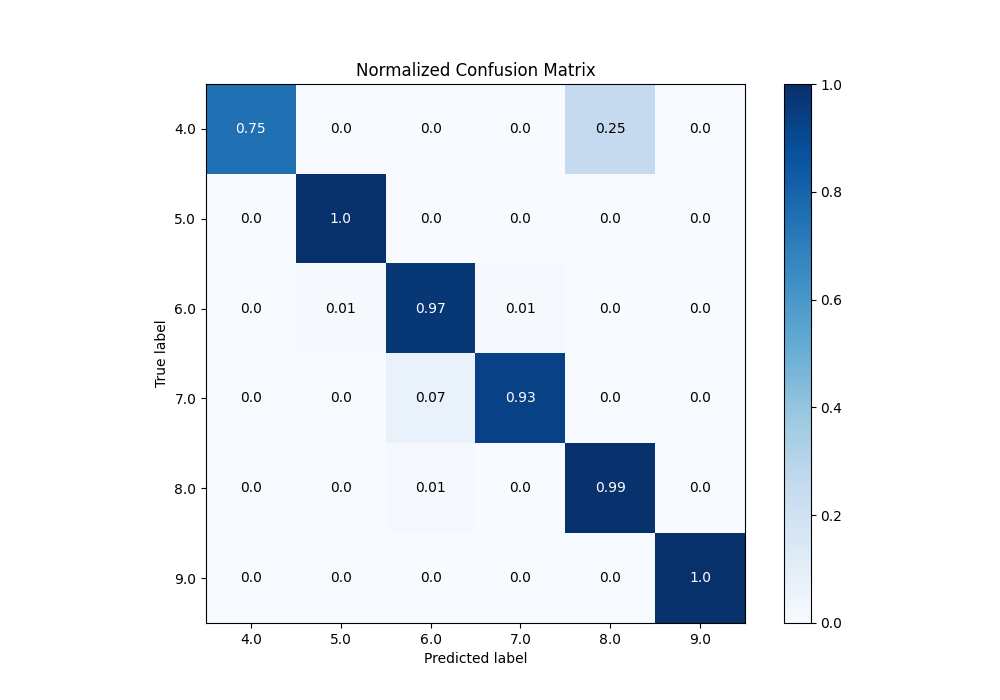

# Summary of 61_NeuralNetwork_Stacked

[<< Go back](../README.md)

## Neural Network
- **n_jobs**: -1
- **dense_1_size**: 64
- **dense_2_size**: 16
- **learning_rate**: 0.01
- **num_class**: 6
- **explain_level**: 0

## Validation
 - **validation_type**: kfold
 - **k_folds**: 5

## Optimized metric
accuracy

## Training time

21.4 seconds

### Metric details
|           |       4.0 |       5.0 |       6.0 |       7.0 |       8.0 |   9.0 |   accuracy |   macro avg |   weighted avg |   logloss |
|:----------|----------:|----------:|----------:|----------:|----------:|------:|-----------:|------------:|---------------:|----------:|
| precision |  1        |  0.952381 |  0.929577 |  0.981481 |  0.940476 |     1 |   0.959044 |    0.967319 |       0.960551 |  0.308138 |
| recall    |  0.75     |  1        |  0.970588 |  0.929825 |  0.9875   |     1 |   0.959044 |    0.939652 |       0.959044 |  0.308138 |
| f1-score  |  0.857143 |  0.97561  |  0.94964  |  0.954955 |  0.963415 |     1 |   0.959044 |    0.950127 |       0.958144 |  0.308138 |
| support   | 20        | 20        | 68        | 57        | 80        |    48 |   0.959044 |  293        |     293        |  0.308138 |

## Confusion matrix
|                |   Predicted as 4.0 |   Predicted as 5.0 |   Predicted as 6.0 |   Predicted as 7.0 |   Predicted as 8.0 |   Predicted as 9.0 |
|:---------------|-------------------:|-------------------:|-------------------:|-------------------:|-------------------:|-------------------:|
| Labeled as 4.0 |                 15 |                  0 |                  0 |                  0 |                  5 |                  0 |
| Labeled as 5.0 |                  0 |                 20 |                  0 |                  0 |                  0 |                  0 |
| Labeled as 6.0 |                  0 |                  1 |                 66 |                  1 |                  0 |                  0 |
| Labeled as 7.0 |                  0 |                  0 |                  4 |                 53 |                  0 |                  0 |
| Labeled as 8.0 |                  0 |                  0 |                  1 |                  0 |                 79 |                  0 |
| Labeled as 9.0 |                  0 |                  0 |                  0 |                  0 |                  0 |                 48 |

## Learning curves

## Confusion Matrix

## Normalized Confusion Matrix

## ROC Curve

## Precision Recall Curve

[<< Go back](../README.md)
