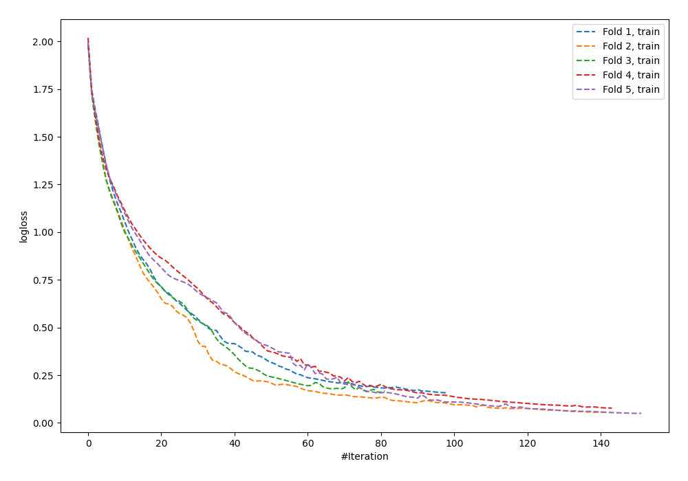
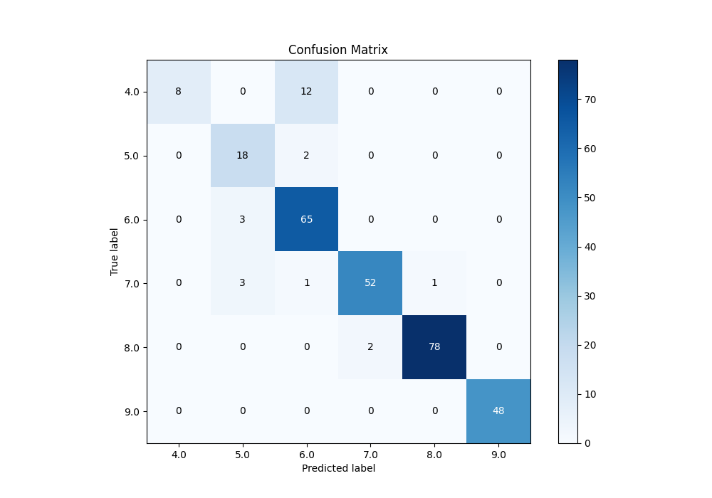
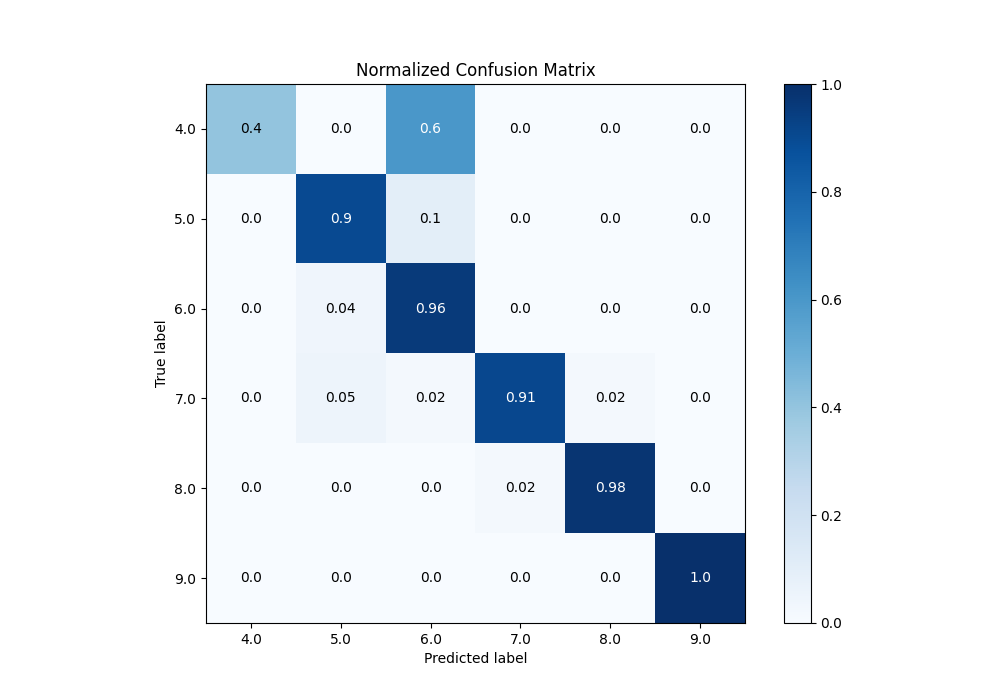
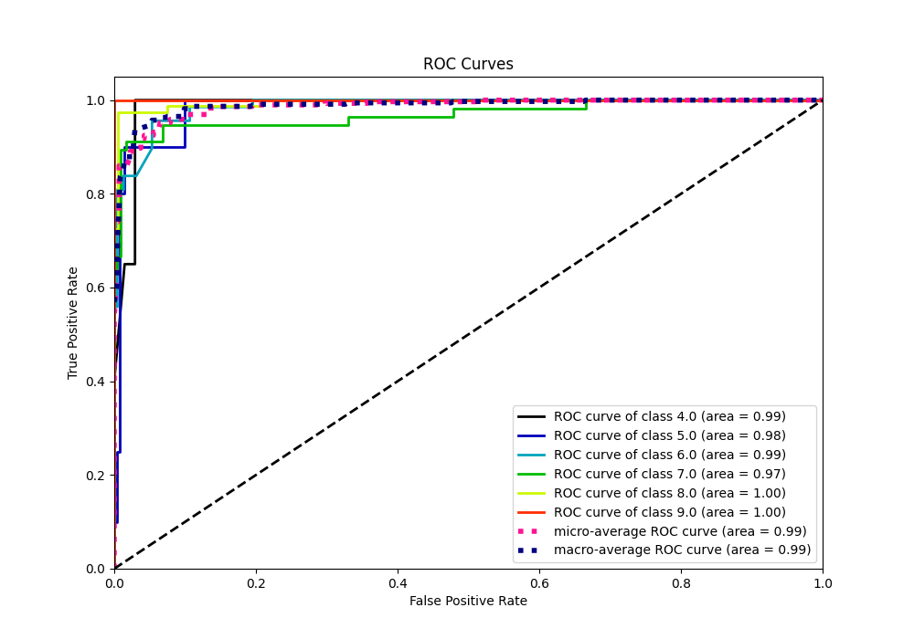
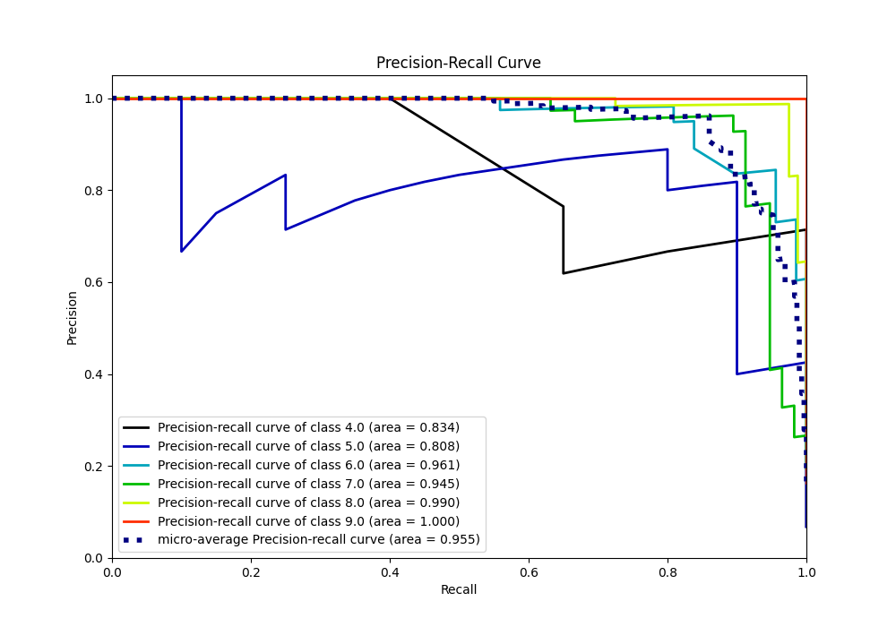

# Summary of 62_NeuralNetwork_SelectedFeatures

[<< Go back](../README.md)

## Neural Network
- **n_jobs**: -1
- **dense_1_size**: 64
- **dense_2_size**: 4
- **learning_rate**: 0.01
- **num_class**: 6
- **explain_level**: 0

## Validation
 - **validation_type**: kfold
 - **k_folds**: 5

## Optimized metric
accuracy

## Training time

7.1 seconds

### Metric details
|           |       4.0 |       5.0 |       6.0 |       7.0 |       8.0 |   9.0 |   accuracy |   macro avg |   weighted avg |   logloss |
|:----------|----------:|----------:|----------:|----------:|----------:|------:|-----------:|------------:|---------------:|----------:|
| precision |  1        |  0.75     |  0.8125   |  0.962963 |  0.987342 |     1 |   0.918089 |    0.918801 |       0.928758 |  0.380746 |
| recall    |  0.4      |  0.9      |  0.955882 |  0.912281 |  0.975    |     1 |   0.918089 |    0.857194 |       0.918089 |  0.380746 |
| f1-score  |  0.571429 |  0.818182 |  0.878378 |  0.936937 |  0.981132 |     1 |   0.918089 |    0.864343 |       0.912689 |  0.380746 |
| support   | 20        | 20        | 68        | 57        | 80        |    48 |   0.918089 |  293        |     293        |  0.380746 |

## Confusion matrix
|                |   Predicted as 4.0 |   Predicted as 5.0 |   Predicted as 6.0 |   Predicted as 7.0 |   Predicted as 8.0 |   Predicted as 9.0 |
|:---------------|-------------------:|-------------------:|-------------------:|-------------------:|-------------------:|-------------------:|
| Labeled as 4.0 |                  8 |                  0 |                 12 |                  0 |                  0 |                  0 |
| Labeled as 5.0 |                  0 |                 18 |                  2 |                  0 |                  0 |                  0 |
| Labeled as 6.0 |                  0 |                  3 |                 65 |                  0 |                  0 |                  0 |
| Labeled as 7.0 |                  0 |                  3 |                  1 |                 52 |                  1 |                  0 |
| Labeled as 8.0 |                  0 |                  0 |                  0 |                  2 |                 78 |                  0 |
| Labeled as 9.0 |                  0 |                  0 |                  0 |                  0 |                  0 |                 48 |

## Learning curves

## Confusion Matrix

## Normalized Confusion Matrix

## ROC Curve

## Precision Recall Curve

[<< Go back](../README.md)
