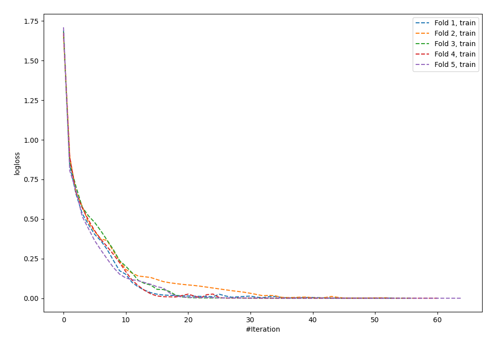
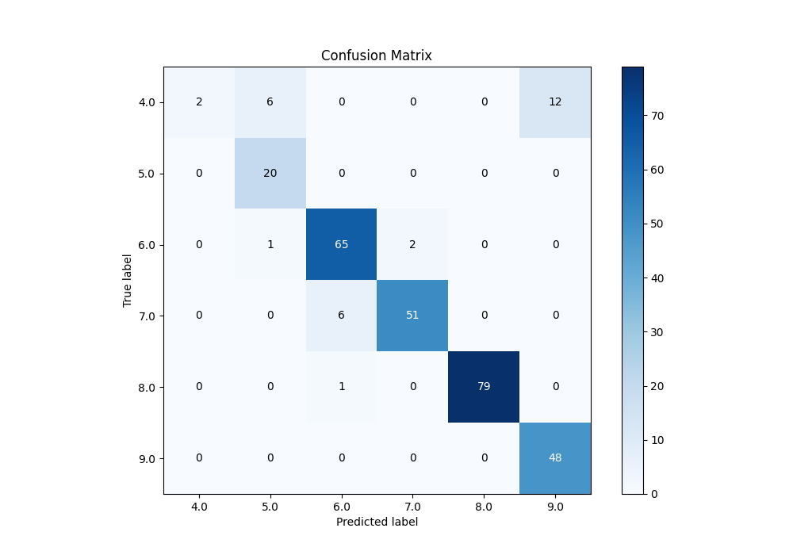
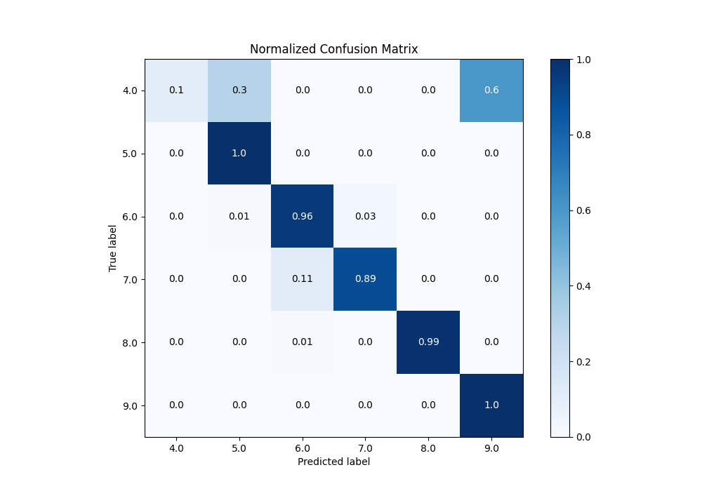
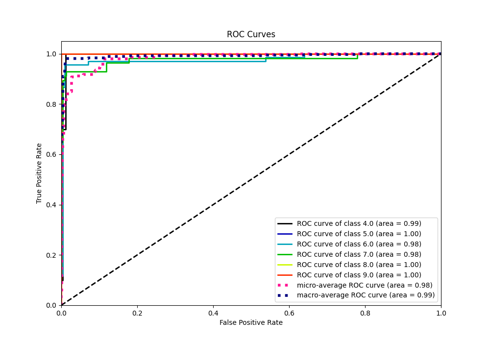
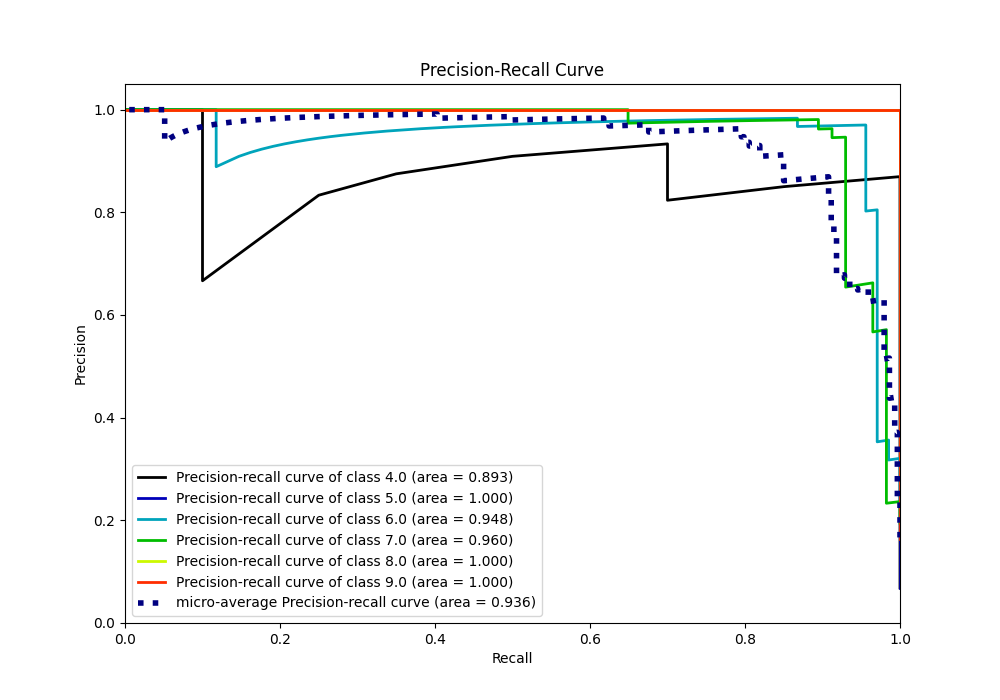

# Summary of 62_NeuralNetwork_Stacked

[<< Go back](../README.md)

## Neural Network
- **n_jobs**: -1
- **dense_1_size**: 64
- **dense_2_size**: 4
- **learning_rate**: 0.01
- **num_class**: 6
- **explain_level**: 0

## Validation
 - **validation_type**: kfold
 - **k_folds**: 5

## Optimized metric
accuracy

## Training time

11.9 seconds

### Metric details
|           |       4.0 |       5.0 |       6.0 |       7.0 |       8.0 |       9.0 |   accuracy |   macro avg |   weighted avg |   logloss |
|:----------|----------:|----------:|----------:|----------:|----------:|----------:|-----------:|------------:|---------------:|----------:|
| precision |  1        |  0.740741 |  0.902778 |  0.962264 |  1        |  0.8      |   0.904437 |    0.900964 |       0.919634 |  0.456241 |
| recall    |  0.1      |  1        |  0.955882 |  0.894737 |  0.9875   |  1        |   0.904437 |    0.82302  |       0.904437 |  0.456241 |
| f1-score  |  0.181818 |  0.851064 |  0.928571 |  0.927273 |  0.993711 |  0.888889 |   0.904437 |    0.795221 |       0.88334  |  0.456241 |
| support   | 20        | 20        | 68        | 57        | 80        | 48        |   0.904437 |  293        |     293        |  0.456241 |

## Confusion matrix
|                |   Predicted as 4.0 |   Predicted as 5.0 |   Predicted as 6.0 |   Predicted as 7.0 |   Predicted as 8.0 |   Predicted as 9.0 |
|:---------------|-------------------:|-------------------:|-------------------:|-------------------:|-------------------:|-------------------:|
| Labeled as 4.0 |                  2 |                  6 |                  0 |                  0 |                  0 |                 12 |
| Labeled as 5.0 |                  0 |                 20 |                  0 |                  0 |                  0 |                  0 |
| Labeled as 6.0 |                  0 |                  1 |                 65 |                  2 |                  0 |                  0 |
| Labeled as 7.0 |                  0 |                  0 |                  6 |                 51 |                  0 |                  0 |
| Labeled as 8.0 |                  0 |                  0 |                  1 |                  0 |                 79 |                  0 |
| Labeled as 9.0 |                  0 |                  0 |                  0 |                  0 |                  0 |                 48 |

## Learning curves

## Confusion Matrix

## Normalized Confusion Matrix

## ROC Curve

## Precision Recall Curve

[<< Go back](../README.md)
